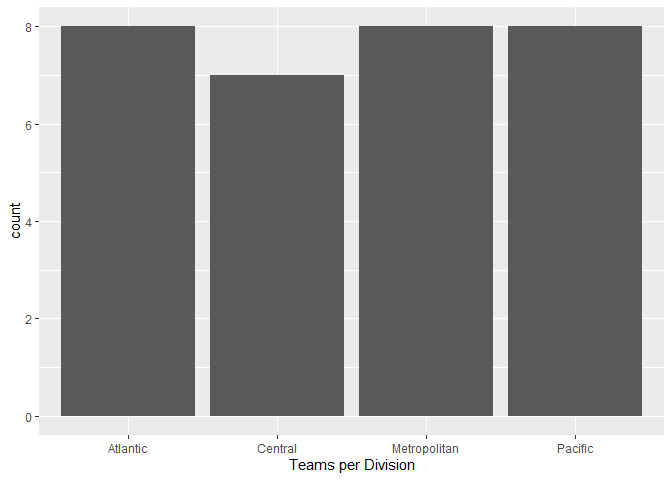
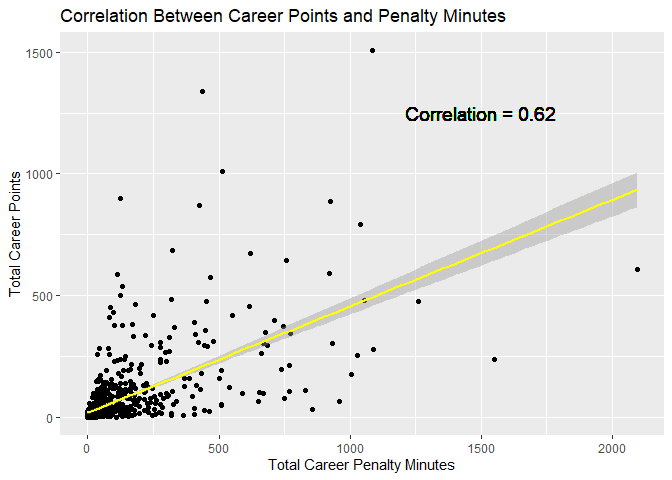

-   [First, a list of packages used in this
    exploration:](#first-a-list-of-packages-used-in-this-exploration)
-   [Let’s dig into the API and take a look at accessing franchise
    data:](#lets-dig-into-the-api-and-take-a-look-at-accessing-franchise-data)
-   [Now that we have data, let’s use it to answer some
    questions.](#now-that-we-have-data-lets-use-it-to-answer-some-questions.)

\#ST 558 Project \#1 - Exploring the NHL API with the Boston Bruins


### First, a list of packages used in this exploration:

``` r
library(tidyverse)
library(rmarkdown)
library(httr) 
library(jsonlite)
library(DT)
library(ggplot2)
library(knitr)
# rmarkdown::render("Project_1.Rmd", output_file="README.md")
```

### Let’s dig into the API and take a look at accessing franchise data:

Return Parsed Franchise Data

``` r
getFranchise <- function(name=NULL, ID=NULL){
  base_url <- "https://records.nhl.com/site/api"
  url <- paste0(base_url, "/", "franchise")
  dat <- as_tibble(fromJSON(content(GET(url),"text"),flatten = T)$data)
  if (!is.null(name)){
    dat <- dat %>% filter(teamCommonName %in% name)
  }
  if (!is.null(ID)){
  dat <- dat %>% filter(id %in% ID)
  }
  dat
}

FranchiseInfo <- getFranchise(name = "Bruins")
```

    ## No encoding supplied: defaulting to UTF-8.

``` r
FranchiseInfo
```

    ## # A tibble: 1 x 6
    ##      id firstSeasonId lastSeasonId mostRecentTeamId teamCommonName
    ##   <int>         <int>        <int>            <int> <chr>         
    ## 1     6      19241925           NA                6 Bruins        
    ## # ... with 1 more variable: teamPlaceName <chr>

Return Franchise Team Totals

``` r
getFranTotal <- function(name=NULL, ID=NULL){
  base_url <- "https://records.nhl.com/site/api"
  url <- paste0(base_url, "/", "franchise-team-totals")
  dat <- as_tibble(fromJSON(content(GET(url),"text"),flatten = T)$data)
  if (!is.null(name)){
    dat <- dat %>% filter(teamName %in% name)
  }
  if (!is.null(ID)){
    dat <- dat %>% filter(teamId %in% ID)
  }
  dat
}

FranchiseTots <- getFranTotal(ID = 6)
```

    ## No encoding supplied: defaulting to UTF-8.

``` r
FranchiseTots
```

    ## # A tibble: 2 x 30
    ##      id activeFranchise firstSeasonId franchiseId gameTypeId
    ##   <int>           <int>         <int>       <int>      <int>
    ## 1    11               1      19241925           6          2
    ## 2    12               1      19241925           6          3
    ## # ... with 25 more variables: gamesPlayed <int>, goalsAgainst <int>,
    ## #   goalsFor <int>, homeLosses <int>, homeOvertimeLosses <int>,
    ## #   homeTies <int>, homeWins <int>, lastSeasonId <int>, losses <int>,
    ## #   overtimeLosses <int>, penaltyMinutes <int>, pointPctg <dbl>,
    ## #   points <int>, roadLosses <int>, roadOvertimeLosses <int>,
    ## #   roadTies <int>, roadWins <int>, shootoutLosses <int>,
    ## #   shootoutWins <int>, shutouts <int>, teamId <int>, teamName <chr>,
    ## #   ties <int>, triCode <chr>, wins <int>

Return Franchise Season Records

``` r
#NEEDS NAME SEARCH
getFranSeasonRecord <- function(name = NULL, ID=NULL){
  base_url <- "https://records.nhl.com/site/api"
  url <- paste0(base_url, "/", "franchise-season-records")
  if (is.null(ID)==F){
    url <- paste0(url, "?cayenneExp=franchiseId=", ID)
  }
  dat <- as_tibble(fromJSON(content(GET(url),"text"),flatten = T)$data)
  if (!is.null(name)){
    dat <- dat %>% filter(franchiseName %in% name)
  }
  if (!is.null(ID)){
    dat <- dat %>% filter(franchiseId %in% ID)
  }
  dat
}

Franch_SnsRcrds <- getFranSeasonRecord(name = "Boston Bruins")
```

    ## Warning in if (is.null(ID) == F) {: the condition has length > 1 and
    ## only the first element will be used

    ## No encoding supplied: defaulting to UTF-8.

``` r
Franch_SnsRcrds
```

    ## # A tibble: 1 x 57
    ##      id fewestGoals fewestGoalsAgai~ fewestGoalsAgai~ fewestGoalsSeas~
    ##   <int>       <int>            <int> <chr>            <chr>           
    ## 1     6         147              172 1952-53 (70)     1955-56 (70)    
    ## # ... with 52 more variables: fewestLosses <int>,
    ## #   fewestLossesSeasons <chr>, fewestPoints <int>,
    ## #   fewestPointsSeasons <chr>, fewestTies <int>,
    ## #   fewestTiesSeasons <chr>, fewestWins <int>,
    ## #   fewestWinsSeasons <chr>, franchiseId <int>, franchiseName <chr>,
    ## #   homeLossStreak <int>, homeLossStreakDates <chr>,
    ## #   homePointStreak <int>, homePointStreakDates <chr>,
    ## #   homeWinStreak <int>, homeWinStreakDates <chr>,
    ## #   homeWinlessStreak <int>, homeWinlessStreakDates <chr>,
    ## #   lossStreak <int>, lossStreakDates <chr>, mostGameGoals <int>,
    ## #   mostGameGoalsDates <chr>, mostGoals <int>, mostGoalsAgainst <int>,
    ## #   mostGoalsAgainstSeasons <chr>, mostGoalsSeasons <chr>,
    ## #   mostLosses <int>, mostLossesSeasons <chr>,
    ## #   mostPenaltyMinutes <int>, mostPenaltyMinutesSeasons <chr>,
    ## #   mostPoints <int>, mostPointsSeasons <chr>, mostShutouts <int>,
    ## #   mostShutoutsSeasons <chr>, mostTies <int>, mostTiesSeasons <chr>,
    ## #   mostWins <int>, mostWinsSeasons <chr>, pointStreak <int>,
    ## #   pointStreakDates <chr>, roadLossStreak <int>,
    ## #   roadLossStreakDates <chr>, roadPointStreak <int>,
    ## #   roadPointStreakDates <chr>, roadWinStreak <int>,
    ## #   roadWinStreakDates <chr>, roadWinlessStreak <int>,
    ## #   roadWinlessStreakDates <chr>, winStreak <int>,
    ## #   winStreakDates <chr>, winlessStreak <int>,
    ## #   winlessStreakDates <chr>

Return Goalie Records

``` r
getFranGoalieRecord <- function(name = NULL, ID=NULL){
  base_url <- "https://records.nhl.com/site/api"
  url <- paste0(base_url, "/", "franchise-goalie-records")
  if (is.null(ID)==F){
    url <- paste0(url, "?cayenneExp=franchiseId=", ID)
  }
  dat <- as_tibble(fromJSON(content(GET(url),"text"),flatten = T)$data)
   if (!is.null(name)){
    dat <- dat %>% filter(franchiseName %in% name)
  }
  if (!is.null(ID)){
    dat <- dat %>% filter(franchiseId %in% ID)
  }
  dat
}

Franch_GoalRcrds <- getFranGoalieRecord(name = "Boston Bruins")
```

    ## Warning in if (is.null(ID) == F) {: the condition has length > 1 and
    ## only the first element will be used

    ## No encoding supplied: defaulting to UTF-8.

``` r
Franch_GoalRcrds
```

    ## # A tibble: 51 x 29
    ##       id activePlayer firstName franchiseId franchiseName gameTypeId
    ##    <int> <lgl>        <chr>           <int> <chr>              <int>
    ##  1   247 FALSE        Gerry               6 Boston Bruins          2
    ##  2   290 FALSE        Tiny                6 Boston Bruins          2
    ##  3   300 FALSE        Eddie               6 Boston Bruins          2
    ##  4   321 TRUE         Tuukka              6 Boston Bruins          2
    ##  5   347 FALSE        Yves                6 Boston Bruins          2
    ##  6   352 FALSE        Daniel              6 Boston Bruins          2
    ##  7   356 FALSE        Craig               6 Boston Bruins          2
    ##  8   374 FALSE        Jon                 6 Boston Bruins          2
    ##  9   380 FALSE        Tim                 6 Boston Bruins          2
    ## 10   427 FALSE        Gilles              6 Boston Bruins          2
    ## # ... with 41 more rows, and 23 more variables: gamesPlayed <int>,
    ## #   lastName <chr>, losses <int>, mostGoalsAgainstDates <chr>,
    ## #   mostGoalsAgainstOneGame <int>, mostSavesDates <chr>,
    ## #   mostSavesOneGame <int>, mostShotsAgainstDates <chr>,
    ## #   mostShotsAgainstOneGame <int>, mostShutoutsOneSeason <int>,
    ## #   mostShutoutsSeasonIds <chr>, mostWinsOneSeason <int>,
    ## #   mostWinsSeasonIds <chr>, overtimeLosses <int>, playerId <int>,
    ## #   positionCode <chr>, rookieGamesPlayed <int>, rookieShutouts <int>,
    ## #   rookieWins <int>, seasons <int>, shutouts <int>, ties <int>,
    ## #   wins <int>

Return Skater Records

``` r
getFranSkaterRecord <- function(name = NULL, ID=NULL){
  base_url <- "https://records.nhl.com/site/api"
  url <- paste0(base_url, "/", "franchise-skater-records")
  if (is.null(ID)==F){
    url <- paste0(url, "?cayenneExp=franchiseId=", ID)
  }
  dat <- as_tibble(fromJSON(content(GET(url),"text"),flatten = T)$data)
  if (!is.null(name)){
    dat <- dat %>% filter(franchiseName %in% name)
  }
  if (!is.null(ID)){
    dat <- dat %>% filter(franchiseId %in% ID)
  }
  dat
}

Bruin_Sk8rRcrds <- getFranSkaterRecord(name = "Boston Bruins")
```

    ## Warning in if (is.null(ID) == F) {: the condition has length > 1 and
    ## only the first element will be used

    ## No encoding supplied: defaulting to UTF-8.

``` r
Bruin_Sk8rRcrds
```

    ## # A tibble: 910 x 30
    ##       id activePlayer assists firstName franchiseId franchiseName
    ##    <int> <lgl>          <int> <chr>           <int> <chr>        
    ##  1 16890 FALSE            794 Johnny              6 Boston Bruins
    ##  2 16892 FALSE           1111 Ray                 6 Boston Bruins
    ##  3 17027 FALSE            402 Terry               6 Boston Bruins
    ##  4 17046 FALSE            553 Phil                6 Boston Bruins
    ##  5 17078 FALSE            624 Bobby               6 Boston Bruins
    ##  6 17108 FALSE             20 Jay                 6 Boston Bruins
    ##  7 17157 FALSE            385 Ken                 6 Boston Bruins
    ##  8 17161 FALSE            496 Rick                6 Boston Bruins
    ##  9 17194 FALSE              4 Henry               6 Boston Bruins
    ## 10 17197 FALSE             20 Norm                6 Boston Bruins
    ## # ... with 900 more rows, and 24 more variables: gameTypeId <int>,
    ## #   gamesPlayed <int>, goals <int>, lastName <chr>,
    ## #   mostAssistsGameDates <chr>, mostAssistsOneGame <int>,
    ## #   mostAssistsOneSeason <int>, mostAssistsSeasonIds <chr>,
    ## #   mostGoalsGameDates <chr>, mostGoalsOneGame <int>,
    ## #   mostGoalsOneSeason <int>, mostGoalsSeasonIds <chr>,
    ## #   mostPenaltyMinutesOneSeason <int>,
    ## #   mostPenaltyMinutesSeasonIds <chr>, mostPointsGameDates <chr>,
    ## #   mostPointsOneGame <int>, mostPointsOneSeason <int>,
    ## #   mostPointsSeasonIds <chr>, penaltyMinutes <int>, playerId <int>,
    ## #   points <int>, positionCode <chr>, rookiePoints <int>,
    ## #   seasons <int>

Stats API - make a note that this only works for current teams

``` r
getStatData <- function(name = NULL, expand=NULL, season=NULL, teamID=NULL, stats=NULL){
  url <- "https://statsapi.web.nhl.com/api/v1/teams"
  if (!is.null(expand)){
    url <- paste0(url, "?expand=", expand)
  }
  if (!is.null(season)){
    url <- paste0(url, "&season=", season)
  }
  if(!is.null(teamID)){
    teams <- paste(teamID, collapse = ",")
    url <- paste0(url, "?teamId=", teams)
  }
  if(!is.null(stats)){
    url <- paste0(url, "?stats=", stats)
  }
  dat <- as_tibble(fromJSON(content(GET(url),"text"),flatten = T)$teams)
  if (!is.null(name)){
    dat <- dat %>% filter(teamName %in% name)
  }
  if (!is.null(teamID)){
    dat <- dat %>% filter(franchiseId %in% teamID)
  }
  dat
}

F <- getStatData(teamID = 6)
F
```

    ## # A tibble: 1 x 29
    ##      id name  link  abbreviation teamName locationName firstYearOfPlay
    ##   <int> <chr> <chr> <chr>        <chr>    <chr>        <chr>          
    ## 1     6 Bost~ /api~ BOS          Bruins   Boston       1924           
    ## # ... with 22 more variables: shortName <chr>, officialSiteUrl <chr>,
    ## #   franchiseId <int>, active <lgl>, venue.id <int>, venue.name <chr>,
    ## #   venue.link <chr>, venue.city <chr>, venue.timeZone.id <chr>,
    ## #   venue.timeZone.offset <int>, venue.timeZone.tz <chr>,
    ## #   division.id <int>, division.name <chr>, division.nameShort <chr>,
    ## #   division.link <chr>, division.abbreviation <chr>,
    ## #   conference.id <int>, conference.name <chr>, conference.link <chr>,
    ## #   franchise.franchiseId <int>, franchise.teamName <chr>,
    ## #   franchise.link <chr>

wrapper function

``` r
wrapper <- function(baseAPI="Record", EndPoint="Franchise", franID=NULL, name=NULL, 
                    expand=NULL, season=NULL, teamID=NULL, stats=NULL){
  
  if (toupper(baseAPI)=="RECORD"){
    if (grepl("SKATE", toupper(EndPoint))){
      dat <- getFranSkaterRecord(ID=franID)
    }
    else if (grepl("GOAL", toupper(EndPoint))){
      dat <- getFranGoalieRecord(ID=franID)
    }
    else if (grepl("SEASON", toupper(EndPoint))){
      dat <- getFranSeasonRecord(ID=franID)
    }
    else if (grepl("TOTAL", toupper(EndPoint))){
      dat <- getFranTotal()
    }
    else if (grepl("FRANCHISE", toupper(EndPoint))){
      dat <- getFranchise()
    }
  }
  else if (toupper(baseAPI)=="STATS"){
    dat <- getStatData(expand=expand, season=season, teamID=teamID, stats=stats)
  }
  else{
    stop("There is no function to call from different APIs")
  }
  dat
}
```

``` r
plot_col <- ggplot(data = E, aes(x = division.name))
plot_col + geom_bar() + labs(x = "Teams per Division")
```



### Now that we have data, let’s use it to answer some questions.

#### Goals by Skater Position

Not knowing much about hockey, I wondered which skating position usually
scores the most goals. I used my wrapper to pull all skater records,
grouped by position, and then found the mean number of points per
season. This involved one extra step, which was creating a variable that
calculated average number of goals per season.

``` r
#what skater positions score most points
#first make new variable which is average points per season

positions <- wrapper(baseAPI="Record", EndPoint="skate", franID=NULL)
```

    ## Warning in if (is.null(ID) == F) {: the condition has length > 1 and
    ## only the first element will be used

    ## No encoding supplied: defaulting to UTF-8.

``` r
posit_andAvg <- mutate(positions, avgGls = (positions$goals/positions$seasons))
table1 <- posit_andAvg %>% group_by(positionCode) %>% summarise(Average = mean(avgGls))
```

    ## `summarise()` ungrouping output (override with `.groups` argument)

``` r
kable(table1)
```

| positionCode |   Average|
|:-------------|---------:|
| C            |  6.364477|
| D            |  2.122197|
| L            |  5.860032|
| R            |  6.589049|

#### Are Pugnacious Bruins More Likely to Be High Scorers?

``` r
correlation <- cor(Bruin_Sk8rRcrds$penaltyMinutes, Bruin_Sk8rRcrds$points)
scatter <- ggplot(Bruin_Sk8rRcrds, aes(x = penaltyMinutes, y = points))
scatter + geom_point() + geom_smooth(method = lm, color = "yellow") + 
  geom_text(x = 1500, y = 1250, size = 5, label = paste0("Correlation = ", 
          round(correlation, 2))) + ylab("Total Career Points") + xlab("Total Career Penalty Minutes") +ggtitle("Correlation Between Career Points and Penalty Minutes")
```

    ## `geom_smooth()` using formula 'y ~ x'


