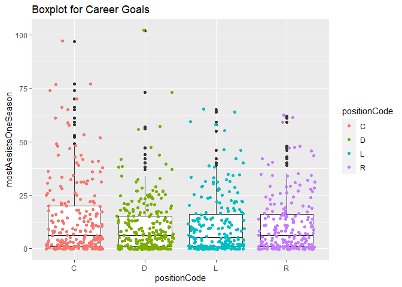

Project 1 - Hockey Vignette
================
Lucy Eckert
9/13/2020

  - [First, a list of packages used in this
    exploration:](#first-a-list-of-packages-used-in-this-exploration)
  - [Let’s dig into the API and take a look at accessing franchise
    data:](#lets-dig-into-the-api-and-take-a-look-at-accessing-franchise-data)
  - [Now that we have data, let’s use it to answer some
    questions.](#now-that-we-have-data-lets-use-it-to-answer-some-questions.)
      - [Goals by Skater Position](#goals-by-skater-position)
      - [Get stats for current teams
        only](#get-stats-for-current-teams-only)
      - [Are Pugnacious Bruins More Likely to Be High
        Scorers?](#are-pugnacious-bruins-more-likely-to-be-high-scorers)
      - [Looking at Lifetime Stats by Skater
        Position](#looking-at-lifetime-stats-by-skater-position)
      - [Does early suscess lead to career
        success?](#does-early-suscess-lead-to-career-success)
      - [What positions usually get the most
        assists?](#what-positions-usually-get-the-most-assists)

\#ST 558 Project \#1 - Exploring the NHL API with the Boston Bruins

### First, a list of packages used in this exploration:

``` r
library(tidyverse)
```

    ## -- Attaching packages --------------------------------------- tidyverse 1.3.0 --

    ## v ggplot2 3.3.2     v purrr   0.3.4
    ## v tibble  3.0.3     v dplyr   1.0.1
    ## v tidyr   1.1.1     v stringr 1.4.0
    ## v readr   1.3.1     v forcats 0.5.0

    ## -- Conflicts ------------------------------------------ tidyverse_conflicts() --
    ## x dplyr::filter() masks stats::filter()
    ## x dplyr::lag()    masks stats::lag()

``` r
library(rmarkdown)
library(httr) 
library(jsonlite)
```

    ## 
    ## Attaching package: 'jsonlite'

    ## The following object is masked from 'package:purrr':
    ## 
    ##     flatten

``` r
library(ggplot2)
library(knitr)
# rmarkdown::render("Project_1.Rmd", output_file="README.md")
```

### Let’s dig into the API and take a look at accessing franchise data:

Return Parsed Franchise Data

``` r
getFranchise <- function(name=NULL, ID=NULL){
  base_url <- "https://records.nhl.com/site/api"
  url <- paste0(base_url, "/", "franchise")
  dat <- as_tibble(fromJSON(content(GET(url),"text"),flatten = T)$data)
  if (!is.null(name)){
    dat <- dat %>% filter(teamCommonName %in% name)
  }
  if (!is.null(ID)){
  dat <- dat %>% filter(id %in% ID)
  }
  dat
}

FranchiseInfo <- getFranchise(name = "Bruins")
```

    ## No encoding supplied: defaulting to UTF-8.

``` r
FranchiseInfo
```

    ## # A tibble: 1 x 6
    ##      id firstSeasonId lastSeasonId mostRecentTeamId teamCommonName
    ##   <int>         <int>        <int>            <int> <chr>         
    ## 1     6      19241925           NA                6 Bruins        
    ## # ... with 1 more variable: teamPlaceName <chr>

Return Franchise Team Totals

``` r
getFranTotal <- function(name=NULL, ID=NULL){
  base_url <- "https://records.nhl.com/site/api"
  url <- paste0(base_url, "/", "franchise-team-totals")
  dat <- as_tibble(fromJSON(content(GET(url),"text"),flatten = T)$data)
  if (!is.null(name)){
    dat <- dat %>% filter(teamName %in% name)
  }
  if (!is.null(ID)){
    dat <- dat %>% filter(teamId %in% ID)
  }
  dat
}

FranchiseTots <- getFranTotal(ID = 6)
```

    ## No encoding supplied: defaulting to UTF-8.

``` r
FranchiseTots
```

    ## # A tibble: 2 x 30
    ##      id activeFranchise firstSeasonId franchiseId gameTypeId
    ##   <int>           <int>         <int>       <int>      <int>
    ## 1    11               1      19241925           6          2
    ## 2    12               1      19241925           6          3
    ## # ... with 25 more variables: gamesPlayed <int>, goalsAgainst <int>,
    ## #   goalsFor <int>, homeLosses <int>, homeOvertimeLosses <int>,
    ## #   homeTies <int>, homeWins <int>, lastSeasonId <int>, losses <int>,
    ## #   overtimeLosses <int>, penaltyMinutes <int>, pointPctg <dbl>,
    ## #   points <int>, roadLosses <int>, roadOvertimeLosses <int>,
    ## #   roadTies <int>, roadWins <int>, shootoutLosses <int>,
    ## #   shootoutWins <int>, shutouts <int>, teamId <int>, teamName <chr>,
    ## #   ties <int>, triCode <chr>, wins <int>

Return Franchise Season Records

``` r
getFranSeasonRecord <- function(name = NULL, ID=NULL){
  base_url <- "https://records.nhl.com/site/api"
  url <- paste0(base_url, "/", "franchise-season-records")
  if (is.null(ID)==F){
    url <- paste0(url, "?cayenneExp=franchiseId=", ID)
  }
  dat <- as_tibble(fromJSON(content(GET(url),"text"),flatten = T)$data)
  if (!is.null(name)){
    dat <- dat %>% filter(franchiseName %in% name)
  }
  if (!is.null(ID)){
    dat <- dat %>% filter(franchiseId %in% ID)
  }
  dat
}

Franch_SnsRcrds <- getFranSeasonRecord(name = "Boston Bruins")
```

    ## Warning in if (is.null(ID) == F) {: the condition has length > 1 and
    ## only the first element will be used

    ## No encoding supplied: defaulting to UTF-8.

``` r
Franch_SnsRcrds
```

    ## # A tibble: 1 x 57
    ##      id fewestGoals fewestGoalsAgai~ fewestGoalsAgai~ fewestGoalsSeas~
    ##   <int>       <int>            <int> <chr>            <chr>           
    ## 1     6         147              172 1952-53 (70)     1955-56 (70)    
    ## # ... with 52 more variables: fewestLosses <int>,
    ## #   fewestLossesSeasons <chr>, fewestPoints <int>,
    ## #   fewestPointsSeasons <chr>, fewestTies <int>,
    ## #   fewestTiesSeasons <chr>, fewestWins <int>,
    ## #   fewestWinsSeasons <chr>, franchiseId <int>, franchiseName <chr>,
    ## #   homeLossStreak <int>, homeLossStreakDates <chr>,
    ## #   homePointStreak <int>, homePointStreakDates <chr>,
    ## #   homeWinStreak <int>, homeWinStreakDates <chr>,
    ## #   homeWinlessStreak <int>, homeWinlessStreakDates <chr>,
    ## #   lossStreak <int>, lossStreakDates <chr>, mostGameGoals <int>,
    ## #   mostGameGoalsDates <chr>, mostGoals <int>,
    ## #   mostGoalsAgainst <int>, mostGoalsAgainstSeasons <chr>,
    ## #   mostGoalsSeasons <chr>, mostLosses <int>,
    ## #   mostLossesSeasons <chr>, mostPenaltyMinutes <int>,
    ## #   mostPenaltyMinutesSeasons <chr>, mostPoints <int>,
    ## #   mostPointsSeasons <chr>, mostShutouts <int>,
    ## #   mostShutoutsSeasons <chr>, mostTies <int>, mostTiesSeasons <chr>,
    ## #   mostWins <int>, mostWinsSeasons <chr>, pointStreak <int>,
    ## #   pointStreakDates <chr>, roadLossStreak <int>,
    ## #   roadLossStreakDates <chr>, roadPointStreak <int>,
    ## #   roadPointStreakDates <chr>, roadWinStreak <int>,
    ## #   roadWinStreakDates <chr>, roadWinlessStreak <int>,
    ## #   roadWinlessStreakDates <chr>, winStreak <int>,
    ## #   winStreakDates <chr>, winlessStreak <int>,
    ## #   winlessStreakDates <chr>

Return Goalie Records

``` r
getFranGoalieRecord <- function(name = NULL, ID=NULL){
  base_url <- "https://records.nhl.com/site/api"
  url <- paste0(base_url, "/", "franchise-goalie-records")
  if (is.null(ID)==F){
    url <- paste0(url, "?cayenneExp=franchiseId=", ID)
  }
  dat <- as_tibble(fromJSON(content(GET(url),"text"),flatten = T)$data)
   if (!is.null(name)){
    dat <- dat %>% filter(franchiseName %in% name)
  }
  if (!is.null(ID)){
    dat <- dat %>% filter(franchiseId %in% ID)
  }
  dat
}

Franch_GoalRcrds <- getFranGoalieRecord(name = "Boston Bruins")
```

    ## Warning in if (is.null(ID) == F) {: the condition has length > 1 and
    ## only the first element will be used

    ## No encoding supplied: defaulting to UTF-8.

``` r
Franch_GoalRcrds
```

    ## # A tibble: 51 x 29
    ##       id activePlayer firstName franchiseId franchiseName gameTypeId
    ##    <int> <lgl>        <chr>           <int> <chr>              <int>
    ##  1   247 FALSE        Gerry               6 Boston Bruins          2
    ##  2   290 FALSE        Tiny                6 Boston Bruins          2
    ##  3   300 FALSE        Eddie               6 Boston Bruins          2
    ##  4   321 TRUE         Tuukka              6 Boston Bruins          2
    ##  5   347 FALSE        Yves                6 Boston Bruins          2
    ##  6   352 FALSE        Daniel              6 Boston Bruins          2
    ##  7   356 FALSE        Craig               6 Boston Bruins          2
    ##  8   374 FALSE        Jon                 6 Boston Bruins          2
    ##  9   380 FALSE        Tim                 6 Boston Bruins          2
    ## 10   427 FALSE        Gilles              6 Boston Bruins          2
    ## # ... with 41 more rows, and 23 more variables: gamesPlayed <int>,
    ## #   lastName <chr>, losses <int>, mostGoalsAgainstDates <chr>,
    ## #   mostGoalsAgainstOneGame <int>, mostSavesDates <chr>,
    ## #   mostSavesOneGame <int>, mostShotsAgainstDates <chr>,
    ## #   mostShotsAgainstOneGame <int>, mostShutoutsOneSeason <int>,
    ## #   mostShutoutsSeasonIds <chr>, mostWinsOneSeason <int>,
    ## #   mostWinsSeasonIds <chr>, overtimeLosses <int>, playerId <int>,
    ## #   positionCode <chr>, rookieGamesPlayed <int>,
    ## #   rookieShutouts <int>, rookieWins <int>, seasons <int>,
    ## #   shutouts <int>, ties <int>, wins <int>

Return Skater Records

``` r
getFranSkaterRecord <- function(name = NULL, ID=NULL){
  base_url <- "https://records.nhl.com/site/api"
  url <- paste0(base_url, "/", "franchise-skater-records")
  if (is.null(ID)==F){
    url <- paste0(url, "?cayenneExp=franchiseId=", ID)
  }
  dat <- as_tibble(fromJSON(content(GET(url),"text"),flatten = T)$data)
  if (!is.null(name)){
    dat <- dat %>% filter(franchiseName %in% name)
  }
  if (!is.null(ID)){
    dat <- dat %>% filter(franchiseId %in% ID)
  }
  dat
}

Bruin_Sk8rRcrds <- getFranSkaterRecord(name = "Boston Bruins")
```

    ## Warning in if (is.null(ID) == F) {: the condition has length > 1 and
    ## only the first element will be used

    ## No encoding supplied: defaulting to UTF-8.

``` r
Bruin_Sk8rRcrds
```

    ## # A tibble: 910 x 30
    ##       id activePlayer assists firstName franchiseId franchiseName
    ##    <int> <lgl>          <int> <chr>           <int> <chr>        
    ##  1 16890 FALSE            794 Johnny              6 Boston Bruins
    ##  2 16892 FALSE           1111 Ray                 6 Boston Bruins
    ##  3 17027 FALSE            402 Terry               6 Boston Bruins
    ##  4 17046 FALSE            553 Phil                6 Boston Bruins
    ##  5 17078 FALSE            624 Bobby               6 Boston Bruins
    ##  6 17108 FALSE             20 Jay                 6 Boston Bruins
    ##  7 17157 FALSE            385 Ken                 6 Boston Bruins
    ##  8 17161 FALSE            496 Rick                6 Boston Bruins
    ##  9 17194 FALSE              4 Henry               6 Boston Bruins
    ## 10 17197 FALSE             20 Norm                6 Boston Bruins
    ## # ... with 900 more rows, and 24 more variables: gameTypeId <int>,
    ## #   gamesPlayed <int>, goals <int>, lastName <chr>,
    ## #   mostAssistsGameDates <chr>, mostAssistsOneGame <int>,
    ## #   mostAssistsOneSeason <int>, mostAssistsSeasonIds <chr>,
    ## #   mostGoalsGameDates <chr>, mostGoalsOneGame <int>,
    ## #   mostGoalsOneSeason <int>, mostGoalsSeasonIds <chr>,
    ## #   mostPenaltyMinutesOneSeason <int>,
    ## #   mostPenaltyMinutesSeasonIds <chr>, mostPointsGameDates <chr>,
    ## #   mostPointsOneGame <int>, mostPointsOneSeason <int>,
    ## #   mostPointsSeasonIds <chr>, penaltyMinutes <int>, playerId <int>,
    ## #   points <int>, positionCode <chr>, rookiePoints <int>,
    ## #   seasons <int>

Stats API - make a note that this only works for current teams

``` r
getStatData <- function(name = NULL, expand=NULL, season=NULL, teamID=NULL, stats=NULL){
  url <- "https://statsapi.web.nhl.com/api/v1/teams"
  if (!is.null(expand)){
    url <- paste0(url, "?expand=", expand)
  }
  if (!is.null(season)){
    url <- paste0(url, "&season=", season)
  }
  if(!is.null(teamID)){
    teams <- paste(teamID, collapse = ",")
    url <- paste0(url, "?teamId=", teams)
  }
  if(!is.null(stats)){
    url <- paste0(url, "?stats=", stats)
  }
  dat <- as_tibble(fromJSON(content(GET(url),"text"),flatten = T)$teams)
  if (!is.null(name)){
    dat <- dat %>% filter(teamName %in% name)
  }
  if (!is.null(teamID)){
    dat <- dat %>% filter(franchiseId %in% teamID)
  }
  dat
}

F <- getStatData(teamID = 6)
F
```

    ## # A tibble: 1 x 29
    ##      id name  link  abbreviation teamName locationName firstYearOfPlay
    ##   <int> <chr> <chr> <chr>        <chr>    <chr>        <chr>          
    ## 1     6 Bost~ /api~ BOS          Bruins   Boston       1924           
    ## # ... with 22 more variables: shortName <chr>, officialSiteUrl <chr>,
    ## #   franchiseId <int>, active <lgl>, venue.id <int>,
    ## #   venue.name <chr>, venue.link <chr>, venue.city <chr>,
    ## #   venue.timeZone.id <chr>, venue.timeZone.offset <int>,
    ## #   venue.timeZone.tz <chr>, division.id <int>, division.name <chr>,
    ## #   division.nameShort <chr>, division.link <chr>,
    ## #   division.abbreviation <chr>, conference.id <int>,
    ## #   conference.name <chr>, conference.link <chr>,
    ## #   franchise.franchiseId <int>, franchise.teamName <chr>,
    ## #   franchise.link <chr>

wrapper function

``` r
wrapper <- function(baseAPI="Record", EndPoint="Franchise", franID=NULL, name=NULL, 
                    expand=NULL, season=NULL, teamID=NULL, stats=NULL){
  
  if (toupper(baseAPI)=="RECORD"){
    if (grepl("SKATE", toupper(EndPoint))){
      dat <- getFranSkaterRecord(ID=franID)
    }
    else if (grepl("GOAL", toupper(EndPoint))){
      dat <- getFranGoalieRecord(ID=franID)
    }
    else if (grepl("SEASON", toupper(EndPoint))){
      dat <- getFranSeasonRecord(ID=franID)
    }
    else if (grepl("TOTAL", toupper(EndPoint))){
      dat <- getFranTotal()
    }
    else if (grepl("FRANCHISE", toupper(EndPoint))){
      dat <- getFranchise()
    }
  }
  else if (toupper(baseAPI)=="STATS"){
    dat <- getStatData(expand=expand, season=season, teamID=teamID, stats=stats)
  }
  else{
    stop("There is no function to call from different APIs")
  }
  dat
}
```

``` r
plot_col <- ggplot(data = E, aes(x = division.name))
plot_col + geom_bar() + labs(x = "Teams per Division")
```

<!-- -->

### Now that we have data, let’s use it to answer some questions.

#### Goals by Skater Position

Not knowing much about hockey, I wondered which skating position usually
scores the most goals. I used my wrapper to pull all skater records,
grouped by position, and then found the mean number of points per
season. This involved one extra step, which was creating a variable that
calculated average number of goals per season.

``` r
#what skater positions score most points
#first make new variable which is average points per season

positions <- wrapper(baseAPI="Record", EndPoint="skate", franID=NULL)
```

    ## Warning in if (is.null(ID) == F) {: the condition has length > 1 and
    ## only the first element will be used

    ## No encoding supplied: defaulting to UTF-8.

``` r
posit_andAvg <- mutate(positions, avgGls = (positions$goals/positions$seasons))
table1 <- posit_andAvg %>% group_by(positionCode) %>% summarise(Average = mean(avgGls))
```

    ## `summarise()` ungrouping output (override with `.groups` argument)

``` r
kable(table1)
```

| positionCode |  Average |
| :----------- | -------: |
| C            | 6.364477 |
| D            | 2.122197 |
| L            | 5.860032 |
| R            | 6.589049 |

#### Get stats for current teams only

First Ill the isolate only the current franchises. To do this, I’ll pull
the franchises that are included in the Endpoint that lists upcoming
games. Then, I’ll join it with season record. We now have a massive
dataset of current franchises full of lots of useful stats

``` r
C <- getStatData(expand="team.schedule.next")
new <- inner_join(C, franch_seasonRecords, by = "franchiseId")
```

#### Are Pugnacious Bruins More Likely to Be High Scorers?

``` r
correlation <- cor(Bruin_Sk8rRcrds$penaltyMinutes, Bruin_Sk8rRcrds$points)
scatter <- ggplot(Bruin_Sk8rRcrds, aes(x = penaltyMinutes, y = points))
scatter + geom_point() + geom_smooth(method = lm, color = "yellow") + 
  geom_text(x = 1500, y = 1250, size = 5, label = paste0("Correlation = ", 
          round(correlation, 2))) + ylab("Total Career Points") + xlab("Total Career Penalty Minutes") +ggtitle("Correlation Between Career Points and Penalty Minutes")
```

    ## `geom_smooth()` using formula 'y ~ x'

<!-- -->

#### Looking at Lifetime Stats by Skater Position

``` r
Bruin_Rcrds <- getFranSkaterRecord(name = "Boston Bruins")
```

    ## Warning in if (is.null(ID) == F) {: the condition has length > 1 and
    ## only the first element will be used

    ## No encoding supplied: defaulting to UTF-8.

``` r
selectBruins <- Bruin_Rcrds %>% select(penaltyMinutes, goals, seasons, assists, positionCode)
bruinstable <- function(position){
  data <- selectBruins %>% filter(positionCode == position) %>% select(-positionCode)
  kable(apply(data, 2, summary), caption = paste("Summary of Position", position), 
        digit = 1)
}
bruinstable("C")
```

|         | penaltyMinutes | goals | seasons | assists |
| :------ | -------------: | ----: | ------: | ------: |
| Min.    |            0.0 |   0.0 |     1.0 |     0.0 |
| 1st Qu. |            4.0 |   0.0 |     1.0 |     1.0 |
| Median  |           20.0 |   5.0 |     2.0 |     8.0 |
| Mean    |           64.8 |  28.4 |     2.7 |    42.3 |
| 3rd Qu. |           72.0 |  24.0 |     4.0 |    36.0 |
| Max.    |          744.0 | 459.0 |    16.0 |   553.0 |

Summary of Position C

``` r
bruinstable("D")
```

|         | penaltyMinutes | goals | seasons | assists |
| :------ | -------------: | ----: | ------: | ------: |
| Min.    |            0.0 |   0.0 |     1.0 |     0.0 |
| 1st Qu. |            6.0 |   0.0 |     1.0 |     1.0 |
| Median  |           38.5 |   2.0 |     2.0 |     7.5 |
| Mean    |          129.3 |  11.5 |     3.1 |    34.0 |
| 3rd Qu. |          152.2 |   9.0 |     3.0 |    27.0 |
| Max.    |         1552.0 | 395.0 |    21.0 |  1111.0 |

Summary of Position D

``` r
bruinstable("L")
```

|         | penaltyMinutes | goals | seasons | assists |
| :------ | -------------: | ----: | ------: | ------: |
| Min.    |            0.0 |   0.0 |     1.0 |     0.0 |
| 1st Qu. |            4.0 |   1.0 |     1.0 |     1.0 |
| Median  |           25.0 |   5.0 |     2.0 |     7.0 |
| Mean    |           87.5 |  25.8 |     2.8 |    33.5 |
| 3rd Qu. |           80.0 |  25.0 |     3.0 |    26.0 |
| Max.    |         1039.0 | 545.0 |    21.0 |   794.0 |

Summary of Position L

``` r
bruinstable("R")
```

|         | penaltyMinutes | goals | seasons | assists |
| :------ | -------------: | ----: | ------: | ------: |
| Min.    |            0.0 |   0.0 |     1.0 |     0.0 |
| 1st Qu. |            4.0 |   0.0 |     1.0 |     1.0 |
| Median  |           23.0 |   6.0 |     2.0 |     7.0 |
| Mean    |           92.2 |  28.3 |     2.7 |    33.3 |
| 3rd Qu. |           84.5 |  26.0 |     3.0 |    24.2 |
| Max.    |         2095.0 | 402.0 |    20.0 |   496.0 |

Summary of Position R

#### Does early suscess lead to career success?

We can see that the majority of players are average caliber (average on
the Bruins still being an amazing athlete\!), but that the players with
“High” - over 41 rookie points, more likely to Rockstar players during
their careers.

``` r
tbl1 <- table(Bruin_Sk8rRcrds$goals, Bruin_Sk8rRcrds$rookiePoints, Bruin_Sk8rRcrds$positionCode)
kable(tbl1[,,1], caption = "Centers")
```

|     |  0 | 1 | 2 | 3 | 4 | 5 | 6 | 7 | 8 | 9 | 10 | 11 | 12 | 13 | 14 | 15 | 16 | 17 | 18 | 19 | 20 | 21 | 22 | 23 | 24 | 25 | 26 | 27 | 28 | 29 | 30 | 31 | 32 | 33 | 34 | 35 | 36 | 37 | 39 | 40 | 41 | 42 | 43 | 45 | 46 | 47 | 49 | 50 | 51 | 56 | 59 | 62 | 65 | 69 | 92 | 102 |
| :-- | -: | -: | -: | -: | -: | -: | -: | -: | -: | -: | -: | -: | -: | -: | -: | -: | -: | -: | -: | -: | -: | -: | -: | -: | -: | -: | -: | -: | -: | -: | -: | -: | -: | -: | -: | -: | -: | -: | -: | -: | -: | -: | -: | -: | -: | -: | -: | -: | -: | -: | -: | -: | -: | -: | -: | --: |
| 0   | 25 | 7 | 3 | 2 | 0 | 0 | 0 | 0 | 0 | 0 |  0 |  0 |  0 |  0 |  0 |  0 |  0 |  0 |  0 |  0 |  0 |  0 |  0 |  0 |  0 |  0 |  0 |  0 |  0 |  0 |  0 |  0 |  0 |  0 |  0 |  0 |  0 |  0 |  0 |  0 |  0 |  0 |  0 |  0 |  0 |  0 |  0 |  0 |  0 |  0 |  0 |  0 |  0 |  0 |  0 |   0 |
| 1   |  1 | 4 | 2 | 1 | 2 | 1 | 0 | 0 | 0 | 0 |  0 |  0 |  0 |  0 |  0 |  0 |  0 |  0 |  0 |  0 |  0 |  0 |  0 |  0 |  0 |  0 |  0 |  0 |  0 |  0 |  0 |  0 |  0 |  0 |  0 |  0 |  0 |  0 |  0 |  0 |  0 |  0 |  0 |  0 |  0 |  0 |  0 |  0 |  0 |  0 |  0 |  0 |  0 |  0 |  0 |   0 |
| 2   |  0 | 0 | 2 | 2 | 1 | 0 | 0 | 1 | 0 | 0 |  0 |  0 |  0 |  0 |  0 |  0 |  0 |  0 |  0 |  0 |  0 |  0 |  0 |  0 |  0 |  0 |  0 |  0 |  0 |  0 |  0 |  0 |  0 |  0 |  0 |  0 |  0 |  0 |  0 |  0 |  0 |  0 |  0 |  0 |  0 |  0 |  0 |  0 |  0 |  0 |  0 |  0 |  0 |  0 |  0 |   0 |
| 3   |  0 | 0 | 0 | 0 | 2 | 0 | 0 | 0 | 0 | 1 |  0 |  0 |  0 |  0 |  0 |  0 |  0 |  0 |  0 |  0 |  0 |  0 |  0 |  0 |  0 |  0 |  0 |  0 |  0 |  0 |  0 |  0 |  0 |  0 |  0 |  0 |  0 |  0 |  0 |  0 |  0 |  0 |  0 |  0 |  0 |  0 |  0 |  0 |  0 |  0 |  0 |  0 |  0 |  0 |  0 |   0 |
| 4   |  0 | 0 | 0 | 0 | 2 | 0 | 2 | 0 | 2 | 0 |  0 |  0 |  0 |  0 |  0 |  0 |  0 |  0 |  0 |  1 |  0 |  0 |  0 |  0 |  0 |  0 |  0 |  0 |  0 |  0 |  0 |  0 |  0 |  0 |  0 |  0 |  0 |  0 |  0 |  0 |  0 |  0 |  0 |  0 |  0 |  0 |  0 |  0 |  0 |  0 |  0 |  0 |  0 |  0 |  0 |   0 |
| 5   |  0 | 0 | 0 | 0 | 0 | 1 | 1 | 0 | 0 | 0 |  1 |  0 |  0 |  1 |  0 |  1 |  0 |  0 |  0 |  0 |  0 |  0 |  0 |  0 |  0 |  0 |  0 |  0 |  0 |  0 |  0 |  0 |  0 |  0 |  0 |  0 |  0 |  0 |  0 |  0 |  0 |  0 |  0 |  0 |  0 |  0 |  0 |  0 |  0 |  0 |  0 |  0 |  0 |  0 |  0 |   0 |
| 6   |  0 | 0 | 0 | 0 | 1 | 0 | 0 | 1 | 0 | 0 |  1 |  0 |  0 |  0 |  0 |  0 |  0 |  0 |  0 |  0 |  0 |  0 |  0 |  0 |  0 |  0 |  0 |  0 |  0 |  0 |  0 |  0 |  0 |  0 |  0 |  0 |  0 |  0 |  0 |  0 |  0 |  0 |  0 |  0 |  0 |  0 |  0 |  0 |  0 |  0 |  0 |  0 |  0 |  0 |  0 |   0 |
| 7   |  0 | 0 | 0 | 1 | 0 | 0 | 0 | 0 | 0 | 0 |  1 |  0 |  0 |  0 |  0 |  0 |  1 |  1 |  0 |  0 |  0 |  0 |  0 |  0 |  0 |  1 |  0 |  0 |  0 |  0 |  0 |  0 |  0 |  0 |  0 |  0 |  0 |  0 |  0 |  0 |  0 |  0 |  0 |  0 |  0 |  0 |  0 |  0 |  0 |  0 |  0 |  0 |  0 |  0 |  0 |   0 |
| 8   |  1 | 0 | 0 | 0 | 0 | 0 | 0 | 0 | 0 | 0 |  0 |  0 |  0 |  0 |  0 |  0 |  0 |  1 |  0 |  0 |  1 |  0 |  0 |  1 |  0 |  0 |  0 |  0 |  0 |  0 |  0 |  0 |  0 |  0 |  0 |  0 |  0 |  0 |  0 |  0 |  0 |  0 |  0 |  0 |  0 |  0 |  0 |  0 |  0 |  0 |  0 |  0 |  0 |  0 |  0 |   0 |
| 9   |  0 | 0 | 1 | 0 | 0 | 0 | 0 | 0 | 0 | 0 |  0 |  0 |  0 |  0 |  1 |  0 |  1 |  0 |  0 |  0 |  0 |  0 |  0 |  0 |  0 |  0 |  0 |  0 |  0 |  0 |  0 |  0 |  0 |  0 |  0 |  0 |  0 |  0 |  0 |  0 |  0 |  0 |  0 |  0 |  0 |  0 |  0 |  0 |  0 |  0 |  0 |  0 |  0 |  0 |  0 |   0 |
| 10  |  0 | 0 | 0 | 0 | 0 | 0 | 0 | 0 | 0 | 0 |  0 |  0 |  0 |  0 |  0 |  0 |  0 |  0 |  0 |  0 |  0 |  1 |  0 |  0 |  0 |  0 |  0 |  0 |  0 |  0 |  0 |  0 |  0 |  0 |  0 |  0 |  0 |  0 |  0 |  0 |  0 |  0 |  0 |  0 |  0 |  0 |  0 |  0 |  0 |  0 |  0 |  0 |  0 |  0 |  0 |   0 |
| 11  |  0 | 0 | 0 | 0 | 0 | 0 | 0 | 0 | 0 | 1 |  0 |  0 |  1 |  0 |  0 |  0 |  0 |  0 |  0 |  1 |  0 |  0 |  0 |  0 |  0 |  0 |  0 |  0 |  0 |  0 |  0 |  0 |  0 |  0 |  0 |  0 |  0 |  0 |  0 |  0 |  0 |  0 |  0 |  0 |  0 |  0 |  0 |  0 |  0 |  0 |  0 |  0 |  0 |  0 |  0 |   0 |
| 12  |  0 | 0 | 0 | 0 | 0 | 0 | 0 | 0 | 0 | 0 |  0 |  0 |  0 |  0 |  0 |  0 |  0 |  0 |  0 |  0 |  0 |  0 |  0 |  0 |  0 |  0 |  0 |  0 |  0 |  0 |  0 |  0 |  0 |  0 |  0 |  0 |  0 |  0 |  0 |  0 |  0 |  0 |  0 |  0 |  0 |  0 |  0 |  0 |  0 |  0 |  0 |  0 |  0 |  0 |  0 |   0 |
| 13  |  0 | 0 | 0 | 0 | 0 | 0 | 0 | 0 | 0 | 0 |  0 |  0 |  0 |  0 |  0 |  0 |  1 |  0 |  0 |  0 |  1 |  0 |  0 |  0 |  0 |  0 |  0 |  0 |  0 |  0 |  0 |  0 |  0 |  0 |  0 |  0 |  0 |  0 |  0 |  0 |  0 |  0 |  0 |  0 |  0 |  0 |  0 |  0 |  0 |  0 |  0 |  0 |  0 |  0 |  0 |   0 |
| 14  |  0 | 0 | 0 | 0 | 0 | 0 | 0 | 0 | 0 | 1 |  0 |  0 |  0 |  0 |  0 |  0 |  0 |  0 |  0 |  0 |  0 |  0 |  0 |  0 |  0 |  0 |  0 |  0 |  0 |  0 |  0 |  0 |  0 |  0 |  0 |  0 |  0 |  0 |  0 |  0 |  0 |  0 |  0 |  0 |  0 |  0 |  0 |  0 |  0 |  0 |  0 |  0 |  0 |  0 |  0 |   0 |
| 15  |  0 | 0 | 0 | 0 | 0 | 0 | 0 | 0 | 0 | 0 |  0 |  0 |  0 |  0 |  0 |  0 |  0 |  0 |  0 |  0 |  0 |  0 |  0 |  0 |  1 |  0 |  0 |  0 |  1 |  0 |  0 |  0 |  0 |  0 |  0 |  0 |  0 |  0 |  0 |  0 |  0 |  0 |  0 |  0 |  0 |  0 |  0 |  0 |  0 |  0 |  0 |  0 |  0 |  0 |  0 |   0 |
| 16  |  0 | 0 | 0 | 0 | 0 | 0 | 0 | 0 | 0 | 0 |  0 |  0 |  0 |  0 |  0 |  0 |  0 |  0 |  0 |  0 |  0 |  0 |  0 |  0 |  0 |  0 |  0 |  0 |  0 |  0 |  0 |  0 |  0 |  0 |  0 |  0 |  0 |  0 |  0 |  0 |  1 |  0 |  0 |  0 |  0 |  0 |  0 |  0 |  0 |  0 |  0 |  0 |  0 |  0 |  0 |   0 |
| 17  |  0 | 0 | 0 | 0 | 0 | 0 | 0 | 0 | 0 | 0 |  0 |  1 |  0 |  0 |  0 |  0 |  0 |  0 |  0 |  0 |  0 |  0 |  0 |  0 |  0 |  0 |  0 |  0 |  0 |  0 |  0 |  0 |  0 |  0 |  0 |  0 |  0 |  0 |  0 |  0 |  0 |  0 |  0 |  0 |  1 |  0 |  0 |  0 |  0 |  0 |  0 |  0 |  0 |  0 |  0 |   0 |
| 18  |  1 | 0 | 0 | 0 | 0 | 1 | 0 | 0 | 0 | 0 |  0 |  0 |  0 |  0 |  0 |  0 |  0 |  0 |  0 |  0 |  0 |  0 |  0 |  0 |  0 |  0 |  0 |  0 |  0 |  0 |  0 |  0 |  0 |  0 |  0 |  0 |  0 |  0 |  0 |  0 |  0 |  0 |  0 |  0 |  0 |  0 |  0 |  0 |  0 |  0 |  0 |  0 |  0 |  0 |  0 |   0 |
| 19  |  0 | 1 | 0 | 0 | 0 | 0 | 0 | 0 | 0 | 0 |  0 |  0 |  0 |  0 |  0 |  0 |  0 |  0 |  0 |  0 |  0 |  0 |  0 |  0 |  0 |  0 |  0 |  0 |  0 |  0 |  0 |  0 |  0 |  0 |  0 |  0 |  0 |  0 |  0 |  0 |  0 |  0 |  0 |  0 |  0 |  0 |  0 |  0 |  0 |  0 |  0 |  0 |  0 |  0 |  0 |   0 |
| 20  |  0 | 0 | 0 | 0 | 0 | 0 | 0 | 0 | 0 | 0 |  0 |  1 |  0 |  0 |  1 |  0 |  0 |  0 |  0 |  0 |  0 |  0 |  1 |  0 |  0 |  0 |  0 |  0 |  0 |  0 |  0 |  0 |  0 |  0 |  0 |  0 |  0 |  0 |  0 |  0 |  0 |  0 |  0 |  0 |  0 |  0 |  0 |  0 |  0 |  0 |  0 |  0 |  0 |  0 |  0 |   0 |
| 21  |  0 | 0 | 0 | 0 | 0 | 0 | 0 | 0 | 0 | 0 |  0 |  0 |  0 |  0 |  0 |  0 |  0 |  0 |  0 |  0 |  0 |  0 |  0 |  0 |  0 |  0 |  0 |  0 |  0 |  0 |  0 |  0 |  0 |  0 |  0 |  0 |  0 |  0 |  0 |  0 |  0 |  0 |  0 |  0 |  0 |  0 |  0 |  0 |  0 |  0 |  0 |  0 |  0 |  0 |  0 |   0 |
| 22  |  0 | 0 | 0 | 0 | 0 | 0 | 0 | 0 | 0 | 0 |  0 |  0 |  0 |  0 |  0 |  0 |  0 |  0 |  0 |  0 |  0 |  0 |  0 |  0 |  0 |  0 |  0 |  0 |  0 |  0 |  0 |  0 |  0 |  0 |  0 |  0 |  0 |  0 |  0 |  0 |  0 |  0 |  0 |  0 |  0 |  0 |  0 |  0 |  0 |  0 |  0 |  0 |  0 |  0 |  0 |   0 |
| 23  |  0 | 0 | 0 | 0 | 0 | 0 | 0 | 0 | 0 | 0 |  0 |  0 |  0 |  0 |  0 |  0 |  0 |  0 |  0 |  1 |  0 |  0 |  0 |  0 |  0 |  0 |  0 |  0 |  0 |  0 |  0 |  0 |  0 |  0 |  0 |  0 |  0 |  0 |  0 |  0 |  0 |  0 |  0 |  0 |  0 |  0 |  0 |  0 |  0 |  0 |  0 |  0 |  0 |  0 |  0 |   0 |
| 24  |  1 | 0 | 0 | 0 | 0 | 0 | 0 | 0 | 0 | 0 |  0 |  0 |  0 |  0 |  1 |  0 |  0 |  0 |  0 |  0 |  0 |  0 |  0 |  0 |  0 |  0 |  0 |  0 |  0 |  0 |  0 |  0 |  0 |  0 |  0 |  0 |  0 |  0 |  0 |  0 |  0 |  0 |  0 |  0 |  0 |  0 |  0 |  0 |  0 |  0 |  0 |  0 |  0 |  0 |  0 |   0 |
| 25  |  0 | 0 | 0 | 0 | 0 | 0 | 0 | 0 | 0 | 0 |  0 |  0 |  0 |  0 |  0 |  0 |  0 |  0 |  0 |  0 |  1 |  0 |  0 |  0 |  0 |  0 |  0 |  0 |  0 |  0 |  0 |  0 |  0 |  0 |  0 |  0 |  0 |  0 |  0 |  0 |  0 |  0 |  0 |  0 |  0 |  0 |  0 |  0 |  0 |  0 |  0 |  0 |  0 |  0 |  0 |   0 |
| 26  |  0 | 0 | 0 | 0 | 0 | 0 | 0 | 0 | 0 | 0 |  0 |  0 |  0 |  1 |  0 |  0 |  0 |  0 |  0 |  0 |  0 |  0 |  0 |  0 |  0 |  0 |  0 |  0 |  0 |  0 |  0 |  0 |  0 |  0 |  0 |  0 |  0 |  0 |  0 |  0 |  0 |  0 |  0 |  0 |  0 |  0 |  0 |  0 |  0 |  0 |  0 |  0 |  0 |  0 |  0 |   0 |
| 27  |  0 | 0 | 0 | 0 | 0 | 0 | 0 | 0 | 0 | 0 |  0 |  0 |  0 |  0 |  0 |  0 |  0 |  0 |  0 |  0 |  0 |  1 |  0 |  0 |  0 |  0 |  0 |  0 |  0 |  0 |  0 |  0 |  0 |  0 |  0 |  0 |  0 |  0 |  0 |  0 |  0 |  0 |  0 |  0 |  0 |  0 |  0 |  0 |  0 |  0 |  0 |  0 |  0 |  0 |  0 |   0 |
| 28  |  0 | 0 | 0 | 0 | 0 | 0 | 0 | 0 | 0 | 0 |  0 |  0 |  0 |  0 |  0 |  0 |  0 |  0 |  0 |  0 |  0 |  0 |  0 |  0 |  0 |  0 |  0 |  0 |  0 |  0 |  0 |  0 |  0 |  0 |  0 |  0 |  0 |  0 |  0 |  0 |  0 |  0 |  0 |  0 |  0 |  0 |  0 |  0 |  0 |  0 |  0 |  0 |  0 |  0 |  0 |   0 |
| 29  |  0 | 0 | 0 | 0 | 0 | 0 | 0 | 0 | 0 | 0 |  0 |  0 |  0 |  0 |  0 |  0 |  0 |  0 |  0 |  0 |  0 |  0 |  0 |  0 |  0 |  0 |  0 |  0 |  0 |  0 |  0 |  0 |  0 |  0 |  0 |  0 |  0 |  0 |  0 |  0 |  0 |  0 |  0 |  0 |  0 |  0 |  0 |  0 |  0 |  0 |  0 |  0 |  0 |  0 |  0 |   0 |
| 30  |  0 | 0 | 0 | 0 | 0 | 0 | 0 | 0 | 0 | 0 |  0 |  0 |  0 |  0 |  0 |  0 |  0 |  0 |  0 |  0 |  0 |  0 |  0 |  0 |  0 |  0 |  0 |  0 |  0 |  0 |  0 |  0 |  0 |  0 |  0 |  0 |  0 |  0 |  0 |  0 |  0 |  0 |  0 |  0 |  0 |  0 |  0 |  0 |  0 |  0 |  0 |  0 |  0 |  0 |  0 |   0 |
| 31  |  0 | 0 | 0 | 0 | 0 | 0 | 0 | 0 | 0 | 0 |  0 |  0 |  0 |  0 |  0 |  0 |  0 |  0 |  0 |  0 |  0 |  0 |  0 |  0 |  0 |  0 |  0 |  0 |  0 |  0 |  0 |  0 |  0 |  0 |  0 |  0 |  0 |  0 |  0 |  0 |  0 |  0 |  0 |  0 |  0 |  0 |  0 |  0 |  0 |  0 |  0 |  0 |  0 |  0 |  0 |   0 |
| 32  |  0 | 0 | 0 | 0 | 0 | 0 | 0 | 0 | 0 | 0 |  0 |  0 |  0 |  0 |  0 |  0 |  0 |  0 |  0 |  0 |  0 |  0 |  0 |  0 |  0 |  0 |  0 |  0 |  0 |  0 |  0 |  0 |  0 |  0 |  0 |  0 |  0 |  0 |  0 |  0 |  0 |  0 |  0 |  0 |  0 |  0 |  0 |  0 |  0 |  0 |  0 |  0 |  0 |  0 |  0 |   0 |
| 33  |  0 | 0 | 0 | 0 | 0 | 0 | 0 | 0 | 0 | 0 |  0 |  0 |  0 |  0 |  0 |  0 |  0 |  0 |  0 |  0 |  0 |  0 |  0 |  0 |  0 |  0 |  0 |  0 |  0 |  0 |  0 |  0 |  0 |  0 |  0 |  0 |  0 |  0 |  0 |  0 |  0 |  0 |  0 |  0 |  0 |  0 |  0 |  0 |  0 |  0 |  0 |  0 |  0 |  0 |  0 |   0 |
| 34  |  0 | 0 | 0 | 0 | 0 | 0 | 0 | 0 | 0 | 0 |  0 |  0 |  0 |  0 |  0 |  0 |  0 |  0 |  0 |  0 |  0 |  0 |  0 |  0 |  0 |  0 |  0 |  0 |  0 |  0 |  0 |  0 |  0 |  0 |  0 |  0 |  0 |  0 |  0 |  0 |  0 |  0 |  0 |  0 |  0 |  0 |  0 |  0 |  0 |  0 |  0 |  0 |  0 |  0 |  0 |   0 |
| 35  |  0 | 0 | 0 | 0 | 0 | 0 | 0 | 0 | 0 | 0 |  0 |  0 |  0 |  0 |  0 |  0 |  0 |  0 |  0 |  0 |  0 |  0 |  0 |  0 |  0 |  0 |  0 |  0 |  0 |  0 |  0 |  0 |  0 |  0 |  0 |  0 |  0 |  0 |  0 |  0 |  0 |  0 |  0 |  0 |  0 |  0 |  0 |  0 |  0 |  0 |  0 |  0 |  0 |  0 |  0 |   0 |
| 36  |  0 | 0 | 0 | 0 | 0 | 0 | 0 | 0 | 0 | 0 |  0 |  0 |  0 |  0 |  0 |  0 |  0 |  0 |  0 |  0 |  0 |  0 |  0 |  0 |  0 |  0 |  0 |  0 |  0 |  0 |  0 |  0 |  0 |  0 |  0 |  0 |  0 |  0 |  0 |  0 |  0 |  0 |  0 |  0 |  0 |  0 |  0 |  0 |  0 |  0 |  1 |  0 |  0 |  0 |  0 |   0 |
| 37  |  1 | 0 | 0 | 0 | 0 | 0 | 0 | 0 | 0 | 0 |  0 |  0 |  0 |  0 |  0 |  0 |  0 |  0 |  0 |  0 |  0 |  0 |  0 |  0 |  0 |  0 |  0 |  0 |  0 |  0 |  0 |  0 |  0 |  0 |  0 |  0 |  0 |  0 |  0 |  0 |  0 |  0 |  0 |  0 |  0 |  0 |  0 |  0 |  0 |  0 |  0 |  0 |  0 |  0 |  0 |   0 |
| 38  |  0 | 0 | 0 | 0 | 0 | 0 | 0 | 0 | 0 | 0 |  0 |  0 |  0 |  0 |  0 |  0 |  0 |  0 |  0 |  0 |  0 |  0 |  0 |  0 |  0 |  0 |  0 |  0 |  0 |  0 |  0 |  0 |  0 |  0 |  0 |  0 |  0 |  0 |  0 |  0 |  0 |  0 |  0 |  0 |  0 |  0 |  0 |  0 |  0 |  0 |  0 |  0 |  0 |  0 |  0 |   0 |
| 39  |  0 | 0 | 0 | 0 | 0 | 0 | 0 | 0 | 0 | 0 |  0 |  0 |  0 |  0 |  0 |  0 |  0 |  0 |  0 |  0 |  0 |  0 |  0 |  0 |  0 |  0 |  0 |  0 |  0 |  0 |  0 |  0 |  0 |  0 |  0 |  0 |  0 |  0 |  0 |  0 |  0 |  0 |  0 |  0 |  0 |  0 |  0 |  0 |  0 |  0 |  0 |  0 |  0 |  0 |  0 |   0 |
| 40  |  0 | 0 | 0 | 0 | 0 | 0 | 0 | 0 | 0 | 0 |  0 |  0 |  0 |  0 |  0 |  0 |  0 |  0 |  0 |  0 |  0 |  0 |  0 |  0 |  0 |  0 |  0 |  0 |  0 |  0 |  0 |  0 |  0 |  0 |  0 |  0 |  0 |  0 |  0 |  0 |  0 |  0 |  0 |  0 |  0 |  0 |  0 |  0 |  0 |  0 |  0 |  0 |  0 |  0 |  0 |   0 |
| 41  |  0 | 0 | 0 | 0 | 0 | 0 | 0 | 0 | 0 | 0 |  0 |  0 |  0 |  0 |  0 |  0 |  0 |  0 |  1 |  0 |  0 |  0 |  0 |  0 |  0 |  0 |  0 |  0 |  0 |  0 |  0 |  0 |  0 |  0 |  0 |  0 |  0 |  0 |  0 |  0 |  0 |  0 |  0 |  0 |  0 |  0 |  0 |  0 |  0 |  0 |  0 |  0 |  0 |  0 |  0 |   0 |
| 42  |  0 | 0 | 0 | 0 | 0 | 0 | 0 | 0 | 0 | 0 |  0 |  0 |  0 |  0 |  0 |  0 |  0 |  0 |  0 |  0 |  0 |  0 |  0 |  0 |  0 |  0 |  0 |  0 |  0 |  0 |  0 |  0 |  0 |  0 |  0 |  0 |  0 |  0 |  0 |  0 |  0 |  0 |  0 |  0 |  0 |  0 |  0 |  0 |  0 |  0 |  0 |  0 |  0 |  0 |  0 |   0 |
| 43  |  0 | 0 | 0 | 0 | 0 | 0 | 0 | 0 | 0 | 0 |  0 |  0 |  0 |  0 |  0 |  0 |  0 |  0 |  0 |  0 |  0 |  0 |  0 |  0 |  0 |  0 |  0 |  0 |  0 |  0 |  0 |  0 |  0 |  0 |  0 |  0 |  0 |  0 |  0 |  0 |  0 |  0 |  0 |  0 |  0 |  0 |  0 |  0 |  0 |  0 |  0 |  0 |  0 |  0 |  0 |   0 |
| 44  |  0 | 0 | 0 | 0 | 0 | 0 | 0 | 0 | 0 | 0 |  0 |  0 |  0 |  0 |  0 |  0 |  0 |  0 |  0 |  0 |  0 |  0 |  0 |  0 |  0 |  0 |  0 |  0 |  1 |  0 |  0 |  0 |  0 |  0 |  0 |  0 |  0 |  0 |  0 |  0 |  0 |  0 |  0 |  0 |  0 |  0 |  0 |  0 |  0 |  0 |  0 |  0 |  0 |  0 |  0 |   0 |
| 47  |  0 | 0 | 0 | 0 | 0 | 0 | 0 | 0 | 0 | 0 |  0 |  0 |  0 |  0 |  0 |  0 |  0 |  0 |  0 |  0 |  0 |  0 |  0 |  0 |  0 |  0 |  0 |  0 |  0 |  0 |  0 |  0 |  0 |  0 |  0 |  0 |  0 |  0 |  0 |  0 |  0 |  0 |  0 |  0 |  0 |  0 |  0 |  0 |  0 |  0 |  0 |  0 |  0 |  0 |  0 |   0 |
| 48  |  0 | 0 | 0 | 0 | 0 | 0 | 0 | 0 | 0 | 0 |  0 |  0 |  1 |  0 |  0 |  0 |  0 |  0 |  0 |  0 |  0 |  0 |  0 |  0 |  0 |  0 |  0 |  0 |  0 |  0 |  0 |  0 |  0 |  0 |  0 |  0 |  0 |  0 |  0 |  0 |  0 |  0 |  0 |  0 |  0 |  0 |  0 |  0 |  0 |  0 |  0 |  0 |  0 |  0 |  0 |   0 |
| 49  |  0 | 0 | 0 | 0 | 0 | 0 | 0 | 0 | 0 | 0 |  0 |  0 |  0 |  0 |  0 |  0 |  0 |  0 |  0 |  0 |  0 |  0 |  0 |  0 |  0 |  0 |  0 |  0 |  0 |  0 |  0 |  0 |  0 |  0 |  0 |  0 |  0 |  0 |  0 |  0 |  0 |  0 |  0 |  0 |  0 |  0 |  0 |  0 |  0 |  0 |  0 |  0 |  0 |  0 |  0 |   0 |
| 50  |  0 | 0 | 0 | 0 | 0 | 0 | 0 | 0 | 0 | 0 |  0 |  0 |  0 |  0 |  0 |  0 |  0 |  0 |  0 |  0 |  0 |  0 |  0 |  0 |  0 |  0 |  0 |  0 |  0 |  0 |  0 |  0 |  0 |  0 |  0 |  0 |  0 |  0 |  0 |  0 |  0 |  0 |  0 |  0 |  0 |  0 |  0 |  0 |  1 |  0 |  0 |  0 |  0 |  0 |  0 |   0 |
| 51  |  0 | 0 | 0 | 0 | 0 | 0 | 0 | 0 | 0 | 0 |  0 |  0 |  0 |  0 |  0 |  0 |  0 |  0 |  0 |  0 |  0 |  0 |  0 |  0 |  0 |  0 |  0 |  0 |  0 |  0 |  0 |  0 |  0 |  0 |  0 |  0 |  0 |  0 |  0 |  0 |  0 |  0 |  0 |  0 |  0 |  0 |  0 |  0 |  0 |  0 |  0 |  0 |  1 |  0 |  0 |   1 |
| 52  |  0 | 0 | 0 | 0 | 0 | 0 | 0 | 0 | 0 | 0 |  0 |  0 |  0 |  0 |  0 |  0 |  0 |  0 |  0 |  0 |  0 |  0 |  0 |  0 |  0 |  0 |  0 |  0 |  0 |  0 |  1 |  0 |  0 |  0 |  0 |  0 |  0 |  0 |  0 |  0 |  0 |  0 |  0 |  0 |  0 |  0 |  0 |  0 |  0 |  0 |  0 |  0 |  0 |  0 |  0 |   0 |
| 53  |  0 | 0 | 0 | 0 | 0 | 0 | 0 | 0 | 0 | 0 |  0 |  0 |  0 |  0 |  0 |  0 |  0 |  0 |  0 |  0 |  0 |  0 |  0 |  0 |  0 |  0 |  0 |  0 |  0 |  0 |  0 |  0 |  0 |  0 |  0 |  0 |  0 |  0 |  0 |  0 |  0 |  0 |  0 |  0 |  0 |  0 |  0 |  0 |  0 |  0 |  0 |  0 |  0 |  0 |  0 |   0 |
| 54  |  0 | 0 | 0 | 0 | 0 | 0 | 0 | 0 | 0 | 0 |  0 |  0 |  0 |  0 |  0 |  0 |  0 |  0 |  0 |  0 |  0 |  0 |  0 |  0 |  0 |  0 |  0 |  0 |  0 |  0 |  0 |  0 |  0 |  0 |  0 |  0 |  0 |  0 |  0 |  0 |  0 |  0 |  0 |  0 |  0 |  0 |  0 |  0 |  0 |  0 |  0 |  0 |  0 |  0 |  0 |   0 |
| 55  |  0 | 0 | 0 | 0 | 0 | 0 | 0 | 0 | 0 | 0 |  0 |  0 |  0 |  0 |  0 |  0 |  0 |  0 |  0 |  0 |  0 |  0 |  0 |  0 |  0 |  0 |  0 |  0 |  0 |  0 |  0 |  0 |  0 |  0 |  0 |  0 |  0 |  0 |  0 |  1 |  0 |  0 |  0 |  0 |  0 |  0 |  0 |  0 |  0 |  0 |  0 |  0 |  0 |  0 |  0 |   0 |
| 56  |  0 | 0 | 0 | 0 | 0 | 0 | 0 | 0 | 0 | 0 |  0 |  0 |  0 |  0 |  1 |  0 |  0 |  0 |  0 |  0 |  0 |  0 |  1 |  0 |  0 |  0 |  0 |  0 |  0 |  0 |  0 |  0 |  0 |  0 |  0 |  0 |  0 |  0 |  0 |  0 |  0 |  0 |  0 |  0 |  0 |  0 |  0 |  0 |  0 |  0 |  0 |  0 |  0 |  0 |  0 |   0 |
| 57  |  0 | 0 | 0 | 0 | 0 | 0 | 0 | 0 | 0 | 0 |  0 |  0 |  0 |  0 |  0 |  0 |  0 |  0 |  0 |  0 |  0 |  0 |  0 |  0 |  0 |  0 |  0 |  0 |  0 |  0 |  0 |  0 |  0 |  0 |  0 |  0 |  0 |  0 |  0 |  0 |  0 |  0 |  0 |  0 |  0 |  0 |  0 |  0 |  0 |  0 |  0 |  0 |  0 |  0 |  0 |   0 |
| 58  |  0 | 0 | 0 | 0 | 0 | 0 | 0 | 0 | 0 | 0 |  0 |  0 |  0 |  0 |  0 |  0 |  0 |  0 |  0 |  0 |  0 |  0 |  0 |  0 |  0 |  0 |  0 |  0 |  0 |  0 |  0 |  0 |  0 |  0 |  0 |  0 |  0 |  0 |  0 |  0 |  0 |  0 |  0 |  0 |  0 |  0 |  0 |  0 |  0 |  0 |  0 |  0 |  0 |  0 |  0 |   0 |
| 60  |  0 | 0 | 0 | 0 | 0 | 0 | 0 | 0 | 0 | 0 |  0 |  0 |  0 |  0 |  0 |  0 |  0 |  0 |  0 |  0 |  0 |  0 |  0 |  0 |  0 |  0 |  0 |  0 |  0 |  0 |  0 |  0 |  0 |  0 |  0 |  0 |  0 |  0 |  0 |  0 |  0 |  0 |  0 |  0 |  0 |  0 |  0 |  0 |  0 |  0 |  0 |  0 |  0 |  0 |  0 |   0 |
| 62  |  0 | 0 | 0 | 0 | 0 | 0 | 0 | 0 | 0 | 0 |  0 |  0 |  0 |  0 |  0 |  0 |  0 |  0 |  0 |  0 |  0 |  0 |  0 |  0 |  0 |  0 |  0 |  0 |  0 |  0 |  0 |  0 |  0 |  0 |  0 |  0 |  0 |  0 |  0 |  0 |  0 |  0 |  0 |  0 |  0 |  0 |  0 |  0 |  0 |  0 |  0 |  0 |  0 |  0 |  0 |   0 |
| 63  |  0 | 0 | 0 | 0 | 0 | 0 | 0 | 0 | 0 | 0 |  0 |  0 |  0 |  0 |  0 |  0 |  0 |  0 |  0 |  0 |  0 |  0 |  0 |  1 |  0 |  0 |  0 |  0 |  0 |  0 |  0 |  0 |  0 |  0 |  0 |  0 |  0 |  0 |  0 |  0 |  0 |  0 |  0 |  0 |  0 |  0 |  0 |  0 |  0 |  0 |  0 |  0 |  0 |  0 |  0 |   0 |
| 64  |  0 | 0 | 0 | 0 | 0 | 0 | 0 | 0 | 0 | 0 |  0 |  0 |  0 |  0 |  0 |  0 |  0 |  0 |  0 |  0 |  0 |  0 |  0 |  0 |  0 |  0 |  0 |  0 |  0 |  0 |  0 |  0 |  0 |  0 |  0 |  0 |  0 |  0 |  0 |  0 |  0 |  0 |  0 |  0 |  0 |  0 |  0 |  0 |  0 |  0 |  0 |  0 |  0 |  0 |  0 |   0 |
| 65  |  0 | 0 | 0 | 0 | 0 | 0 | 0 | 0 | 0 | 0 |  0 |  0 |  0 |  0 |  0 |  0 |  0 |  0 |  0 |  0 |  0 |  0 |  0 |  0 |  0 |  0 |  0 |  0 |  0 |  0 |  0 |  0 |  0 |  0 |  1 |  0 |  0 |  0 |  0 |  0 |  0 |  0 |  0 |  0 |  0 |  0 |  0 |  0 |  0 |  0 |  0 |  0 |  0 |  0 |  0 |   0 |
| 66  |  0 | 0 | 0 | 0 | 0 | 0 | 0 | 0 | 0 | 0 |  0 |  0 |  0 |  0 |  0 |  0 |  0 |  0 |  0 |  0 |  0 |  0 |  0 |  0 |  0 |  0 |  0 |  0 |  0 |  0 |  0 |  0 |  0 |  0 |  0 |  0 |  0 |  0 |  0 |  0 |  0 |  0 |  0 |  0 |  0 |  0 |  0 |  0 |  0 |  0 |  0 |  0 |  0 |  0 |  0 |   0 |
| 67  |  0 | 0 | 0 | 0 | 0 | 0 | 0 | 0 | 0 | 0 |  0 |  0 |  0 |  0 |  0 |  0 |  0 |  0 |  0 |  0 |  0 |  0 |  0 |  0 |  0 |  0 |  0 |  0 |  0 |  0 |  0 |  0 |  0 |  0 |  0 |  0 |  0 |  0 |  0 |  0 |  0 |  0 |  0 |  0 |  0 |  0 |  0 |  0 |  0 |  0 |  0 |  0 |  0 |  0 |  0 |   0 |
| 69  |  0 | 0 | 0 | 0 | 0 | 0 | 0 | 0 | 0 | 0 |  0 |  0 |  0 |  0 |  0 |  0 |  0 |  0 |  0 |  0 |  0 |  0 |  0 |  0 |  0 |  0 |  0 |  0 |  0 |  0 |  0 |  0 |  0 |  0 |  0 |  0 |  0 |  0 |  0 |  0 |  0 |  0 |  0 |  0 |  0 |  0 |  0 |  0 |  0 |  0 |  0 |  0 |  0 |  0 |  0 |   0 |
| 70  |  0 | 0 | 0 | 0 | 0 | 0 | 0 | 0 | 0 | 0 |  0 |  0 |  0 |  0 |  0 |  0 |  0 |  0 |  0 |  0 |  0 |  0 |  0 |  0 |  0 |  0 |  0 |  0 |  0 |  0 |  0 |  0 |  0 |  0 |  0 |  0 |  0 |  0 |  0 |  0 |  0 |  0 |  0 |  0 |  0 |  0 |  0 |  0 |  0 |  0 |  0 |  0 |  0 |  0 |  0 |   0 |
| 72  |  0 | 0 | 0 | 0 | 0 | 0 | 0 | 0 | 0 | 0 |  0 |  0 |  0 |  0 |  0 |  0 |  0 |  0 |  0 |  0 |  0 |  0 |  0 |  0 |  0 |  0 |  0 |  0 |  0 |  0 |  0 |  1 |  0 |  0 |  0 |  0 |  0 |  0 |  0 |  0 |  0 |  0 |  0 |  0 |  0 |  0 |  0 |  0 |  0 |  0 |  0 |  0 |  0 |  0 |  0 |   0 |
| 74  |  0 | 0 | 0 | 0 | 0 | 0 | 0 | 0 | 0 | 0 |  0 |  0 |  0 |  0 |  0 |  0 |  0 |  0 |  0 |  0 |  0 |  0 |  0 |  0 |  0 |  0 |  0 |  0 |  0 |  0 |  0 |  0 |  0 |  0 |  0 |  0 |  0 |  0 |  0 |  0 |  0 |  0 |  0 |  0 |  0 |  0 |  0 |  0 |  0 |  0 |  0 |  0 |  0 |  0 |  0 |   0 |
| 75  |  0 | 0 | 0 | 0 | 0 | 0 | 0 | 0 | 0 | 0 |  0 |  0 |  0 |  0 |  0 |  0 |  0 |  0 |  0 |  0 |  0 |  0 |  0 |  0 |  0 |  0 |  0 |  0 |  0 |  0 |  0 |  0 |  0 |  0 |  0 |  0 |  0 |  0 |  0 |  0 |  0 |  0 |  0 |  0 |  0 |  0 |  0 |  0 |  0 |  0 |  0 |  0 |  0 |  0 |  0 |   0 |
| 76  |  0 | 0 | 0 | 0 | 0 | 0 | 0 | 0 | 0 | 0 |  0 |  0 |  0 |  0 |  0 |  0 |  0 |  0 |  0 |  0 |  0 |  0 |  0 |  0 |  0 |  0 |  0 |  0 |  0 |  0 |  0 |  0 |  0 |  0 |  0 |  0 |  0 |  0 |  0 |  0 |  0 |  0 |  0 |  0 |  0 |  0 |  0 |  0 |  0 |  0 |  0 |  0 |  0 |  0 |  0 |   0 |
| 77  |  0 | 0 | 0 | 0 | 0 | 0 | 0 | 0 | 0 | 0 |  0 |  0 |  0 |  0 |  0 |  0 |  0 |  0 |  0 |  0 |  0 |  0 |  0 |  0 |  0 |  0 |  0 |  0 |  0 |  0 |  0 |  0 |  0 |  0 |  0 |  0 |  0 |  0 |  0 |  0 |  0 |  0 |  0 |  0 |  0 |  0 |  0 |  0 |  0 |  0 |  0 |  0 |  0 |  0 |  0 |   0 |
| 78  |  0 | 0 | 0 | 0 | 0 | 0 | 0 | 0 | 0 | 0 |  0 |  0 |  0 |  0 |  0 |  0 |  0 |  0 |  0 |  0 |  0 |  0 |  0 |  0 |  0 |  0 |  0 |  0 |  0 |  0 |  0 |  0 |  0 |  0 |  0 |  0 |  0 |  0 |  0 |  0 |  0 |  0 |  0 |  0 |  0 |  0 |  0 |  0 |  0 |  0 |  0 |  0 |  0 |  0 |  0 |   0 |
| 81  |  0 | 0 | 0 | 0 | 0 | 0 | 0 | 0 | 0 | 0 |  0 |  0 |  0 |  0 |  0 |  0 |  0 |  0 |  0 |  0 |  0 |  0 |  0 |  0 |  0 |  0 |  0 |  0 |  0 |  0 |  0 |  0 |  0 |  0 |  0 |  0 |  0 |  0 |  0 |  0 |  0 |  0 |  0 |  1 |  0 |  0 |  0 |  0 |  0 |  0 |  0 |  0 |  0 |  0 |  0 |   0 |
| 84  |  0 | 0 | 0 | 0 | 0 | 0 | 0 | 0 | 0 | 0 |  0 |  0 |  0 |  0 |  0 |  0 |  0 |  0 |  0 |  0 |  0 |  0 |  0 |  0 |  0 |  0 |  0 |  0 |  0 |  0 |  0 |  0 |  0 |  0 |  0 |  0 |  0 |  0 |  0 |  0 |  0 |  0 |  0 |  0 |  0 |  0 |  0 |  0 |  0 |  0 |  0 |  0 |  0 |  0 |  0 |   0 |
| 85  |  0 | 0 | 0 | 0 | 0 | 0 | 0 | 0 | 0 | 0 |  0 |  0 |  0 |  0 |  0 |  0 |  0 |  0 |  0 |  0 |  0 |  0 |  0 |  0 |  0 |  0 |  0 |  0 |  0 |  0 |  0 |  0 |  0 |  0 |  0 |  0 |  0 |  0 |  0 |  0 |  0 |  0 |  0 |  0 |  0 |  0 |  0 |  0 |  0 |  0 |  0 |  1 |  0 |  0 |  0 |   0 |
| 89  |  0 | 0 | 0 | 0 | 0 | 0 | 0 | 0 | 0 | 0 |  0 |  0 |  0 |  0 |  0 |  0 |  0 |  0 |  0 |  0 |  0 |  0 |  0 |  0 |  0 |  0 |  0 |  0 |  0 |  0 |  0 |  0 |  0 |  0 |  0 |  0 |  0 |  0 |  0 |  0 |  0 |  0 |  0 |  0 |  0 |  0 |  0 |  0 |  0 |  0 |  0 |  0 |  0 |  0 |  0 |   0 |
| 91  |  0 | 0 | 0 | 0 | 0 | 0 | 0 | 0 | 0 | 0 |  0 |  0 |  0 |  0 |  0 |  0 |  0 |  0 |  0 |  0 |  0 |  0 |  0 |  0 |  0 |  0 |  0 |  0 |  0 |  0 |  0 |  0 |  0 |  0 |  0 |  0 |  0 |  0 |  0 |  0 |  0 |  0 |  0 |  0 |  0 |  0 |  0 |  0 |  0 |  0 |  0 |  0 |  0 |  0 |  0 |   0 |
| 94  |  0 | 0 | 0 | 0 | 0 | 0 | 0 | 0 | 0 | 0 |  0 |  0 |  0 |  0 |  0 |  0 |  0 |  0 |  0 |  0 |  0 |  0 |  0 |  0 |  0 |  0 |  0 |  0 |  0 |  0 |  0 |  0 |  0 |  0 |  0 |  0 |  0 |  0 |  0 |  0 |  0 |  0 |  0 |  0 |  0 |  0 |  0 |  0 |  0 |  0 |  0 |  0 |  0 |  0 |  0 |   0 |
| 96  |  0 | 0 | 0 | 0 | 0 | 0 | 0 | 0 | 0 | 0 |  0 |  0 |  0 |  0 |  0 |  0 |  0 |  0 |  0 |  0 |  0 |  0 |  0 |  0 |  0 |  0 |  0 |  0 |  0 |  0 |  0 |  0 |  0 |  0 |  0 |  0 |  0 |  0 |  0 |  0 |  0 |  0 |  0 |  0 |  0 |  0 |  0 |  0 |  0 |  0 |  0 |  0 |  0 |  0 |  0 |   0 |
| 98  |  0 | 0 | 0 | 0 | 0 | 0 | 0 | 0 | 0 | 0 |  0 |  0 |  0 |  0 |  0 |  0 |  0 |  0 |  0 |  0 |  0 |  0 |  0 |  0 |  0 |  0 |  0 |  0 |  0 |  0 |  0 |  0 |  0 |  0 |  0 |  0 |  0 |  0 |  1 |  0 |  0 |  0 |  0 |  0 |  0 |  0 |  0 |  0 |  0 |  0 |  0 |  0 |  0 |  0 |  0 |   0 |
| 100 |  0 | 0 | 0 | 0 | 0 | 0 | 0 | 0 | 0 | 0 |  0 |  0 |  0 |  0 |  0 |  0 |  0 |  0 |  0 |  0 |  0 |  0 |  0 |  0 |  0 |  0 |  0 |  0 |  0 |  0 |  0 |  0 |  0 |  0 |  0 |  0 |  0 |  0 |  0 |  0 |  0 |  0 |  0 |  0 |  0 |  0 |  0 |  0 |  0 |  0 |  0 |  0 |  0 |  0 |  0 |   0 |
| 101 |  0 | 0 | 0 | 0 | 0 | 0 | 0 | 0 | 0 | 0 |  0 |  0 |  0 |  0 |  0 |  0 |  0 |  0 |  0 |  0 |  0 |  0 |  0 |  0 |  0 |  0 |  0 |  0 |  0 |  0 |  0 |  0 |  0 |  0 |  0 |  0 |  0 |  0 |  0 |  0 |  0 |  0 |  0 |  0 |  0 |  0 |  0 |  0 |  0 |  0 |  0 |  0 |  0 |  0 |  0 |   0 |
| 103 |  0 | 0 | 0 | 0 | 0 | 0 | 0 | 0 | 0 | 0 |  0 |  0 |  0 |  0 |  0 |  0 |  0 |  0 |  0 |  0 |  0 |  0 |  0 |  0 |  0 |  0 |  0 |  0 |  0 |  0 |  0 |  0 |  0 |  0 |  0 |  0 |  0 |  0 |  0 |  0 |  0 |  0 |  0 |  0 |  0 |  0 |  0 |  0 |  0 |  0 |  0 |  0 |  0 |  0 |  0 |   0 |
| 104 |  0 | 0 | 0 | 0 | 0 | 0 | 0 | 0 | 0 | 0 |  0 |  0 |  0 |  0 |  0 |  0 |  0 |  0 |  0 |  0 |  0 |  0 |  0 |  0 |  0 |  0 |  0 |  0 |  0 |  0 |  0 |  0 |  0 |  0 |  0 |  0 |  0 |  0 |  0 |  0 |  0 |  0 |  0 |  0 |  0 |  0 |  0 |  0 |  0 |  0 |  0 |  0 |  0 |  0 |  0 |   0 |
| 105 |  0 | 0 | 0 | 0 | 0 | 0 | 0 | 0 | 0 | 0 |  0 |  0 |  0 |  0 |  0 |  0 |  0 |  0 |  0 |  0 |  0 |  0 |  0 |  0 |  0 |  0 |  0 |  0 |  0 |  0 |  0 |  0 |  0 |  0 |  0 |  0 |  0 |  0 |  0 |  0 |  0 |  0 |  0 |  0 |  0 |  0 |  0 |  0 |  0 |  0 |  0 |  0 |  0 |  0 |  0 |   0 |
| 106 |  0 | 0 | 0 | 0 | 0 | 0 | 0 | 0 | 0 | 0 |  0 |  0 |  0 |  0 |  0 |  0 |  0 |  0 |  0 |  0 |  0 |  0 |  0 |  0 |  0 |  0 |  0 |  0 |  0 |  0 |  0 |  0 |  0 |  0 |  0 |  0 |  0 |  0 |  0 |  0 |  0 |  0 |  0 |  0 |  0 |  0 |  0 |  0 |  0 |  0 |  0 |  0 |  0 |  0 |  0 |   0 |
| 108 |  0 | 0 | 0 | 0 | 0 | 0 | 0 | 0 | 0 | 0 |  0 |  0 |  0 |  0 |  0 |  0 |  0 |  0 |  0 |  0 |  0 |  0 |  0 |  0 |  0 |  0 |  0 |  0 |  0 |  0 |  0 |  0 |  0 |  0 |  0 |  0 |  0 |  0 |  0 |  0 |  0 |  0 |  0 |  0 |  0 |  0 |  0 |  0 |  0 |  0 |  0 |  0 |  0 |  0 |  0 |   0 |
| 109 |  0 | 0 | 0 | 0 | 0 | 0 | 0 | 0 | 0 | 0 |  0 |  0 |  0 |  0 |  0 |  0 |  0 |  0 |  0 |  0 |  0 |  0 |  0 |  0 |  0 |  0 |  0 |  0 |  0 |  0 |  0 |  0 |  0 |  0 |  0 |  0 |  0 |  0 |  0 |  0 |  0 |  0 |  0 |  0 |  0 |  0 |  0 |  0 |  0 |  0 |  0 |  0 |  0 |  0 |  0 |   0 |
| 116 |  0 | 0 | 0 | 0 | 0 | 0 | 0 | 0 | 0 | 0 |  0 |  0 |  0 |  0 |  0 |  0 |  0 |  0 |  0 |  0 |  0 |  0 |  0 |  0 |  0 |  0 |  0 |  0 |  0 |  0 |  0 |  0 |  0 |  0 |  0 |  0 |  0 |  0 |  0 |  0 |  0 |  0 |  0 |  0 |  0 |  0 |  0 |  0 |  0 |  0 |  0 |  0 |  0 |  0 |  0 |   0 |
| 118 |  0 | 0 | 0 | 0 | 0 | 0 | 0 | 0 | 0 | 0 |  0 |  0 |  0 |  0 |  0 |  0 |  0 |  0 |  0 |  0 |  0 |  0 |  0 |  0 |  0 |  0 |  0 |  0 |  0 |  0 |  0 |  0 |  0 |  0 |  0 |  0 |  0 |  0 |  0 |  0 |  0 |  0 |  0 |  0 |  0 |  0 |  0 |  0 |  0 |  0 |  0 |  0 |  0 |  0 |  0 |   0 |
| 119 |  0 | 0 | 0 | 0 | 0 | 0 | 0 | 0 | 0 | 0 |  0 |  0 |  0 |  0 |  0 |  0 |  0 |  0 |  0 |  0 |  0 |  0 |  0 |  0 |  0 |  0 |  0 |  0 |  0 |  0 |  0 |  0 |  0 |  0 |  0 |  0 |  0 |  0 |  0 |  0 |  0 |  0 |  0 |  0 |  0 |  0 |  0 |  0 |  0 |  0 |  0 |  0 |  0 |  0 |  0 |   0 |
| 123 |  0 | 0 | 0 | 0 | 0 | 0 | 0 | 0 | 0 | 0 |  0 |  0 |  0 |  0 |  0 |  0 |  0 |  0 |  0 |  0 |  0 |  0 |  0 |  0 |  0 |  0 |  0 |  0 |  0 |  0 |  0 |  0 |  0 |  0 |  0 |  0 |  0 |  0 |  0 |  0 |  0 |  0 |  0 |  0 |  0 |  0 |  0 |  0 |  0 |  0 |  0 |  0 |  0 |  0 |  0 |   0 |
| 125 |  0 | 0 | 0 | 0 | 0 | 0 | 0 | 0 | 0 | 0 |  0 |  0 |  0 |  0 |  0 |  0 |  0 |  0 |  0 |  0 |  0 |  0 |  0 |  0 |  0 |  0 |  0 |  0 |  0 |  0 |  0 |  0 |  0 |  0 |  0 |  0 |  0 |  0 |  0 |  0 |  0 |  0 |  0 |  0 |  0 |  0 |  0 |  0 |  0 |  0 |  0 |  0 |  0 |  0 |  0 |   0 |
| 126 |  0 | 0 | 0 | 0 | 0 | 0 | 0 | 0 | 0 | 0 |  0 |  0 |  0 |  0 |  0 |  0 |  0 |  0 |  0 |  0 |  0 |  0 |  0 |  0 |  0 |  0 |  0 |  0 |  0 |  0 |  0 |  0 |  0 |  0 |  0 |  0 |  0 |  0 |  0 |  0 |  0 |  0 |  0 |  0 |  0 |  0 |  0 |  0 |  0 |  0 |  0 |  0 |  0 |  0 |  0 |   0 |
| 127 |  0 | 0 | 0 | 0 | 0 | 0 | 0 | 0 | 0 | 0 |  0 |  0 |  0 |  0 |  0 |  0 |  0 |  0 |  0 |  0 |  0 |  0 |  0 |  0 |  0 |  0 |  0 |  0 |  0 |  0 |  0 |  0 |  0 |  0 |  0 |  0 |  0 |  0 |  0 |  0 |  0 |  0 |  0 |  0 |  0 |  0 |  0 |  0 |  0 |  0 |  0 |  0 |  0 |  0 |  0 |   0 |
| 129 |  0 | 0 | 0 | 0 | 0 | 0 | 0 | 0 | 0 | 0 |  0 |  0 |  0 |  0 |  0 |  0 |  0 |  0 |  0 |  0 |  0 |  0 |  0 |  0 |  0 |  0 |  0 |  0 |  0 |  0 |  0 |  0 |  0 |  0 |  0 |  0 |  0 |  0 |  0 |  0 |  0 |  0 |  0 |  0 |  0 |  0 |  0 |  0 |  0 |  0 |  0 |  0 |  0 |  0 |  0 |   0 |
| 131 |  0 | 0 | 0 | 0 | 0 | 0 | 0 | 0 | 0 | 0 |  0 |  0 |  0 |  0 |  0 |  0 |  0 |  0 |  1 |  0 |  0 |  0 |  0 |  0 |  0 |  0 |  0 |  0 |  0 |  0 |  0 |  0 |  0 |  0 |  0 |  0 |  0 |  0 |  0 |  0 |  0 |  0 |  0 |  0 |  0 |  0 |  0 |  0 |  0 |  0 |  0 |  0 |  0 |  0 |  0 |   0 |
| 134 |  0 | 0 | 0 | 0 | 0 | 0 | 0 | 0 | 0 | 0 |  0 |  0 |  0 |  0 |  0 |  0 |  0 |  0 |  0 |  0 |  0 |  0 |  0 |  0 |  0 |  0 |  0 |  0 |  0 |  0 |  0 |  0 |  0 |  0 |  0 |  0 |  0 |  0 |  0 |  0 |  0 |  0 |  0 |  0 |  0 |  0 |  0 |  0 |  0 |  0 |  0 |  0 |  0 |  0 |  0 |   0 |
| 135 |  0 | 0 | 0 | 0 | 0 | 0 | 0 | 0 | 0 | 0 |  0 |  0 |  0 |  0 |  0 |  0 |  0 |  0 |  0 |  0 |  0 |  0 |  0 |  0 |  0 |  0 |  0 |  0 |  0 |  0 |  0 |  0 |  0 |  0 |  0 |  0 |  0 |  0 |  0 |  0 |  0 |  0 |  0 |  0 |  0 |  0 |  1 |  0 |  0 |  1 |  0 |  0 |  0 |  0 |  0 |   0 |
| 139 |  0 | 0 | 0 | 0 | 0 | 0 | 0 | 0 | 0 | 0 |  0 |  0 |  0 |  0 |  0 |  0 |  0 |  0 |  0 |  0 |  0 |  0 |  0 |  0 |  0 |  0 |  0 |  0 |  0 |  0 |  0 |  0 |  0 |  0 |  0 |  0 |  0 |  0 |  0 |  0 |  0 |  0 |  0 |  0 |  0 |  0 |  0 |  0 |  0 |  0 |  0 |  0 |  0 |  0 |  0 |   0 |
| 140 |  0 | 0 | 0 | 0 | 0 | 0 | 0 | 0 | 0 | 0 |  0 |  0 |  0 |  0 |  0 |  0 |  0 |  0 |  0 |  0 |  0 |  0 |  0 |  0 |  0 |  0 |  0 |  0 |  0 |  0 |  0 |  0 |  0 |  0 |  0 |  0 |  0 |  0 |  0 |  0 |  0 |  0 |  0 |  0 |  0 |  0 |  0 |  0 |  0 |  0 |  0 |  0 |  0 |  0 |  0 |   0 |
| 142 |  0 | 0 | 0 | 0 | 0 | 0 | 0 | 0 | 0 | 0 |  0 |  0 |  0 |  0 |  0 |  0 |  0 |  0 |  0 |  0 |  0 |  0 |  0 |  0 |  0 |  0 |  0 |  0 |  0 |  0 |  0 |  0 |  0 |  0 |  0 |  0 |  0 |  0 |  0 |  0 |  0 |  0 |  0 |  0 |  0 |  0 |  0 |  0 |  0 |  0 |  0 |  0 |  0 |  0 |  0 |   0 |
| 148 |  0 | 0 | 0 | 0 | 0 | 0 | 0 | 0 | 0 | 0 |  0 |  0 |  0 |  0 |  0 |  0 |  0 |  0 |  0 |  0 |  0 |  0 |  0 |  0 |  0 |  0 |  0 |  0 |  0 |  0 |  0 |  0 |  0 |  0 |  0 |  0 |  0 |  0 |  0 |  0 |  0 |  0 |  0 |  0 |  0 |  0 |  0 |  0 |  0 |  0 |  0 |  0 |  0 |  0 |  0 |   0 |
| 151 |  0 | 0 | 0 | 0 | 0 | 0 | 0 | 0 | 0 | 0 |  0 |  0 |  0 |  0 |  0 |  0 |  0 |  0 |  0 |  0 |  0 |  0 |  0 |  0 |  0 |  0 |  0 |  0 |  0 |  0 |  0 |  0 |  0 |  0 |  0 |  0 |  0 |  0 |  0 |  0 |  0 |  0 |  0 |  0 |  0 |  0 |  0 |  0 |  0 |  0 |  0 |  0 |  0 |  0 |  0 |   0 |
| 153 |  0 | 0 | 0 | 0 | 0 | 0 | 0 | 0 | 0 | 0 |  0 |  0 |  0 |  0 |  0 |  0 |  0 |  0 |  0 |  0 |  0 |  0 |  0 |  0 |  0 |  0 |  0 |  0 |  0 |  0 |  0 |  0 |  0 |  0 |  0 |  0 |  0 |  0 |  0 |  0 |  0 |  0 |  0 |  0 |  0 |  0 |  0 |  0 |  0 |  0 |  0 |  0 |  0 |  0 |  0 |   0 |
| 155 |  0 | 0 | 0 | 0 | 0 | 0 | 0 | 0 | 0 | 0 |  0 |  0 |  0 |  0 |  0 |  0 |  0 |  0 |  0 |  0 |  0 |  0 |  0 |  0 |  0 |  0 |  0 |  0 |  0 |  0 |  0 |  0 |  0 |  0 |  0 |  0 |  0 |  0 |  0 |  0 |  0 |  0 |  0 |  0 |  0 |  0 |  0 |  1 |  0 |  0 |  0 |  0 |  0 |  0 |  0 |   0 |
| 164 |  0 | 0 | 0 | 0 | 0 | 0 | 0 | 0 | 0 | 0 |  0 |  0 |  0 |  0 |  0 |  0 |  0 |  0 |  0 |  0 |  0 |  0 |  0 |  0 |  0 |  0 |  0 |  0 |  0 |  0 |  0 |  0 |  0 |  0 |  0 |  0 |  0 |  0 |  0 |  0 |  0 |  0 |  0 |  0 |  0 |  0 |  0 |  0 |  0 |  0 |  0 |  0 |  0 |  0 |  0 |   0 |
| 166 |  0 | 0 | 0 | 0 | 0 | 0 | 0 | 0 | 0 | 0 |  0 |  0 |  0 |  0 |  0 |  0 |  0 |  0 |  0 |  0 |  0 |  0 |  0 |  0 |  0 |  0 |  0 |  0 |  0 |  0 |  0 |  0 |  0 |  0 |  0 |  0 |  0 |  0 |  0 |  0 |  0 |  0 |  0 |  0 |  0 |  0 |  0 |  0 |  0 |  0 |  0 |  0 |  0 |  0 |  1 |   0 |
| 169 |  0 | 0 | 0 | 0 | 0 | 0 | 0 | 1 | 0 | 0 |  0 |  0 |  0 |  0 |  0 |  0 |  0 |  0 |  0 |  0 |  0 |  0 |  0 |  0 |  0 |  0 |  0 |  0 |  0 |  0 |  0 |  0 |  0 |  0 |  0 |  0 |  0 |  0 |  0 |  0 |  0 |  0 |  0 |  0 |  0 |  0 |  0 |  0 |  0 |  0 |  0 |  0 |  0 |  0 |  0 |   0 |
| 180 |  0 | 0 | 0 | 0 | 0 | 0 | 0 | 0 | 0 | 0 |  0 |  0 |  0 |  0 |  0 |  0 |  0 |  0 |  0 |  0 |  0 |  0 |  0 |  0 |  0 |  0 |  0 |  0 |  0 |  0 |  0 |  0 |  0 |  0 |  0 |  0 |  0 |  0 |  0 |  0 |  0 |  0 |  0 |  0 |  0 |  0 |  0 |  0 |  0 |  0 |  0 |  0 |  0 |  0 |  0 |   0 |
| 190 |  0 | 0 | 0 | 0 | 0 | 0 | 0 | 0 | 0 | 0 |  0 |  0 |  0 |  0 |  0 |  0 |  0 |  0 |  0 |  0 |  0 |  0 |  0 |  0 |  0 |  0 |  0 |  0 |  0 |  0 |  0 |  0 |  0 |  0 |  0 |  0 |  0 |  0 |  0 |  0 |  0 |  0 |  0 |  0 |  0 |  0 |  0 |  0 |  0 |  0 |  0 |  0 |  0 |  0 |  0 |   0 |
| 195 |  0 | 0 | 0 | 0 | 0 | 0 | 0 | 0 | 0 | 0 |  0 |  0 |  0 |  0 |  0 |  0 |  0 |  0 |  0 |  0 |  0 |  0 |  0 |  0 |  0 |  0 |  0 |  0 |  0 |  0 |  0 |  0 |  0 |  0 |  0 |  0 |  0 |  0 |  0 |  0 |  0 |  1 |  0 |  0 |  0 |  0 |  0 |  0 |  0 |  0 |  0 |  0 |  0 |  0 |  0 |   0 |
| 204 |  0 | 0 | 0 | 0 | 0 | 0 | 0 | 0 | 0 | 0 |  0 |  0 |  0 |  0 |  0 |  0 |  0 |  0 |  0 |  0 |  0 |  0 |  0 |  0 |  0 |  0 |  0 |  0 |  0 |  0 |  0 |  0 |  0 |  0 |  0 |  0 |  0 |  0 |  0 |  0 |  0 |  0 |  0 |  0 |  0 |  0 |  0 |  0 |  0 |  0 |  0 |  0 |  0 |  0 |  0 |   0 |
| 207 |  0 | 0 | 0 | 0 | 0 | 0 | 0 | 0 | 0 | 0 |  0 |  0 |  0 |  0 |  0 |  0 |  0 |  0 |  0 |  0 |  0 |  0 |  0 |  0 |  0 |  0 |  0 |  1 |  0 |  0 |  0 |  0 |  0 |  0 |  0 |  0 |  0 |  0 |  0 |  0 |  0 |  0 |  0 |  0 |  0 |  0 |  0 |  0 |  0 |  0 |  0 |  0 |  0 |  0 |  0 |   0 |
| 209 |  0 | 0 | 0 | 0 | 0 | 0 | 0 | 0 | 0 | 0 |  0 |  0 |  0 |  0 |  0 |  0 |  0 |  0 |  0 |  0 |  0 |  0 |  0 |  0 |  0 |  0 |  0 |  0 |  0 |  0 |  0 |  0 |  0 |  0 |  0 |  0 |  0 |  0 |  0 |  0 |  0 |  0 |  0 |  0 |  0 |  0 |  0 |  0 |  0 |  0 |  0 |  0 |  0 |  0 |  0 |   0 |
| 211 |  0 | 0 | 0 | 0 | 0 | 0 | 0 | 0 | 0 | 0 |  0 |  0 |  0 |  0 |  0 |  0 |  0 |  0 |  0 |  0 |  0 |  0 |  0 |  0 |  0 |  0 |  0 |  0 |  0 |  0 |  0 |  0 |  0 |  0 |  0 |  0 |  0 |  0 |  0 |  0 |  0 |  0 |  0 |  0 |  0 |  0 |  0 |  0 |  0 |  0 |  0 |  0 |  0 |  0 |  0 |   0 |
| 219 |  0 | 0 | 0 | 0 | 0 | 0 | 0 | 0 | 0 | 0 |  0 |  0 |  0 |  0 |  0 |  0 |  0 |  0 |  0 |  0 |  0 |  0 |  0 |  0 |  0 |  0 |  0 |  0 |  0 |  0 |  0 |  0 |  0 |  0 |  0 |  0 |  0 |  0 |  0 |  0 |  0 |  0 |  0 |  0 |  0 |  0 |  0 |  0 |  0 |  0 |  0 |  0 |  0 |  0 |  0 |   0 |
| 229 |  0 | 0 | 0 | 0 | 0 | 0 | 0 | 0 | 0 | 0 |  1 |  0 |  0 |  0 |  0 |  0 |  0 |  0 |  0 |  0 |  0 |  0 |  0 |  0 |  0 |  0 |  0 |  0 |  0 |  0 |  0 |  0 |  0 |  0 |  0 |  0 |  0 |  0 |  0 |  0 |  0 |  0 |  0 |  0 |  0 |  0 |  0 |  0 |  0 |  0 |  0 |  0 |  0 |  0 |  0 |   0 |
| 230 |  0 | 0 | 0 | 0 | 0 | 0 | 0 | 0 | 0 | 0 |  0 |  0 |  0 |  0 |  0 |  0 |  0 |  0 |  0 |  0 |  0 |  0 |  0 |  0 |  0 |  0 |  0 |  0 |  0 |  0 |  0 |  0 |  0 |  0 |  0 |  0 |  0 |  0 |  0 |  0 |  0 |  0 |  0 |  0 |  0 |  0 |  0 |  0 |  0 |  0 |  0 |  0 |  0 |  0 |  0 |   0 |
| 263 |  0 | 0 | 0 | 0 | 0 | 0 | 0 | 0 | 0 | 0 |  0 |  0 |  0 |  0 |  0 |  0 |  0 |  0 |  0 |  0 |  0 |  0 |  0 |  0 |  0 |  0 |  0 |  0 |  0 |  0 |  0 |  0 |  0 |  0 |  0 |  0 |  0 |  0 |  0 |  0 |  0 |  0 |  0 |  0 |  0 |  0 |  0 |  0 |  0 |  0 |  0 |  0 |  0 |  0 |  0 |   0 |
| 264 |  0 | 0 | 0 | 0 | 0 | 0 | 0 | 0 | 0 | 0 |  0 |  0 |  0 |  0 |  0 |  0 |  0 |  0 |  0 |  0 |  0 |  0 |  0 |  0 |  0 |  0 |  0 |  0 |  0 |  0 |  0 |  0 |  0 |  0 |  0 |  0 |  0 |  0 |  0 |  0 |  0 |  0 |  0 |  0 |  0 |  0 |  0 |  0 |  0 |  0 |  0 |  0 |  0 |  0 |  0 |   0 |
| 277 |  0 | 0 | 0 | 0 | 0 | 0 | 0 | 0 | 0 | 0 |  0 |  0 |  0 |  0 |  0 |  0 |  0 |  0 |  0 |  0 |  0 |  0 |  0 |  0 |  0 |  0 |  0 |  0 |  0 |  0 |  0 |  0 |  0 |  0 |  0 |  0 |  0 |  0 |  0 |  0 |  0 |  0 |  0 |  0 |  0 |  0 |  0 |  0 |  0 |  0 |  0 |  0 |  0 |  0 |  0 |   0 |
| 289 |  0 | 0 | 0 | 0 | 0 | 0 | 0 | 0 | 0 | 0 |  0 |  0 |  0 |  0 |  0 |  0 |  0 |  0 |  0 |  0 |  0 |  0 |  0 |  0 |  0 |  0 |  0 |  0 |  0 |  0 |  0 |  0 |  0 |  0 |  0 |  0 |  0 |  0 |  0 |  0 |  0 |  0 |  0 |  0 |  0 |  0 |  0 |  0 |  0 |  0 |  0 |  0 |  0 |  0 |  0 |   0 |
| 290 |  0 | 0 | 0 | 0 | 0 | 0 | 0 | 0 | 0 | 0 |  0 |  0 |  0 |  0 |  0 |  0 |  0 |  0 |  0 |  0 |  0 |  0 |  0 |  0 |  0 |  0 |  0 |  0 |  0 |  0 |  0 |  0 |  0 |  0 |  0 |  0 |  0 |  0 |  0 |  0 |  0 |  0 |  0 |  0 |  0 |  0 |  0 |  0 |  0 |  0 |  0 |  0 |  0 |  0 |  0 |   0 |
| 344 |  0 | 0 | 0 | 0 | 0 | 0 | 0 | 0 | 0 | 0 |  0 |  0 |  0 |  0 |  0 |  0 |  0 |  0 |  0 |  0 |  0 |  0 |  0 |  0 |  0 |  0 |  0 |  0 |  0 |  0 |  0 |  0 |  0 |  0 |  0 |  0 |  0 |  0 |  0 |  0 |  0 |  0 |  0 |  0 |  0 |  0 |  0 |  0 |  0 |  0 |  0 |  0 |  0 |  0 |  0 |   0 |
| 352 |  0 | 0 | 0 | 0 | 0 | 0 | 0 | 0 | 0 | 0 |  0 |  0 |  0 |  0 |  0 |  0 |  0 |  0 |  0 |  0 |  0 |  0 |  0 |  0 |  0 |  0 |  0 |  0 |  0 |  0 |  0 |  0 |  0 |  0 |  0 |  0 |  0 |  0 |  1 |  0 |  0 |  0 |  0 |  0 |  0 |  0 |  0 |  0 |  0 |  0 |  0 |  0 |  0 |  0 |  0 |   0 |
| 395 |  0 | 0 | 0 | 0 | 0 | 0 | 0 | 0 | 0 | 0 |  0 |  0 |  0 |  0 |  0 |  0 |  0 |  0 |  0 |  0 |  0 |  0 |  0 |  0 |  0 |  0 |  0 |  0 |  0 |  0 |  0 |  0 |  0 |  0 |  0 |  0 |  0 |  0 |  0 |  0 |  0 |  0 |  0 |  0 |  0 |  0 |  0 |  0 |  0 |  0 |  0 |  0 |  0 |  0 |  0 |   0 |
| 402 |  0 | 0 | 0 | 0 | 0 | 0 | 0 | 0 | 0 | 0 |  0 |  0 |  0 |  0 |  0 |  0 |  0 |  0 |  0 |  0 |  0 |  0 |  0 |  0 |  0 |  0 |  0 |  0 |  0 |  0 |  0 |  0 |  0 |  0 |  0 |  0 |  0 |  0 |  0 |  0 |  0 |  0 |  0 |  0 |  0 |  0 |  0 |  0 |  0 |  0 |  0 |  0 |  0 |  0 |  0 |   0 |
| 459 |  0 | 0 | 0 | 0 | 0 | 0 | 0 | 0 | 0 | 0 |  0 |  0 |  0 |  0 |  0 |  0 |  0 |  0 |  0 |  0 |  0 |  0 |  0 |  0 |  0 |  0 |  0 |  0 |  0 |  0 |  0 |  0 |  0 |  0 |  0 |  0 |  0 |  0 |  0 |  0 |  0 |  0 |  0 |  0 |  0 |  0 |  0 |  0 |  0 |  0 |  0 |  0 |  0 |  0 |  0 |   0 |
| 545 |  0 | 0 | 0 | 0 | 0 | 0 | 0 | 0 | 0 | 0 |  0 |  0 |  0 |  0 |  0 |  0 |  0 |  0 |  0 |  0 |  0 |  0 |  0 |  0 |  0 |  0 |  0 |  0 |  0 |  0 |  0 |  0 |  0 |  0 |  0 |  0 |  0 |  0 |  0 |  0 |  0 |  0 |  0 |  0 |  0 |  0 |  0 |  0 |  0 |  0 |  0 |  0 |  0 |  0 |  0 |   0 |

Centers

``` r
tbl2 <- table(Bruin_Sk8rRcrds$goals, Bruin_Sk8rRcrds$rookiePoints, Bruin_Sk8rRcrds$positionCode)
kable(tbl2[,,2], caption = "Defense")
```

|     |  0 | 1 | 2 | 3 | 4 | 5 | 6 | 7 | 8 | 9 | 10 | 11 | 12 | 13 | 14 | 15 | 16 | 17 | 18 | 19 | 20 | 21 | 22 | 23 | 24 | 25 | 26 | 27 | 28 | 29 | 30 | 31 | 32 | 33 | 34 | 35 | 36 | 37 | 39 | 40 | 41 | 42 | 43 | 45 | 46 | 47 | 49 | 50 | 51 | 56 | 59 | 62 | 65 | 69 | 92 | 102 |
| :-- | -: | -: | -: | -: | -: | -: | -: | -: | -: | -: | -: | -: | -: | -: | -: | -: | -: | -: | -: | -: | -: | -: | -: | -: | -: | -: | -: | -: | -: | -: | -: | -: | -: | -: | -: | -: | -: | -: | -: | -: | -: | -: | -: | -: | -: | -: | -: | -: | -: | -: | -: | -: | -: | -: | -: | --: |
| 0   | 28 | 9 | 4 | 1 | 2 | 1 | 1 | 0 | 0 | 0 |  0 |  0 |  0 |  0 |  0 |  0 |  0 |  0 |  0 |  0 |  0 |  0 |  0 |  0 |  0 |  0 |  0 |  0 |  0 |  0 |  0 |  0 |  0 |  0 |  0 |  0 |  0 |  0 |  0 |  0 |  0 |  0 |  0 |  0 |  0 |  0 |  0 |  0 |  0 |  0 |  0 |  0 |  0 |  0 |  0 |   0 |
| 1   |  0 | 4 | 2 | 0 | 2 | 1 | 0 | 2 | 1 | 0 |  1 |  1 |  0 |  0 |  0 |  0 |  0 |  0 |  0 |  0 |  0 |  0 |  0 |  0 |  0 |  0 |  0 |  0 |  0 |  0 |  0 |  0 |  0 |  0 |  0 |  0 |  0 |  0 |  0 |  0 |  0 |  0 |  0 |  0 |  0 |  0 |  0 |  0 |  0 |  0 |  0 |  0 |  0 |  0 |  0 |   0 |
| 2   |  0 | 0 | 3 | 1 | 0 | 1 | 1 | 2 | 0 | 2 |  0 |  0 |  0 |  0 |  0 |  1 |  0 |  0 |  0 |  0 |  0 |  0 |  0 |  0 |  0 |  0 |  0 |  0 |  0 |  0 |  0 |  0 |  0 |  0 |  0 |  0 |  0 |  0 |  0 |  0 |  0 |  0 |  0 |  0 |  0 |  0 |  0 |  0 |  0 |  0 |  0 |  0 |  0 |  0 |  0 |   0 |
| 3   |  1 | 1 | 1 | 0 | 0 | 3 | 1 | 1 | 0 | 0 |  1 |  1 |  0 |  0 |  0 |  0 |  0 |  0 |  0 |  0 |  1 |  0 |  0 |  0 |  0 |  0 |  0 |  0 |  0 |  0 |  0 |  0 |  0 |  0 |  0 |  0 |  0 |  0 |  0 |  0 |  0 |  0 |  0 |  0 |  0 |  0 |  0 |  0 |  0 |  0 |  0 |  0 |  0 |  0 |  0 |   0 |
| 4   |  0 | 0 | 0 | 0 | 0 | 0 | 0 | 0 | 0 | 0 |  1 |  0 |  1 |  0 |  0 |  0 |  0 |  0 |  0 |  0 |  0 |  0 |  0 |  0 |  0 |  0 |  0 |  0 |  0 |  0 |  0 |  0 |  0 |  0 |  0 |  0 |  0 |  0 |  0 |  0 |  0 |  0 |  0 |  0 |  0 |  0 |  0 |  0 |  0 |  0 |  0 |  0 |  0 |  0 |  0 |   0 |
| 5   |  0 | 0 | 0 | 0 | 0 | 0 | 1 | 0 | 1 | 0 |  0 |  0 |  0 |  0 |  0 |  0 |  1 |  0 |  0 |  0 |  0 |  0 |  0 |  0 |  0 |  0 |  0 |  0 |  0 |  0 |  0 |  0 |  0 |  0 |  0 |  0 |  0 |  0 |  0 |  0 |  0 |  0 |  0 |  0 |  0 |  0 |  0 |  0 |  0 |  0 |  0 |  0 |  0 |  0 |  0 |   0 |
| 6   |  0 | 0 | 0 | 0 | 0 | 0 | 0 | 0 | 0 | 0 |  0 |  0 |  1 |  0 |  0 |  0 |  0 |  0 |  0 |  0 |  0 |  0 |  0 |  0 |  0 |  0 |  0 |  0 |  0 |  0 |  0 |  0 |  0 |  0 |  0 |  0 |  0 |  0 |  0 |  0 |  0 |  0 |  0 |  0 |  0 |  0 |  0 |  0 |  0 |  0 |  0 |  0 |  0 |  0 |  0 |   0 |
| 7   |  0 | 0 | 0 | 0 | 0 | 0 | 0 | 0 | 0 | 0 |  0 |  1 |  0 |  0 |  0 |  0 |  0 |  0 |  0 |  0 |  0 |  0 |  0 |  0 |  0 |  0 |  0 |  0 |  0 |  0 |  0 |  0 |  0 |  0 |  0 |  0 |  0 |  0 |  0 |  0 |  0 |  0 |  0 |  0 |  0 |  0 |  0 |  0 |  0 |  0 |  0 |  0 |  0 |  0 |  0 |   0 |
| 8   |  0 | 2 | 1 | 0 | 0 | 0 | 0 | 0 | 0 | 0 |  1 |  1 |  0 |  0 |  0 |  0 |  0 |  0 |  1 |  0 |  0 |  0 |  0 |  0 |  0 |  0 |  0 |  0 |  0 |  0 |  0 |  0 |  0 |  0 |  0 |  0 |  0 |  0 |  0 |  0 |  0 |  0 |  0 |  0 |  0 |  0 |  0 |  0 |  0 |  0 |  0 |  0 |  0 |  0 |  0 |   0 |
| 9   |  1 | 0 | 0 | 0 | 0 | 0 | 0 | 0 | 0 | 0 |  0 |  0 |  0 |  0 |  1 |  0 |  1 |  0 |  0 |  0 |  0 |  0 |  0 |  0 |  0 |  0 |  0 |  0 |  0 |  0 |  0 |  0 |  0 |  0 |  0 |  0 |  0 |  0 |  0 |  0 |  0 |  0 |  0 |  0 |  0 |  0 |  0 |  0 |  0 |  0 |  0 |  0 |  0 |  0 |  0 |   0 |
| 10  |  0 | 0 | 0 | 0 | 0 | 0 | 0 | 0 | 0 | 0 |  0 |  0 |  0 |  0 |  0 |  1 |  1 |  0 |  0 |  0 |  1 |  0 |  0 |  0 |  0 |  0 |  0 |  0 |  0 |  0 |  0 |  0 |  0 |  0 |  0 |  0 |  0 |  0 |  0 |  0 |  0 |  0 |  0 |  0 |  0 |  0 |  0 |  0 |  0 |  0 |  0 |  0 |  0 |  0 |  0 |   0 |
| 11  |  0 | 0 | 0 | 0 | 0 | 0 | 0 | 0 | 0 | 0 |  0 |  0 |  0 |  0 |  0 |  0 |  0 |  0 |  0 |  0 |  0 |  0 |  0 |  0 |  0 |  0 |  0 |  0 |  0 |  0 |  0 |  0 |  0 |  0 |  0 |  0 |  0 |  0 |  0 |  0 |  0 |  0 |  0 |  0 |  0 |  0 |  0 |  0 |  0 |  0 |  0 |  0 |  0 |  0 |  0 |   0 |
| 12  |  0 | 0 | 0 | 0 | 0 | 0 | 1 | 0 | 0 | 0 |  0 |  0 |  0 |  0 |  0 |  0 |  1 |  0 |  0 |  0 |  0 |  0 |  0 |  0 |  0 |  0 |  0 |  0 |  0 |  0 |  0 |  0 |  0 |  0 |  0 |  0 |  0 |  0 |  0 |  0 |  0 |  0 |  0 |  0 |  0 |  0 |  0 |  0 |  0 |  0 |  0 |  0 |  0 |  0 |  0 |   0 |
| 13  |  0 | 0 | 1 | 0 | 0 | 0 | 0 | 0 | 1 | 0 |  0 |  0 |  0 |  0 |  0 |  1 |  0 |  0 |  0 |  0 |  0 |  0 |  0 |  0 |  0 |  0 |  0 |  1 |  0 |  0 |  0 |  0 |  0 |  0 |  0 |  0 |  0 |  0 |  0 |  0 |  0 |  0 |  0 |  0 |  0 |  0 |  0 |  0 |  0 |  0 |  0 |  0 |  0 |  0 |  0 |   0 |
| 14  |  0 | 0 | 0 | 0 | 0 | 0 | 0 | 0 | 0 | 0 |  0 |  0 |  0 |  0 |  0 |  0 |  0 |  0 |  0 |  0 |  0 |  0 |  0 |  0 |  0 |  0 |  0 |  0 |  0 |  0 |  0 |  0 |  0 |  0 |  0 |  0 |  0 |  0 |  0 |  0 |  0 |  0 |  0 |  0 |  0 |  0 |  0 |  0 |  0 |  0 |  0 |  0 |  0 |  0 |  0 |   0 |
| 15  |  0 | 0 | 0 | 0 | 1 | 0 | 0 | 0 | 0 | 0 |  0 |  0 |  0 |  0 |  0 |  0 |  0 |  0 |  0 |  0 |  0 |  0 |  0 |  0 |  0 |  0 |  0 |  0 |  0 |  0 |  0 |  0 |  0 |  0 |  0 |  0 |  0 |  0 |  0 |  0 |  0 |  0 |  0 |  0 |  0 |  0 |  0 |  0 |  0 |  0 |  0 |  0 |  0 |  0 |  0 |   0 |
| 16  |  0 | 0 | 0 | 0 | 0 | 0 | 0 | 0 | 0 | 0 |  0 |  0 |  0 |  0 |  0 |  0 |  0 |  0 |  0 |  0 |  0 |  0 |  0 |  0 |  0 |  0 |  0 |  0 |  0 |  0 |  0 |  0 |  0 |  0 |  0 |  0 |  0 |  0 |  0 |  0 |  0 |  0 |  0 |  0 |  0 |  0 |  0 |  0 |  0 |  0 |  0 |  0 |  0 |  0 |  0 |   0 |
| 17  |  0 | 0 | 0 | 0 | 0 | 0 | 0 | 0 | 0 | 0 |  0 |  0 |  0 |  0 |  0 |  0 |  1 |  0 |  0 |  0 |  0 |  0 |  0 |  0 |  0 |  0 |  0 |  0 |  0 |  0 |  0 |  0 |  0 |  0 |  0 |  0 |  0 |  0 |  0 |  0 |  0 |  0 |  0 |  0 |  0 |  0 |  0 |  0 |  0 |  0 |  0 |  0 |  0 |  0 |  0 |   0 |
| 18  |  0 | 0 | 0 | 0 | 0 | 0 | 0 | 0 | 0 | 0 |  0 |  0 |  0 |  0 |  0 |  0 |  0 |  0 |  0 |  0 |  0 |  0 |  0 |  0 |  0 |  0 |  0 |  0 |  0 |  0 |  0 |  0 |  0 |  0 |  0 |  0 |  0 |  0 |  0 |  0 |  0 |  0 |  0 |  0 |  0 |  0 |  0 |  0 |  0 |  0 |  0 |  0 |  0 |  0 |  0 |   0 |
| 19  |  0 | 0 | 0 | 0 | 0 | 0 | 0 | 0 | 0 | 0 |  0 |  0 |  0 |  0 |  0 |  1 |  0 |  0 |  0 |  0 |  0 |  0 |  0 |  0 |  0 |  0 |  0 |  0 |  0 |  0 |  0 |  0 |  1 |  0 |  0 |  0 |  0 |  0 |  0 |  0 |  0 |  0 |  0 |  0 |  0 |  0 |  0 |  0 |  0 |  0 |  0 |  0 |  0 |  0 |  0 |   0 |
| 20  |  0 | 0 | 0 | 0 | 0 | 0 | 1 | 0 | 1 | 0 |  0 |  0 |  0 |  0 |  0 |  0 |  0 |  0 |  0 |  0 |  0 |  0 |  0 |  0 |  0 |  0 |  1 |  0 |  0 |  0 |  0 |  0 |  0 |  0 |  0 |  0 |  0 |  0 |  0 |  0 |  0 |  0 |  0 |  0 |  0 |  0 |  0 |  0 |  0 |  0 |  0 |  0 |  0 |  0 |  0 |   0 |
| 21  |  0 | 0 | 0 | 0 | 0 | 1 | 0 | 0 | 0 | 0 |  0 |  0 |  0 |  0 |  0 |  0 |  0 |  0 |  0 |  0 |  0 |  0 |  0 |  0 |  0 |  0 |  0 |  0 |  0 |  0 |  0 |  0 |  0 |  0 |  0 |  0 |  0 |  0 |  0 |  0 |  0 |  0 |  0 |  0 |  0 |  0 |  0 |  0 |  0 |  0 |  0 |  0 |  0 |  0 |  0 |   0 |
| 22  |  0 | 0 | 0 | 0 | 0 | 0 | 0 | 0 | 0 | 0 |  0 |  0 |  1 |  0 |  0 |  0 |  1 |  0 |  1 |  0 |  0 |  0 |  0 |  0 |  0 |  0 |  0 |  0 |  0 |  0 |  0 |  0 |  0 |  0 |  0 |  0 |  0 |  0 |  0 |  0 |  0 |  0 |  0 |  0 |  0 |  0 |  0 |  0 |  0 |  0 |  0 |  0 |  0 |  0 |  0 |   0 |
| 23  |  0 | 0 | 0 | 0 | 0 | 0 | 0 | 0 | 0 | 0 |  0 |  0 |  0 |  0 |  0 |  0 |  0 |  0 |  0 |  0 |  0 |  0 |  0 |  0 |  0 |  0 |  0 |  0 |  0 |  0 |  0 |  0 |  0 |  0 |  0 |  0 |  0 |  0 |  0 |  0 |  0 |  0 |  0 |  0 |  0 |  0 |  0 |  0 |  0 |  0 |  0 |  0 |  0 |  0 |  0 |   0 |
| 24  |  0 | 1 | 0 | 0 | 0 | 0 | 0 | 0 | 0 | 0 |  0 |  0 |  0 |  0 |  0 |  0 |  0 |  0 |  0 |  0 |  0 |  0 |  0 |  0 |  0 |  0 |  0 |  0 |  0 |  0 |  0 |  0 |  0 |  0 |  0 |  0 |  0 |  0 |  0 |  0 |  0 |  0 |  0 |  0 |  0 |  0 |  0 |  0 |  0 |  0 |  0 |  0 |  0 |  0 |  0 |   0 |
| 25  |  0 | 0 | 0 | 0 | 0 | 0 | 0 | 1 | 0 | 0 |  0 |  0 |  0 |  0 |  0 |  0 |  0 |  0 |  0 |  0 |  0 |  0 |  0 |  0 |  0 |  0 |  0 |  0 |  0 |  0 |  0 |  0 |  0 |  0 |  0 |  0 |  0 |  0 |  0 |  0 |  0 |  0 |  0 |  0 |  0 |  0 |  0 |  0 |  0 |  0 |  0 |  0 |  0 |  0 |  0 |   0 |
| 26  |  0 | 0 | 0 | 0 | 0 | 0 | 0 | 0 | 0 | 0 |  0 |  0 |  0 |  0 |  0 |  0 |  0 |  0 |  0 |  0 |  0 |  0 |  0 |  0 |  0 |  0 |  0 |  0 |  0 |  0 |  0 |  0 |  0 |  0 |  0 |  0 |  0 |  0 |  0 |  0 |  0 |  0 |  0 |  0 |  0 |  0 |  0 |  0 |  0 |  0 |  0 |  0 |  0 |  0 |  0 |   0 |
| 27  |  0 | 0 | 0 | 0 | 0 | 0 | 0 | 0 | 0 | 0 |  0 |  0 |  0 |  0 |  0 |  0 |  0 |  0 |  0 |  0 |  0 |  0 |  0 |  0 |  0 |  0 |  0 |  0 |  0 |  0 |  0 |  0 |  0 |  0 |  0 |  0 |  0 |  0 |  0 |  1 |  0 |  0 |  0 |  0 |  0 |  0 |  0 |  0 |  0 |  0 |  0 |  0 |  0 |  0 |  0 |   0 |
| 28  |  0 | 0 | 0 | 0 | 0 | 0 | 0 | 0 | 0 | 0 |  0 |  0 |  0 |  0 |  0 |  0 |  0 |  0 |  0 |  0 |  0 |  0 |  0 |  0 |  0 |  0 |  0 |  0 |  0 |  0 |  0 |  0 |  0 |  0 |  0 |  0 |  0 |  0 |  0 |  0 |  0 |  0 |  0 |  0 |  0 |  0 |  0 |  0 |  0 |  0 |  0 |  0 |  0 |  0 |  0 |   0 |
| 29  |  0 | 0 | 0 | 0 | 0 | 0 | 0 | 0 | 0 | 0 |  0 |  0 |  0 |  0 |  0 |  0 |  0 |  0 |  0 |  0 |  0 |  0 |  0 |  0 |  0 |  0 |  0 |  0 |  0 |  0 |  0 |  0 |  0 |  0 |  0 |  0 |  0 |  0 |  0 |  0 |  0 |  0 |  0 |  0 |  0 |  0 |  0 |  0 |  0 |  0 |  0 |  0 |  0 |  0 |  0 |   0 |
| 30  |  1 | 0 | 0 | 0 | 0 | 0 | 0 | 0 | 0 | 0 |  0 |  0 |  0 |  0 |  0 |  0 |  0 |  0 |  0 |  0 |  0 |  0 |  0 |  0 |  0 |  0 |  0 |  0 |  0 |  0 |  0 |  0 |  0 |  0 |  0 |  0 |  0 |  0 |  0 |  0 |  0 |  0 |  0 |  0 |  0 |  0 |  0 |  0 |  0 |  0 |  0 |  0 |  0 |  0 |  0 |   0 |
| 31  |  0 | 0 | 0 | 0 | 0 | 0 | 0 | 0 | 0 | 0 |  0 |  0 |  0 |  0 |  0 |  0 |  0 |  0 |  0 |  0 |  0 |  0 |  0 |  0 |  0 |  0 |  0 |  0 |  0 |  0 |  0 |  0 |  0 |  0 |  0 |  0 |  0 |  0 |  0 |  0 |  0 |  0 |  0 |  0 |  0 |  0 |  0 |  0 |  0 |  0 |  0 |  0 |  0 |  0 |  0 |   0 |
| 32  |  0 | 0 | 0 | 0 | 0 | 0 | 0 | 0 | 0 | 0 |  0 |  0 |  0 |  0 |  0 |  0 |  0 |  0 |  0 |  0 |  0 |  0 |  0 |  0 |  0 |  0 |  0 |  0 |  0 |  0 |  0 |  0 |  0 |  0 |  0 |  0 |  0 |  0 |  0 |  0 |  0 |  0 |  0 |  0 |  0 |  0 |  0 |  0 |  0 |  0 |  0 |  0 |  0 |  0 |  0 |   0 |
| 33  |  0 | 0 | 0 | 0 | 0 | 0 | 0 | 0 | 0 | 0 |  0 |  0 |  0 |  0 |  0 |  0 |  0 |  0 |  0 |  0 |  0 |  0 |  0 |  0 |  0 |  0 |  0 |  0 |  0 |  0 |  0 |  0 |  0 |  0 |  0 |  0 |  0 |  0 |  0 |  0 |  0 |  0 |  0 |  0 |  0 |  0 |  0 |  0 |  0 |  0 |  0 |  0 |  0 |  0 |  0 |   0 |
| 34  |  0 | 0 | 0 | 0 | 0 | 0 | 0 | 0 | 0 | 0 |  0 |  0 |  0 |  0 |  0 |  0 |  0 |  1 |  0 |  0 |  0 |  0 |  0 |  0 |  0 |  0 |  0 |  0 |  0 |  0 |  0 |  0 |  0 |  0 |  0 |  0 |  0 |  0 |  0 |  0 |  0 |  0 |  0 |  0 |  0 |  0 |  0 |  0 |  0 |  0 |  0 |  0 |  0 |  0 |  0 |   0 |
| 35  |  0 | 0 | 0 | 0 | 0 | 0 | 0 | 0 | 0 | 0 |  0 |  0 |  0 |  0 |  0 |  0 |  0 |  0 |  0 |  0 |  0 |  0 |  0 |  0 |  0 |  0 |  0 |  0 |  0 |  0 |  0 |  0 |  0 |  0 |  0 |  0 |  0 |  0 |  0 |  0 |  0 |  0 |  0 |  0 |  0 |  0 |  0 |  0 |  0 |  0 |  0 |  0 |  0 |  0 |  0 |   0 |
| 36  |  0 | 0 | 0 | 0 | 0 | 1 | 0 | 0 | 0 | 0 |  0 |  0 |  0 |  0 |  0 |  0 |  0 |  0 |  0 |  0 |  0 |  0 |  0 |  0 |  0 |  0 |  0 |  0 |  0 |  0 |  0 |  0 |  0 |  0 |  0 |  0 |  0 |  0 |  0 |  0 |  0 |  0 |  0 |  0 |  0 |  0 |  0 |  0 |  0 |  0 |  0 |  0 |  0 |  0 |  0 |   0 |
| 37  |  0 | 0 | 0 | 0 | 0 | 0 | 0 | 0 | 0 | 0 |  0 |  0 |  0 |  0 |  0 |  0 |  0 |  0 |  0 |  0 |  0 |  0 |  0 |  0 |  0 |  0 |  0 |  0 |  0 |  0 |  0 |  0 |  0 |  0 |  0 |  0 |  0 |  0 |  0 |  0 |  0 |  0 |  0 |  0 |  0 |  0 |  0 |  0 |  0 |  0 |  0 |  0 |  0 |  0 |  0 |   0 |
| 38  |  1 | 0 | 0 | 0 | 0 | 0 | 0 | 0 | 0 | 0 |  0 |  0 |  0 |  0 |  0 |  0 |  0 |  0 |  0 |  0 |  0 |  0 |  0 |  0 |  0 |  0 |  0 |  0 |  0 |  0 |  0 |  0 |  0 |  0 |  0 |  0 |  0 |  0 |  0 |  0 |  0 |  0 |  0 |  0 |  0 |  0 |  0 |  0 |  0 |  0 |  0 |  0 |  0 |  0 |  0 |   0 |
| 39  |  0 | 0 | 0 | 0 | 0 | 0 | 0 | 0 | 0 | 0 |  0 |  0 |  0 |  0 |  0 |  0 |  0 |  0 |  0 |  0 |  0 |  0 |  0 |  0 |  0 |  0 |  0 |  0 |  0 |  0 |  0 |  0 |  0 |  0 |  0 |  0 |  0 |  0 |  0 |  0 |  0 |  0 |  0 |  0 |  0 |  0 |  0 |  0 |  0 |  0 |  0 |  0 |  0 |  0 |  0 |   0 |
| 40  |  0 | 0 | 0 | 0 | 0 | 0 | 0 | 0 | 0 | 0 |  0 |  0 |  0 |  0 |  0 |  0 |  0 |  0 |  0 |  0 |  0 |  0 |  0 |  0 |  0 |  0 |  0 |  0 |  0 |  0 |  0 |  0 |  0 |  0 |  0 |  0 |  0 |  0 |  0 |  0 |  0 |  0 |  0 |  0 |  0 |  0 |  0 |  0 |  0 |  0 |  0 |  0 |  0 |  0 |  0 |   0 |
| 41  |  0 | 0 | 0 | 0 | 0 | 0 | 0 | 0 | 0 | 0 |  0 |  0 |  0 |  0 |  0 |  0 |  0 |  0 |  0 |  0 |  0 |  0 |  0 |  0 |  0 |  0 |  0 |  0 |  0 |  0 |  0 |  0 |  0 |  0 |  0 |  0 |  0 |  0 |  0 |  0 |  0 |  0 |  0 |  0 |  0 |  0 |  0 |  0 |  0 |  0 |  0 |  0 |  0 |  0 |  0 |   0 |
| 42  |  0 | 0 | 0 | 0 | 0 | 0 | 0 | 0 | 0 | 0 |  0 |  0 |  0 |  0 |  0 |  0 |  0 |  0 |  0 |  0 |  0 |  0 |  0 |  0 |  0 |  0 |  0 |  0 |  0 |  0 |  0 |  0 |  0 |  0 |  0 |  0 |  0 |  0 |  0 |  0 |  0 |  0 |  0 |  0 |  0 |  0 |  0 |  0 |  0 |  0 |  0 |  0 |  0 |  0 |  0 |   0 |
| 43  |  0 | 0 | 0 | 0 | 0 | 0 | 0 | 0 | 0 | 0 |  0 |  0 |  0 |  0 |  0 |  0 |  0 |  0 |  0 |  0 |  0 |  0 |  0 |  0 |  0 |  0 |  0 |  0 |  0 |  0 |  0 |  0 |  0 |  0 |  0 |  0 |  0 |  0 |  0 |  0 |  0 |  0 |  0 |  0 |  0 |  0 |  0 |  0 |  0 |  0 |  0 |  0 |  0 |  0 |  0 |   0 |
| 44  |  0 | 0 | 0 | 0 | 0 | 0 | 0 | 0 | 0 | 1 |  0 |  0 |  0 |  0 |  0 |  0 |  0 |  0 |  0 |  0 |  0 |  0 |  0 |  0 |  0 |  0 |  0 |  0 |  0 |  0 |  0 |  0 |  0 |  0 |  0 |  0 |  0 |  0 |  0 |  0 |  0 |  0 |  0 |  0 |  0 |  0 |  0 |  0 |  0 |  0 |  0 |  0 |  0 |  0 |  0 |   0 |
| 47  |  0 | 0 | 0 | 0 | 0 | 0 | 0 | 0 | 0 | 0 |  0 |  0 |  0 |  0 |  0 |  0 |  0 |  0 |  0 |  0 |  0 |  0 |  0 |  0 |  0 |  0 |  0 |  0 |  0 |  0 |  0 |  0 |  0 |  0 |  0 |  0 |  0 |  0 |  0 |  0 |  0 |  0 |  0 |  0 |  0 |  0 |  0 |  0 |  0 |  0 |  0 |  0 |  0 |  0 |  0 |   0 |
| 48  |  0 | 0 | 0 | 0 | 0 | 0 | 0 | 0 | 0 | 0 |  0 |  1 |  0 |  0 |  0 |  0 |  0 |  0 |  0 |  0 |  0 |  0 |  0 |  0 |  0 |  0 |  0 |  0 |  0 |  0 |  0 |  0 |  0 |  0 |  0 |  0 |  0 |  0 |  0 |  0 |  0 |  0 |  0 |  0 |  0 |  0 |  0 |  0 |  0 |  0 |  0 |  0 |  0 |  0 |  0 |   0 |
| 49  |  0 | 0 | 0 | 0 | 0 | 0 | 0 | 0 | 0 | 0 |  0 |  0 |  0 |  0 |  0 |  0 |  0 |  0 |  0 |  0 |  0 |  0 |  0 |  0 |  1 |  0 |  0 |  0 |  0 |  0 |  0 |  0 |  0 |  0 |  0 |  0 |  0 |  0 |  0 |  0 |  0 |  0 |  0 |  0 |  0 |  0 |  0 |  0 |  0 |  0 |  0 |  0 |  0 |  0 |  0 |   0 |
| 50  |  0 | 0 | 0 | 0 | 0 | 0 | 0 | 0 | 0 | 0 |  0 |  0 |  0 |  0 |  0 |  0 |  0 |  0 |  0 |  0 |  0 |  0 |  0 |  0 |  0 |  0 |  0 |  0 |  0 |  0 |  0 |  0 |  0 |  0 |  0 |  0 |  0 |  0 |  0 |  0 |  0 |  0 |  0 |  0 |  0 |  0 |  0 |  0 |  0 |  0 |  0 |  0 |  0 |  0 |  0 |   0 |
| 51  |  0 | 0 | 0 | 0 | 0 | 0 | 0 | 0 | 0 | 0 |  0 |  0 |  0 |  0 |  0 |  0 |  0 |  0 |  0 |  0 |  0 |  0 |  0 |  0 |  0 |  0 |  0 |  0 |  0 |  0 |  0 |  0 |  0 |  0 |  0 |  0 |  0 |  0 |  0 |  0 |  0 |  0 |  0 |  0 |  0 |  0 |  0 |  0 |  0 |  0 |  0 |  0 |  0 |  0 |  0 |   0 |
| 52  |  0 | 0 | 0 | 0 | 0 | 0 | 0 | 0 | 1 | 0 |  0 |  0 |  0 |  0 |  0 |  0 |  0 |  0 |  0 |  0 |  0 |  0 |  0 |  0 |  0 |  0 |  0 |  0 |  0 |  0 |  0 |  0 |  0 |  0 |  0 |  0 |  0 |  0 |  0 |  0 |  0 |  0 |  0 |  0 |  0 |  0 |  0 |  0 |  0 |  0 |  0 |  0 |  0 |  0 |  0 |   0 |
| 53  |  0 | 0 | 0 | 0 | 0 | 0 | 0 | 0 | 0 | 0 |  0 |  0 |  0 |  0 |  0 |  0 |  0 |  0 |  0 |  0 |  0 |  0 |  0 |  0 |  0 |  0 |  0 |  0 |  0 |  0 |  0 |  0 |  0 |  0 |  0 |  0 |  0 |  0 |  0 |  0 |  0 |  0 |  0 |  0 |  0 |  0 |  0 |  0 |  0 |  0 |  0 |  0 |  0 |  0 |  0 |   0 |
| 54  |  0 | 0 | 0 | 0 | 0 | 0 | 0 | 0 | 0 | 0 |  1 |  0 |  0 |  0 |  0 |  0 |  0 |  0 |  0 |  0 |  0 |  0 |  0 |  0 |  0 |  0 |  0 |  0 |  0 |  0 |  0 |  0 |  0 |  0 |  0 |  0 |  0 |  0 |  0 |  0 |  0 |  0 |  0 |  0 |  0 |  0 |  0 |  0 |  0 |  0 |  0 |  0 |  0 |  0 |  0 |   0 |
| 55  |  0 | 0 | 0 | 0 | 0 | 0 | 0 | 0 | 0 | 0 |  0 |  0 |  0 |  0 |  0 |  0 |  0 |  0 |  0 |  0 |  0 |  0 |  0 |  0 |  0 |  0 |  0 |  0 |  0 |  0 |  0 |  0 |  0 |  0 |  0 |  0 |  0 |  0 |  0 |  0 |  0 |  0 |  0 |  0 |  0 |  0 |  0 |  0 |  0 |  0 |  0 |  0 |  0 |  0 |  0 |   0 |
| 56  |  0 | 0 | 0 | 0 | 0 | 0 | 0 | 0 | 0 | 0 |  0 |  0 |  0 |  0 |  0 |  0 |  0 |  0 |  0 |  0 |  0 |  0 |  0 |  0 |  0 |  0 |  0 |  0 |  0 |  0 |  0 |  0 |  0 |  0 |  0 |  0 |  0 |  0 |  0 |  0 |  0 |  0 |  0 |  0 |  0 |  0 |  0 |  0 |  0 |  0 |  0 |  0 |  0 |  0 |  0 |   0 |
| 57  |  0 | 0 | 0 | 0 | 0 | 0 | 0 | 0 | 0 | 0 |  0 |  0 |  0 |  0 |  0 |  0 |  0 |  0 |  0 |  0 |  0 |  0 |  0 |  0 |  0 |  0 |  0 |  0 |  0 |  0 |  0 |  0 |  0 |  0 |  0 |  0 |  0 |  0 |  0 |  0 |  0 |  0 |  0 |  0 |  0 |  0 |  0 |  0 |  0 |  0 |  0 |  0 |  0 |  0 |  0 |   0 |
| 58  |  0 | 0 | 0 | 0 | 0 | 0 | 0 | 0 | 0 | 0 |  0 |  0 |  0 |  0 |  0 |  0 |  0 |  0 |  0 |  0 |  0 |  0 |  0 |  0 |  0 |  0 |  0 |  0 |  0 |  0 |  0 |  0 |  0 |  0 |  0 |  0 |  0 |  0 |  0 |  0 |  0 |  0 |  0 |  0 |  0 |  0 |  0 |  0 |  0 |  0 |  0 |  0 |  0 |  0 |  0 |   0 |
| 60  |  0 | 0 | 0 | 0 | 0 | 0 | 0 | 0 | 0 | 0 |  0 |  0 |  0 |  0 |  0 |  0 |  0 |  0 |  0 |  0 |  0 |  0 |  0 |  0 |  0 |  0 |  0 |  0 |  0 |  0 |  0 |  0 |  0 |  0 |  0 |  0 |  0 |  0 |  0 |  0 |  0 |  0 |  0 |  0 |  0 |  0 |  0 |  0 |  0 |  0 |  0 |  0 |  0 |  0 |  0 |   0 |
| 62  |  0 | 0 | 0 | 0 | 0 | 0 | 0 | 0 | 0 | 0 |  0 |  0 |  0 |  0 |  0 |  0 |  0 |  0 |  0 |  0 |  0 |  0 |  0 |  0 |  0 |  0 |  0 |  0 |  0 |  0 |  0 |  0 |  0 |  0 |  0 |  0 |  0 |  0 |  0 |  0 |  0 |  0 |  0 |  0 |  0 |  0 |  0 |  0 |  0 |  0 |  0 |  0 |  0 |  0 |  0 |   0 |
| 63  |  0 | 0 | 0 | 0 | 0 | 0 | 0 | 0 | 0 | 0 |  0 |  0 |  0 |  0 |  0 |  0 |  0 |  0 |  0 |  0 |  0 |  0 |  0 |  0 |  0 |  0 |  0 |  0 |  0 |  0 |  0 |  0 |  0 |  0 |  0 |  0 |  0 |  0 |  0 |  0 |  0 |  0 |  0 |  0 |  0 |  0 |  0 |  0 |  0 |  0 |  0 |  0 |  0 |  0 |  0 |   0 |
| 64  |  0 | 0 | 0 | 0 | 0 | 0 | 0 | 0 | 0 | 0 |  0 |  0 |  0 |  0 |  0 |  0 |  0 |  0 |  0 |  0 |  0 |  0 |  0 |  0 |  0 |  0 |  0 |  0 |  0 |  0 |  0 |  0 |  0 |  0 |  0 |  0 |  0 |  0 |  0 |  0 |  0 |  0 |  0 |  0 |  0 |  0 |  0 |  0 |  0 |  0 |  0 |  0 |  0 |  0 |  0 |   0 |
| 65  |  0 | 0 | 0 | 0 | 0 | 0 | 0 | 0 | 0 | 0 |  0 |  0 |  0 |  0 |  0 |  0 |  0 |  0 |  0 |  0 |  0 |  0 |  0 |  0 |  0 |  0 |  0 |  0 |  0 |  0 |  0 |  0 |  0 |  0 |  0 |  0 |  0 |  0 |  0 |  0 |  0 |  0 |  0 |  0 |  0 |  0 |  0 |  0 |  0 |  0 |  0 |  0 |  0 |  0 |  0 |   0 |
| 66  |  0 | 0 | 0 | 0 | 0 | 0 | 0 | 0 | 0 | 0 |  0 |  0 |  0 |  0 |  0 |  0 |  0 |  0 |  0 |  0 |  0 |  0 |  0 |  0 |  0 |  0 |  0 |  0 |  0 |  0 |  0 |  0 |  0 |  0 |  0 |  0 |  0 |  0 |  0 |  0 |  0 |  0 |  0 |  0 |  0 |  0 |  0 |  0 |  0 |  0 |  0 |  0 |  0 |  0 |  0 |   0 |
| 67  |  0 | 0 | 0 | 0 | 0 | 0 | 0 | 0 | 0 | 0 |  0 |  0 |  0 |  0 |  0 |  0 |  0 |  0 |  0 |  0 |  0 |  0 |  0 |  0 |  0 |  0 |  0 |  0 |  0 |  0 |  0 |  0 |  0 |  0 |  0 |  0 |  0 |  0 |  0 |  1 |  0 |  0 |  0 |  0 |  0 |  0 |  0 |  0 |  0 |  0 |  0 |  0 |  0 |  0 |  0 |   0 |
| 69  |  0 | 0 | 0 | 0 | 0 | 0 | 0 | 0 | 0 | 0 |  0 |  0 |  0 |  0 |  0 |  0 |  0 |  0 |  0 |  0 |  0 |  0 |  0 |  0 |  0 |  0 |  0 |  0 |  0 |  0 |  0 |  0 |  0 |  0 |  0 |  0 |  0 |  0 |  0 |  0 |  0 |  0 |  0 |  0 |  0 |  0 |  0 |  0 |  0 |  0 |  0 |  0 |  0 |  0 |  0 |   0 |
| 70  |  0 | 0 | 0 | 0 | 0 | 0 | 0 | 0 | 0 | 0 |  0 |  0 |  0 |  0 |  0 |  0 |  0 |  0 |  0 |  0 |  0 |  0 |  0 |  0 |  0 |  0 |  0 |  0 |  0 |  0 |  0 |  0 |  0 |  0 |  0 |  0 |  0 |  0 |  0 |  0 |  0 |  0 |  0 |  0 |  0 |  0 |  0 |  0 |  0 |  0 |  0 |  0 |  0 |  0 |  0 |   0 |
| 72  |  0 | 0 | 0 | 0 | 0 | 0 | 0 | 0 | 0 | 0 |  0 |  0 |  0 |  0 |  0 |  0 |  0 |  0 |  0 |  0 |  0 |  0 |  0 |  0 |  0 |  0 |  0 |  0 |  0 |  0 |  0 |  0 |  0 |  0 |  0 |  0 |  0 |  0 |  0 |  0 |  0 |  0 |  0 |  0 |  0 |  0 |  0 |  0 |  0 |  0 |  0 |  0 |  0 |  0 |  0 |   0 |
| 74  |  0 | 0 | 0 | 0 | 0 | 0 | 0 | 0 | 0 | 0 |  0 |  0 |  0 |  0 |  0 |  0 |  0 |  0 |  0 |  0 |  0 |  0 |  0 |  0 |  0 |  0 |  0 |  0 |  0 |  0 |  0 |  0 |  0 |  0 |  0 |  0 |  0 |  0 |  0 |  0 |  0 |  0 |  0 |  0 |  0 |  0 |  0 |  0 |  0 |  0 |  0 |  0 |  0 |  0 |  0 |   0 |
| 75  |  0 | 0 | 0 | 0 | 0 | 0 | 0 | 0 | 0 | 0 |  0 |  0 |  0 |  0 |  0 |  0 |  0 |  0 |  0 |  0 |  0 |  0 |  0 |  0 |  0 |  0 |  0 |  0 |  0 |  0 |  0 |  0 |  0 |  0 |  0 |  0 |  0 |  0 |  0 |  0 |  0 |  0 |  0 |  0 |  0 |  0 |  0 |  0 |  0 |  0 |  0 |  0 |  0 |  0 |  0 |   0 |
| 76  |  0 | 0 | 0 | 0 | 0 | 0 | 0 | 0 | 0 | 0 |  0 |  0 |  0 |  0 |  0 |  0 |  0 |  0 |  0 |  0 |  0 |  0 |  0 |  0 |  0 |  0 |  0 |  0 |  0 |  0 |  0 |  0 |  0 |  0 |  0 |  0 |  0 |  0 |  0 |  0 |  0 |  0 |  0 |  0 |  0 |  0 |  0 |  0 |  0 |  0 |  0 |  0 |  0 |  0 |  0 |   0 |
| 77  |  0 | 0 | 0 | 0 | 0 | 0 | 0 | 0 | 0 | 0 |  0 |  0 |  0 |  0 |  0 |  0 |  0 |  0 |  0 |  0 |  0 |  0 |  0 |  0 |  0 |  0 |  0 |  0 |  0 |  0 |  0 |  0 |  0 |  0 |  0 |  0 |  0 |  1 |  0 |  0 |  0 |  0 |  0 |  0 |  0 |  0 |  0 |  0 |  0 |  0 |  0 |  0 |  0 |  0 |  0 |   0 |
| 78  |  0 | 0 | 0 | 0 | 0 | 0 | 0 | 0 | 0 | 0 |  0 |  0 |  0 |  0 |  0 |  0 |  0 |  0 |  0 |  0 |  0 |  0 |  0 |  0 |  0 |  0 |  0 |  0 |  0 |  0 |  0 |  0 |  0 |  0 |  0 |  0 |  0 |  0 |  0 |  0 |  0 |  0 |  0 |  0 |  0 |  0 |  0 |  0 |  0 |  0 |  0 |  0 |  0 |  0 |  0 |   0 |
| 81  |  0 | 0 | 0 | 0 | 0 | 0 | 0 | 0 | 0 | 0 |  0 |  0 |  0 |  0 |  0 |  0 |  0 |  0 |  0 |  0 |  0 |  0 |  0 |  0 |  0 |  0 |  0 |  0 |  0 |  0 |  0 |  0 |  0 |  0 |  0 |  0 |  0 |  0 |  0 |  0 |  0 |  0 |  0 |  0 |  0 |  0 |  0 |  0 |  0 |  0 |  0 |  0 |  0 |  0 |  0 |   0 |
| 84  |  0 | 0 | 0 | 0 | 0 | 0 | 0 | 0 | 0 | 0 |  0 |  0 |  0 |  0 |  0 |  0 |  0 |  0 |  0 |  0 |  0 |  0 |  0 |  0 |  0 |  0 |  0 |  0 |  0 |  0 |  0 |  0 |  0 |  0 |  0 |  0 |  0 |  0 |  0 |  0 |  0 |  0 |  0 |  0 |  0 |  0 |  0 |  0 |  0 |  0 |  0 |  0 |  0 |  0 |  0 |   0 |
| 85  |  0 | 0 | 0 | 0 | 0 | 0 | 0 | 0 | 0 | 0 |  0 |  0 |  0 |  0 |  0 |  0 |  0 |  0 |  0 |  0 |  0 |  0 |  0 |  0 |  0 |  0 |  0 |  0 |  0 |  0 |  0 |  0 |  0 |  0 |  0 |  0 |  0 |  0 |  0 |  0 |  0 |  0 |  0 |  0 |  0 |  0 |  0 |  0 |  0 |  0 |  0 |  0 |  0 |  0 |  0 |   0 |
| 89  |  0 | 0 | 0 | 0 | 0 | 0 | 0 | 0 | 0 | 0 |  0 |  0 |  0 |  0 |  0 |  0 |  0 |  0 |  0 |  0 |  0 |  0 |  0 |  0 |  0 |  0 |  0 |  0 |  0 |  0 |  0 |  0 |  0 |  0 |  0 |  0 |  0 |  0 |  0 |  0 |  0 |  0 |  0 |  0 |  0 |  0 |  0 |  0 |  0 |  0 |  0 |  0 |  0 |  0 |  0 |   0 |
| 91  |  0 | 0 | 0 | 0 | 0 | 0 | 0 | 0 | 0 | 0 |  0 |  0 |  0 |  0 |  0 |  0 |  0 |  0 |  0 |  0 |  0 |  0 |  0 |  0 |  0 |  0 |  0 |  0 |  0 |  0 |  0 |  0 |  0 |  0 |  0 |  0 |  0 |  0 |  0 |  0 |  0 |  0 |  0 |  0 |  0 |  0 |  0 |  0 |  0 |  0 |  0 |  0 |  0 |  0 |  0 |   0 |
| 94  |  0 | 0 | 0 | 0 | 0 | 0 | 0 | 0 | 0 | 0 |  0 |  0 |  0 |  0 |  0 |  0 |  0 |  0 |  0 |  0 |  0 |  0 |  0 |  0 |  0 |  0 |  0 |  0 |  0 |  0 |  0 |  0 |  0 |  0 |  0 |  0 |  0 |  0 |  0 |  0 |  0 |  0 |  0 |  0 |  0 |  0 |  0 |  0 |  0 |  0 |  0 |  0 |  0 |  0 |  0 |   0 |
| 96  |  0 | 0 | 0 | 0 | 0 | 0 | 0 | 0 | 0 | 0 |  0 |  0 |  0 |  0 |  0 |  0 |  0 |  0 |  0 |  0 |  0 |  0 |  0 |  0 |  0 |  0 |  0 |  0 |  0 |  0 |  0 |  0 |  0 |  0 |  0 |  0 |  0 |  0 |  0 |  0 |  0 |  0 |  0 |  0 |  0 |  0 |  0 |  0 |  0 |  0 |  0 |  0 |  0 |  0 |  0 |   0 |
| 98  |  0 | 0 | 0 | 0 | 0 | 0 | 0 | 0 | 0 | 0 |  0 |  0 |  0 |  0 |  0 |  0 |  0 |  0 |  0 |  0 |  0 |  0 |  0 |  0 |  0 |  0 |  0 |  0 |  0 |  0 |  0 |  0 |  0 |  0 |  0 |  0 |  0 |  0 |  0 |  0 |  0 |  0 |  0 |  0 |  0 |  0 |  0 |  0 |  0 |  0 |  0 |  0 |  0 |  0 |  0 |   0 |
| 100 |  0 | 0 | 0 | 0 | 0 | 0 | 0 | 0 | 0 | 0 |  0 |  0 |  0 |  0 |  0 |  0 |  0 |  0 |  0 |  0 |  0 |  0 |  0 |  0 |  0 |  0 |  0 |  0 |  0 |  0 |  0 |  0 |  0 |  0 |  0 |  0 |  0 |  0 |  0 |  0 |  0 |  0 |  0 |  0 |  0 |  0 |  0 |  0 |  0 |  0 |  0 |  0 |  0 |  0 |  0 |   0 |
| 101 |  0 | 0 | 0 | 0 | 0 | 0 | 0 | 0 | 0 | 0 |  0 |  0 |  0 |  0 |  0 |  0 |  0 |  0 |  0 |  0 |  0 |  0 |  0 |  0 |  0 |  0 |  0 |  0 |  0 |  0 |  0 |  0 |  0 |  0 |  0 |  0 |  0 |  0 |  0 |  0 |  0 |  0 |  0 |  0 |  0 |  0 |  0 |  0 |  0 |  0 |  0 |  0 |  0 |  0 |  0 |   0 |
| 103 |  0 | 0 | 0 | 0 | 0 | 0 | 0 | 0 | 0 | 0 |  0 |  0 |  0 |  0 |  0 |  0 |  0 |  0 |  1 |  0 |  0 |  0 |  0 |  0 |  0 |  0 |  0 |  0 |  0 |  0 |  0 |  0 |  0 |  0 |  0 |  0 |  0 |  0 |  0 |  0 |  0 |  0 |  0 |  0 |  0 |  0 |  0 |  0 |  0 |  0 |  0 |  0 |  0 |  0 |  0 |   0 |
| 104 |  0 | 0 | 0 | 0 | 0 | 0 | 0 | 0 | 0 | 0 |  0 |  0 |  0 |  0 |  0 |  0 |  0 |  0 |  0 |  0 |  0 |  0 |  0 |  0 |  0 |  0 |  0 |  0 |  0 |  0 |  0 |  0 |  0 |  0 |  0 |  0 |  0 |  0 |  0 |  0 |  0 |  0 |  0 |  0 |  0 |  0 |  0 |  0 |  0 |  0 |  0 |  0 |  0 |  0 |  0 |   0 |
| 105 |  0 | 0 | 0 | 0 | 0 | 0 | 0 | 0 | 0 | 0 |  0 |  0 |  0 |  0 |  0 |  0 |  0 |  0 |  0 |  0 |  0 |  0 |  0 |  0 |  0 |  0 |  0 |  0 |  0 |  0 |  0 |  0 |  0 |  0 |  0 |  0 |  0 |  0 |  0 |  0 |  0 |  0 |  0 |  0 |  0 |  0 |  0 |  0 |  0 |  0 |  0 |  0 |  0 |  0 |  0 |   0 |
| 106 |  0 | 0 | 0 | 0 | 0 | 0 | 0 | 0 | 0 | 0 |  0 |  0 |  0 |  0 |  0 |  0 |  0 |  0 |  0 |  0 |  0 |  0 |  0 |  0 |  0 |  0 |  0 |  0 |  0 |  0 |  0 |  0 |  0 |  0 |  0 |  0 |  0 |  0 |  0 |  0 |  0 |  0 |  0 |  0 |  0 |  0 |  0 |  0 |  0 |  0 |  0 |  0 |  0 |  0 |  0 |   0 |
| 108 |  0 | 0 | 0 | 0 | 0 | 0 | 0 | 0 | 0 | 0 |  0 |  0 |  0 |  0 |  0 |  0 |  0 |  0 |  0 |  0 |  0 |  0 |  0 |  0 |  0 |  0 |  0 |  0 |  0 |  0 |  0 |  0 |  0 |  0 |  0 |  0 |  0 |  0 |  0 |  0 |  0 |  0 |  0 |  0 |  0 |  0 |  0 |  0 |  0 |  0 |  0 |  0 |  0 |  0 |  0 |   0 |
| 109 |  0 | 0 | 0 | 0 | 0 | 0 | 0 | 0 | 0 | 0 |  0 |  0 |  0 |  0 |  0 |  0 |  0 |  0 |  0 |  0 |  0 |  0 |  0 |  0 |  0 |  0 |  0 |  0 |  0 |  0 |  0 |  0 |  0 |  0 |  0 |  0 |  0 |  0 |  0 |  0 |  0 |  0 |  0 |  0 |  0 |  0 |  0 |  0 |  0 |  0 |  0 |  0 |  0 |  0 |  0 |   0 |
| 116 |  0 | 0 | 0 | 0 | 0 | 0 | 0 | 0 | 0 | 0 |  0 |  0 |  0 |  0 |  0 |  0 |  0 |  0 |  0 |  0 |  0 |  0 |  0 |  0 |  0 |  0 |  0 |  0 |  0 |  0 |  0 |  0 |  0 |  0 |  0 |  0 |  0 |  0 |  0 |  0 |  0 |  0 |  0 |  0 |  0 |  0 |  0 |  0 |  0 |  0 |  0 |  0 |  0 |  0 |  0 |   0 |
| 118 |  0 | 0 | 0 | 0 | 0 | 0 | 0 | 0 | 0 | 0 |  0 |  0 |  0 |  0 |  0 |  0 |  0 |  0 |  0 |  0 |  0 |  0 |  0 |  0 |  0 |  0 |  0 |  0 |  0 |  0 |  0 |  0 |  0 |  0 |  0 |  0 |  0 |  0 |  0 |  0 |  0 |  0 |  0 |  0 |  0 |  0 |  0 |  0 |  0 |  0 |  0 |  0 |  0 |  0 |  0 |   0 |
| 119 |  0 | 0 | 0 | 0 | 0 | 0 | 0 | 0 | 0 | 0 |  0 |  0 |  0 |  0 |  0 |  0 |  0 |  0 |  0 |  0 |  0 |  0 |  0 |  0 |  0 |  0 |  0 |  0 |  0 |  0 |  0 |  0 |  0 |  0 |  0 |  0 |  0 |  0 |  0 |  0 |  0 |  0 |  0 |  0 |  0 |  0 |  0 |  0 |  0 |  0 |  0 |  0 |  0 |  0 |  0 |   0 |
| 123 |  0 | 0 | 0 | 0 | 0 | 0 | 0 | 0 | 0 | 0 |  0 |  0 |  0 |  0 |  0 |  0 |  0 |  0 |  0 |  0 |  0 |  0 |  0 |  0 |  0 |  0 |  0 |  0 |  0 |  0 |  0 |  0 |  0 |  0 |  0 |  0 |  0 |  0 |  0 |  0 |  0 |  0 |  0 |  0 |  0 |  0 |  0 |  0 |  0 |  0 |  0 |  0 |  0 |  0 |  0 |   0 |
| 125 |  0 | 0 | 0 | 0 | 0 | 0 | 0 | 0 | 0 | 0 |  0 |  0 |  0 |  0 |  0 |  0 |  0 |  0 |  0 |  0 |  0 |  0 |  0 |  0 |  0 |  0 |  0 |  0 |  0 |  0 |  0 |  0 |  0 |  0 |  0 |  0 |  0 |  0 |  0 |  0 |  0 |  0 |  0 |  0 |  0 |  0 |  0 |  0 |  0 |  0 |  0 |  0 |  0 |  0 |  0 |   0 |
| 126 |  0 | 0 | 0 | 0 | 0 | 0 | 0 | 0 | 0 | 0 |  0 |  0 |  0 |  0 |  0 |  0 |  0 |  0 |  0 |  0 |  0 |  0 |  0 |  0 |  0 |  0 |  0 |  0 |  0 |  0 |  0 |  0 |  0 |  0 |  0 |  0 |  0 |  0 |  0 |  0 |  0 |  0 |  0 |  0 |  0 |  0 |  0 |  0 |  0 |  0 |  0 |  0 |  0 |  0 |  0 |   0 |
| 127 |  0 | 0 | 0 | 0 | 0 | 0 | 0 | 0 | 0 | 0 |  0 |  0 |  0 |  0 |  0 |  0 |  0 |  0 |  0 |  0 |  0 |  0 |  0 |  0 |  0 |  0 |  0 |  0 |  0 |  0 |  0 |  0 |  0 |  0 |  0 |  0 |  0 |  0 |  0 |  0 |  0 |  0 |  0 |  0 |  0 |  0 |  0 |  0 |  0 |  0 |  0 |  0 |  0 |  0 |  0 |   0 |
| 129 |  0 | 0 | 0 | 0 | 0 | 0 | 0 | 0 | 0 | 0 |  0 |  0 |  0 |  0 |  0 |  0 |  0 |  0 |  0 |  0 |  0 |  0 |  0 |  0 |  0 |  0 |  0 |  0 |  0 |  0 |  0 |  0 |  0 |  0 |  0 |  0 |  0 |  0 |  0 |  0 |  0 |  0 |  0 |  0 |  0 |  0 |  0 |  0 |  0 |  0 |  0 |  0 |  0 |  0 |  0 |   0 |
| 131 |  0 | 0 | 0 | 0 | 0 | 0 | 0 | 0 | 0 | 0 |  0 |  0 |  0 |  0 |  0 |  0 |  0 |  0 |  0 |  0 |  0 |  0 |  0 |  0 |  0 |  0 |  0 |  0 |  0 |  0 |  0 |  0 |  0 |  0 |  0 |  0 |  0 |  0 |  0 |  0 |  0 |  0 |  0 |  0 |  0 |  0 |  0 |  0 |  0 |  0 |  0 |  0 |  0 |  0 |  0 |   0 |
| 134 |  0 | 0 | 0 | 0 | 0 | 0 | 0 | 0 | 0 | 0 |  0 |  0 |  0 |  0 |  0 |  0 |  0 |  0 |  0 |  0 |  0 |  0 |  0 |  0 |  0 |  0 |  0 |  0 |  0 |  0 |  0 |  0 |  0 |  0 |  0 |  0 |  0 |  0 |  0 |  0 |  0 |  0 |  0 |  0 |  0 |  0 |  0 |  0 |  0 |  0 |  0 |  0 |  0 |  0 |  0 |   0 |
| 135 |  0 | 0 | 0 | 0 | 0 | 0 | 0 | 0 | 0 | 0 |  0 |  0 |  0 |  0 |  0 |  0 |  0 |  0 |  0 |  0 |  0 |  0 |  0 |  0 |  0 |  0 |  0 |  0 |  0 |  0 |  0 |  0 |  0 |  0 |  0 |  0 |  0 |  0 |  0 |  0 |  0 |  0 |  0 |  0 |  0 |  0 |  0 |  0 |  0 |  0 |  0 |  0 |  0 |  0 |  0 |   0 |
| 139 |  0 | 0 | 0 | 0 | 0 | 0 | 0 | 0 | 0 | 0 |  0 |  0 |  0 |  0 |  0 |  0 |  0 |  0 |  0 |  0 |  0 |  0 |  0 |  0 |  0 |  0 |  0 |  0 |  0 |  0 |  0 |  0 |  0 |  0 |  0 |  0 |  0 |  0 |  0 |  0 |  0 |  0 |  0 |  0 |  0 |  0 |  0 |  0 |  0 |  0 |  0 |  0 |  0 |  0 |  0 |   0 |
| 140 |  0 | 0 | 0 | 0 | 0 | 0 | 0 | 0 | 0 | 0 |  0 |  0 |  0 |  0 |  0 |  0 |  0 |  0 |  0 |  0 |  0 |  0 |  0 |  0 |  0 |  0 |  0 |  0 |  0 |  0 |  0 |  0 |  0 |  0 |  0 |  0 |  0 |  0 |  0 |  0 |  0 |  0 |  0 |  0 |  0 |  0 |  0 |  0 |  0 |  0 |  0 |  0 |  0 |  0 |  0 |   0 |
| 142 |  0 | 0 | 0 | 0 | 0 | 0 | 0 | 0 | 0 | 0 |  0 |  0 |  0 |  0 |  0 |  0 |  0 |  0 |  0 |  0 |  0 |  0 |  0 |  0 |  0 |  0 |  0 |  0 |  0 |  0 |  0 |  0 |  0 |  0 |  0 |  0 |  0 |  0 |  0 |  0 |  0 |  0 |  0 |  0 |  0 |  0 |  0 |  0 |  0 |  0 |  0 |  0 |  0 |  0 |  0 |   0 |
| 148 |  0 | 0 | 0 | 0 | 0 | 0 | 0 | 0 | 0 | 0 |  0 |  0 |  0 |  0 |  0 |  0 |  0 |  0 |  0 |  0 |  0 |  0 |  0 |  0 |  0 |  0 |  0 |  0 |  0 |  0 |  0 |  0 |  0 |  0 |  0 |  0 |  0 |  0 |  0 |  0 |  0 |  0 |  0 |  0 |  0 |  0 |  0 |  0 |  0 |  0 |  0 |  0 |  0 |  0 |  0 |   0 |
| 151 |  0 | 0 | 0 | 0 | 0 | 0 | 0 | 0 | 0 | 0 |  0 |  0 |  0 |  0 |  0 |  0 |  0 |  0 |  0 |  0 |  0 |  0 |  0 |  0 |  0 |  0 |  0 |  0 |  0 |  0 |  0 |  0 |  0 |  0 |  0 |  0 |  0 |  0 |  0 |  0 |  0 |  0 |  0 |  0 |  0 |  0 |  0 |  0 |  0 |  0 |  0 |  0 |  0 |  0 |  0 |   0 |
| 153 |  0 | 0 | 0 | 0 | 0 | 0 | 0 | 0 | 0 | 0 |  0 |  0 |  0 |  0 |  0 |  0 |  0 |  0 |  0 |  0 |  0 |  0 |  0 |  0 |  0 |  0 |  0 |  0 |  0 |  0 |  0 |  0 |  0 |  0 |  0 |  0 |  0 |  0 |  0 |  0 |  0 |  0 |  0 |  0 |  0 |  0 |  0 |  0 |  0 |  0 |  0 |  0 |  0 |  0 |  0 |   0 |
| 155 |  0 | 0 | 0 | 0 | 0 | 0 | 0 | 0 | 0 | 0 |  0 |  0 |  0 |  0 |  0 |  0 |  0 |  0 |  0 |  0 |  0 |  0 |  0 |  0 |  0 |  0 |  0 |  0 |  0 |  0 |  0 |  0 |  0 |  0 |  0 |  0 |  0 |  0 |  0 |  0 |  0 |  0 |  0 |  0 |  0 |  0 |  0 |  0 |  0 |  0 |  0 |  0 |  0 |  0 |  0 |   0 |
| 164 |  0 | 0 | 0 | 0 | 0 | 0 | 0 | 0 | 0 | 0 |  0 |  0 |  0 |  0 |  0 |  0 |  0 |  0 |  0 |  0 |  0 |  0 |  0 |  0 |  0 |  0 |  0 |  0 |  0 |  0 |  0 |  0 |  0 |  0 |  0 |  0 |  0 |  0 |  0 |  0 |  0 |  0 |  0 |  0 |  0 |  0 |  0 |  0 |  0 |  0 |  0 |  0 |  0 |  0 |  0 |   0 |
| 166 |  0 | 0 | 0 | 0 | 0 | 0 | 0 | 0 | 0 | 0 |  0 |  0 |  0 |  0 |  0 |  0 |  0 |  0 |  0 |  0 |  0 |  0 |  0 |  0 |  0 |  0 |  0 |  0 |  0 |  0 |  0 |  0 |  0 |  0 |  0 |  0 |  0 |  0 |  0 |  0 |  0 |  0 |  0 |  0 |  0 |  0 |  0 |  0 |  0 |  0 |  0 |  0 |  0 |  0 |  0 |   0 |
| 169 |  0 | 0 | 0 | 0 | 0 | 0 | 0 | 0 | 0 | 0 |  0 |  0 |  0 |  0 |  0 |  0 |  0 |  0 |  0 |  0 |  0 |  0 |  0 |  0 |  0 |  0 |  0 |  0 |  0 |  0 |  0 |  0 |  0 |  0 |  0 |  0 |  0 |  0 |  0 |  0 |  0 |  0 |  0 |  0 |  0 |  0 |  0 |  0 |  0 |  0 |  0 |  0 |  0 |  0 |  0 |   0 |
| 180 |  0 | 0 | 0 | 0 | 0 | 0 | 0 | 0 | 0 | 0 |  0 |  0 |  0 |  0 |  0 |  0 |  0 |  0 |  0 |  0 |  0 |  0 |  0 |  0 |  0 |  0 |  0 |  0 |  0 |  0 |  0 |  0 |  0 |  0 |  0 |  0 |  0 |  0 |  0 |  0 |  0 |  0 |  0 |  0 |  0 |  0 |  0 |  0 |  0 |  0 |  0 |  0 |  0 |  0 |  0 |   0 |
| 190 |  0 | 0 | 0 | 0 | 0 | 0 | 0 | 0 | 0 | 0 |  0 |  0 |  0 |  0 |  0 |  0 |  0 |  0 |  0 |  0 |  0 |  0 |  0 |  0 |  0 |  0 |  0 |  0 |  0 |  0 |  0 |  0 |  0 |  0 |  0 |  0 |  0 |  0 |  0 |  0 |  0 |  0 |  0 |  0 |  0 |  0 |  0 |  0 |  0 |  0 |  0 |  0 |  0 |  0 |  0 |   0 |
| 195 |  0 | 0 | 0 | 0 | 0 | 0 | 0 | 0 | 0 | 0 |  0 |  0 |  0 |  0 |  0 |  0 |  0 |  0 |  0 |  0 |  0 |  0 |  0 |  0 |  0 |  0 |  0 |  0 |  0 |  0 |  0 |  0 |  0 |  0 |  0 |  0 |  0 |  0 |  0 |  0 |  0 |  0 |  0 |  0 |  0 |  0 |  0 |  0 |  0 |  0 |  0 |  0 |  0 |  0 |  0 |   0 |
| 204 |  0 | 0 | 0 | 0 | 0 | 0 | 0 | 0 | 0 | 0 |  0 |  0 |  0 |  0 |  0 |  0 |  0 |  0 |  0 |  0 |  0 |  0 |  0 |  0 |  0 |  0 |  0 |  0 |  0 |  0 |  0 |  0 |  0 |  0 |  0 |  0 |  0 |  0 |  0 |  0 |  0 |  0 |  0 |  0 |  0 |  0 |  0 |  0 |  0 |  0 |  0 |  0 |  0 |  0 |  0 |   0 |
| 207 |  0 | 0 | 0 | 0 | 0 | 0 | 0 | 0 | 0 | 0 |  0 |  0 |  0 |  0 |  0 |  0 |  0 |  0 |  0 |  0 |  0 |  0 |  0 |  0 |  0 |  0 |  0 |  0 |  0 |  0 |  0 |  0 |  0 |  0 |  0 |  0 |  0 |  0 |  0 |  0 |  0 |  0 |  0 |  0 |  0 |  0 |  0 |  0 |  0 |  0 |  0 |  0 |  0 |  0 |  0 |   0 |
| 209 |  0 | 0 | 0 | 0 | 0 | 0 | 0 | 0 | 0 | 0 |  0 |  0 |  0 |  0 |  0 |  0 |  0 |  0 |  0 |  0 |  0 |  0 |  0 |  0 |  0 |  0 |  0 |  0 |  0 |  0 |  0 |  0 |  0 |  0 |  0 |  0 |  0 |  0 |  0 |  0 |  0 |  0 |  0 |  0 |  0 |  0 |  0 |  0 |  0 |  0 |  0 |  0 |  0 |  0 |  0 |   0 |
| 211 |  0 | 0 | 0 | 0 | 0 | 0 | 0 | 0 | 0 | 0 |  0 |  0 |  0 |  0 |  0 |  0 |  0 |  0 |  0 |  0 |  0 |  0 |  0 |  0 |  0 |  0 |  0 |  0 |  0 |  0 |  0 |  0 |  0 |  0 |  0 |  0 |  0 |  0 |  0 |  0 |  0 |  0 |  0 |  0 |  0 |  0 |  0 |  0 |  0 |  0 |  0 |  0 |  0 |  0 |  0 |   0 |
| 219 |  0 | 0 | 0 | 0 | 0 | 0 | 0 | 0 | 0 | 0 |  0 |  0 |  0 |  0 |  0 |  0 |  0 |  0 |  0 |  0 |  0 |  0 |  0 |  0 |  0 |  0 |  0 |  0 |  0 |  0 |  0 |  0 |  0 |  0 |  0 |  0 |  0 |  0 |  0 |  0 |  0 |  0 |  0 |  0 |  0 |  0 |  0 |  0 |  0 |  0 |  0 |  0 |  0 |  0 |  0 |   0 |
| 229 |  0 | 0 | 0 | 0 | 0 | 0 | 0 | 0 | 0 | 0 |  0 |  0 |  0 |  0 |  0 |  0 |  0 |  0 |  0 |  0 |  0 |  0 |  0 |  0 |  0 |  0 |  0 |  0 |  0 |  0 |  0 |  0 |  0 |  0 |  0 |  0 |  0 |  0 |  0 |  0 |  0 |  0 |  0 |  0 |  0 |  0 |  0 |  0 |  0 |  0 |  0 |  0 |  0 |  0 |  0 |   0 |
| 230 |  0 | 0 | 0 | 0 | 0 | 0 | 0 | 0 | 0 | 0 |  0 |  0 |  0 |  0 |  0 |  0 |  0 |  0 |  0 |  0 |  0 |  0 |  0 |  0 |  0 |  0 |  0 |  0 |  0 |  0 |  0 |  0 |  0 |  0 |  0 |  0 |  0 |  0 |  0 |  0 |  0 |  0 |  0 |  0 |  0 |  0 |  0 |  0 |  0 |  0 |  0 |  0 |  0 |  0 |  0 |   0 |
| 263 |  0 | 0 | 0 | 0 | 0 | 0 | 0 | 0 | 0 | 0 |  0 |  0 |  0 |  0 |  0 |  0 |  0 |  0 |  0 |  0 |  0 |  0 |  0 |  0 |  0 |  0 |  0 |  0 |  0 |  0 |  0 |  0 |  0 |  0 |  0 |  0 |  0 |  0 |  0 |  0 |  0 |  0 |  0 |  0 |  0 |  0 |  0 |  0 |  0 |  0 |  0 |  0 |  0 |  0 |  0 |   0 |
| 264 |  0 | 0 | 0 | 0 | 0 | 0 | 0 | 0 | 0 | 0 |  0 |  0 |  0 |  0 |  0 |  0 |  0 |  0 |  0 |  0 |  0 |  0 |  0 |  0 |  0 |  0 |  0 |  0 |  0 |  0 |  0 |  0 |  0 |  0 |  0 |  0 |  0 |  0 |  0 |  0 |  1 |  0 |  0 |  0 |  0 |  0 |  0 |  0 |  0 |  0 |  0 |  0 |  0 |  0 |  0 |   0 |
| 277 |  0 | 0 | 0 | 0 | 0 | 0 | 0 | 0 | 0 | 0 |  0 |  0 |  0 |  0 |  0 |  0 |  0 |  0 |  0 |  0 |  0 |  0 |  0 |  0 |  0 |  0 |  0 |  0 |  0 |  0 |  0 |  0 |  0 |  0 |  0 |  0 |  0 |  0 |  0 |  0 |  0 |  0 |  0 |  0 |  0 |  0 |  0 |  0 |  0 |  0 |  0 |  0 |  0 |  0 |  0 |   0 |
| 289 |  0 | 0 | 0 | 0 | 0 | 0 | 0 | 0 | 0 | 0 |  0 |  0 |  0 |  0 |  0 |  0 |  0 |  0 |  0 |  0 |  0 |  0 |  0 |  0 |  0 |  0 |  0 |  0 |  0 |  0 |  0 |  0 |  0 |  0 |  0 |  0 |  0 |  0 |  0 |  0 |  0 |  0 |  0 |  0 |  0 |  0 |  0 |  0 |  0 |  0 |  0 |  0 |  0 |  0 |  0 |   0 |
| 290 |  0 | 0 | 0 | 0 | 0 | 0 | 0 | 0 | 0 | 0 |  0 |  0 |  0 |  0 |  0 |  0 |  0 |  0 |  0 |  0 |  0 |  0 |  0 |  0 |  0 |  0 |  0 |  0 |  0 |  0 |  0 |  0 |  0 |  0 |  0 |  0 |  0 |  0 |  0 |  0 |  0 |  0 |  0 |  0 |  0 |  0 |  0 |  0 |  0 |  0 |  0 |  0 |  0 |  0 |  0 |   0 |
| 344 |  0 | 0 | 0 | 0 | 0 | 0 | 0 | 0 | 0 | 0 |  0 |  0 |  0 |  0 |  0 |  0 |  0 |  0 |  0 |  0 |  0 |  0 |  0 |  0 |  0 |  0 |  0 |  0 |  0 |  0 |  0 |  0 |  0 |  0 |  0 |  0 |  0 |  0 |  0 |  0 |  0 |  0 |  0 |  0 |  0 |  0 |  0 |  0 |  0 |  0 |  0 |  0 |  0 |  0 |  0 |   0 |
| 352 |  0 | 0 | 0 | 0 | 0 | 0 | 0 | 0 | 0 | 0 |  0 |  0 |  0 |  0 |  0 |  0 |  0 |  0 |  0 |  0 |  0 |  0 |  0 |  0 |  0 |  0 |  0 |  0 |  0 |  0 |  0 |  0 |  0 |  0 |  0 |  0 |  0 |  0 |  0 |  0 |  0 |  0 |  0 |  0 |  0 |  0 |  0 |  0 |  0 |  0 |  0 |  0 |  0 |  0 |  0 |   0 |
| 395 |  0 | 0 | 0 | 0 | 0 | 0 | 0 | 0 | 0 | 0 |  0 |  0 |  0 |  0 |  0 |  0 |  0 |  0 |  0 |  0 |  0 |  0 |  0 |  0 |  0 |  0 |  0 |  0 |  0 |  0 |  0 |  0 |  0 |  0 |  0 |  0 |  0 |  0 |  0 |  0 |  0 |  0 |  0 |  0 |  0 |  0 |  0 |  0 |  0 |  0 |  0 |  0 |  1 |  0 |  0 |   0 |
| 402 |  0 | 0 | 0 | 0 | 0 | 0 | 0 | 0 | 0 | 0 |  0 |  0 |  0 |  0 |  0 |  0 |  0 |  0 |  0 |  0 |  0 |  0 |  0 |  0 |  0 |  0 |  0 |  0 |  0 |  0 |  0 |  0 |  0 |  0 |  0 |  0 |  0 |  0 |  0 |  0 |  0 |  0 |  0 |  0 |  0 |  0 |  0 |  0 |  0 |  0 |  0 |  0 |  0 |  0 |  0 |   0 |
| 459 |  0 | 0 | 0 | 0 | 0 | 0 | 0 | 0 | 0 | 0 |  0 |  0 |  0 |  0 |  0 |  0 |  0 |  0 |  0 |  0 |  0 |  0 |  0 |  0 |  0 |  0 |  0 |  0 |  0 |  0 |  0 |  0 |  0 |  0 |  0 |  0 |  0 |  0 |  0 |  0 |  0 |  0 |  0 |  0 |  0 |  0 |  0 |  0 |  0 |  0 |  0 |  0 |  0 |  0 |  0 |   0 |
| 545 |  0 | 0 | 0 | 0 | 0 | 0 | 0 | 0 | 0 | 0 |  0 |  0 |  0 |  0 |  0 |  0 |  0 |  0 |  0 |  0 |  0 |  0 |  0 |  0 |  0 |  0 |  0 |  0 |  0 |  0 |  0 |  0 |  0 |  0 |  0 |  0 |  0 |  0 |  0 |  0 |  0 |  0 |  0 |  0 |  0 |  0 |  0 |  0 |  0 |  0 |  0 |  0 |  0 |  0 |  0 |   0 |

Defense

``` r
tbl3 <- table(Bruin_Sk8rRcrds$goals, Bruin_Sk8rRcrds$rookiePoints, Bruin_Sk8rRcrds$positionCode)
kable(tbl3[,,3], caption = "Left Wing")
```

|     |  0 | 1 | 2 | 3 | 4 | 5 | 6 | 7 | 8 | 9 | 10 | 11 | 12 | 13 | 14 | 15 | 16 | 17 | 18 | 19 | 20 | 21 | 22 | 23 | 24 | 25 | 26 | 27 | 28 | 29 | 30 | 31 | 32 | 33 | 34 | 35 | 36 | 37 | 39 | 40 | 41 | 42 | 43 | 45 | 46 | 47 | 49 | 50 | 51 | 56 | 59 | 62 | 65 | 69 | 92 | 102 |
| :-- | -: | -: | -: | -: | -: | -: | -: | -: | -: | -: | -: | -: | -: | -: | -: | -: | -: | -: | -: | -: | -: | -: | -: | -: | -: | -: | -: | -: | -: | -: | -: | -: | -: | -: | -: | -: | -: | -: | -: | -: | -: | -: | -: | -: | -: | -: | -: | -: | -: | -: | -: | -: | -: | -: | -: | --: |
| 0   | 24 | 5 | 0 | 0 | 0 | 1 | 0 | 0 | 0 | 0 |  0 |  0 |  0 |  0 |  0 |  0 |  0 |  0 |  0 |  0 |  0 |  0 |  0 |  0 |  0 |  0 |  0 |  0 |  0 |  0 |  0 |  0 |  0 |  0 |  0 |  0 |  0 |  0 |  0 |  0 |  0 |  0 |  0 |  0 |  0 |  0 |  0 |  0 |  0 |  0 |  0 |  0 |  0 |  0 |  0 |   0 |
| 1   |  0 | 1 | 5 | 0 | 2 | 1 | 0 | 0 | 0 | 0 |  0 |  0 |  0 |  0 |  0 |  0 |  0 |  0 |  0 |  0 |  0 |  0 |  0 |  0 |  0 |  0 |  0 |  0 |  0 |  0 |  0 |  0 |  0 |  0 |  0 |  0 |  0 |  0 |  0 |  0 |  0 |  0 |  0 |  0 |  0 |  0 |  0 |  0 |  0 |  0 |  0 |  0 |  0 |  0 |  0 |   0 |
| 2   |  1 | 1 | 0 | 2 | 3 | 0 | 0 | 1 | 0 | 0 |  0 |  0 |  0 |  0 |  0 |  0 |  0 |  0 |  0 |  0 |  0 |  0 |  0 |  0 |  0 |  0 |  0 |  0 |  0 |  0 |  0 |  0 |  0 |  0 |  0 |  0 |  0 |  0 |  0 |  0 |  0 |  0 |  0 |  0 |  0 |  0 |  0 |  0 |  0 |  0 |  0 |  0 |  0 |  0 |  0 |   0 |
| 3   |  0 | 0 | 0 | 1 | 1 | 1 | 0 | 0 | 0 | 1 |  1 |  0 |  0 |  0 |  0 |  0 |  0 |  0 |  0 |  0 |  0 |  0 |  0 |  0 |  0 |  0 |  0 |  0 |  0 |  0 |  0 |  0 |  0 |  0 |  0 |  0 |  0 |  0 |  0 |  0 |  0 |  0 |  0 |  0 |  0 |  0 |  0 |  0 |  0 |  0 |  0 |  0 |  0 |  0 |  0 |   0 |
| 4   |  0 | 2 | 0 | 1 | 2 | 0 | 0 | 0 | 0 | 0 |  0 |  0 |  0 |  0 |  1 |  0 |  0 |  0 |  0 |  0 |  0 |  0 |  0 |  0 |  0 |  0 |  0 |  0 |  0 |  0 |  0 |  0 |  0 |  0 |  0 |  0 |  0 |  0 |  0 |  0 |  0 |  0 |  0 |  0 |  0 |  0 |  0 |  0 |  0 |  0 |  0 |  0 |  0 |  0 |  0 |   0 |
| 5   |  0 | 0 | 1 | 0 | 0 | 0 | 0 | 0 | 0 | 0 |  0 |  0 |  0 |  0 |  0 |  0 |  0 |  0 |  0 |  0 |  0 |  0 |  0 |  0 |  0 |  0 |  0 |  0 |  0 |  0 |  0 |  0 |  0 |  0 |  0 |  0 |  0 |  0 |  0 |  0 |  0 |  0 |  0 |  0 |  0 |  0 |  0 |  0 |  0 |  0 |  0 |  0 |  0 |  0 |  0 |   0 |
| 6   |  0 | 0 | 0 | 0 | 0 | 2 | 0 | 0 | 0 | 0 |  0 |  0 |  0 |  1 |  0 |  0 |  0 |  1 |  0 |  0 |  1 |  0 |  0 |  0 |  0 |  0 |  0 |  0 |  0 |  0 |  0 |  0 |  0 |  0 |  0 |  0 |  0 |  0 |  0 |  0 |  0 |  0 |  0 |  0 |  0 |  0 |  0 |  0 |  0 |  0 |  0 |  0 |  0 |  0 |  0 |   0 |
| 7   |  0 | 0 | 0 | 0 | 0 | 0 | 0 | 0 | 0 | 2 |  0 |  0 |  0 |  0 |  0 |  0 |  0 |  0 |  0 |  0 |  0 |  0 |  0 |  0 |  0 |  0 |  0 |  0 |  0 |  0 |  0 |  0 |  0 |  0 |  0 |  0 |  0 |  0 |  0 |  0 |  0 |  0 |  0 |  0 |  0 |  0 |  0 |  0 |  0 |  0 |  0 |  0 |  0 |  0 |  0 |   0 |
| 8   |  0 | 0 | 0 | 0 | 0 | 0 | 0 | 0 | 0 | 0 |  0 |  1 |  0 |  1 |  1 |  0 |  0 |  0 |  1 |  0 |  0 |  0 |  0 |  0 |  0 |  0 |  0 |  0 |  0 |  0 |  0 |  0 |  0 |  0 |  0 |  0 |  0 |  0 |  0 |  0 |  0 |  0 |  0 |  0 |  0 |  0 |  0 |  0 |  0 |  0 |  0 |  0 |  0 |  0 |  0 |   0 |
| 9   |  0 | 0 | 0 | 0 | 0 | 0 | 0 | 0 | 0 | 0 |  1 |  0 |  0 |  0 |  0 |  0 |  0 |  0 |  0 |  0 |  0 |  1 |  0 |  0 |  0 |  0 |  0 |  0 |  0 |  0 |  0 |  0 |  0 |  0 |  0 |  0 |  0 |  0 |  0 |  0 |  0 |  0 |  0 |  0 |  0 |  0 |  0 |  0 |  0 |  0 |  0 |  0 |  0 |  0 |  0 |   0 |
| 10  |  0 | 0 | 0 | 0 | 0 | 0 | 0 | 0 | 0 | 0 |  0 |  0 |  0 |  0 |  0 |  0 |  0 |  1 |  0 |  0 |  0 |  0 |  0 |  0 |  0 |  0 |  0 |  0 |  0 |  0 |  0 |  0 |  0 |  0 |  0 |  0 |  0 |  0 |  0 |  0 |  0 |  0 |  0 |  0 |  0 |  0 |  0 |  0 |  0 |  0 |  0 |  0 |  0 |  0 |  0 |   0 |
| 11  |  0 | 0 | 0 | 0 | 0 | 0 | 0 | 0 | 0 | 0 |  0 |  0 |  0 |  0 |  0 |  0 |  0 |  0 |  0 |  0 |  0 |  0 |  0 |  0 |  0 |  0 |  0 |  0 |  0 |  0 |  0 |  0 |  0 |  0 |  0 |  0 |  0 |  0 |  0 |  0 |  0 |  0 |  0 |  0 |  0 |  0 |  0 |  0 |  0 |  0 |  0 |  0 |  0 |  0 |  0 |   0 |
| 12  |  0 | 0 | 0 | 0 | 0 | 0 | 0 | 0 | 0 | 0 |  0 |  0 |  0 |  0 |  0 |  0 |  0 |  0 |  0 |  0 |  1 |  0 |  0 |  0 |  0 |  0 |  0 |  0 |  0 |  0 |  0 |  0 |  0 |  0 |  0 |  0 |  0 |  0 |  0 |  0 |  0 |  0 |  0 |  0 |  0 |  0 |  0 |  0 |  0 |  0 |  0 |  0 |  0 |  0 |  0 |   0 |
| 13  |  0 | 0 | 0 | 1 | 0 | 0 | 0 | 0 | 0 | 0 |  0 |  0 |  0 |  0 |  0 |  0 |  0 |  0 |  0 |  0 |  0 |  0 |  0 |  0 |  0 |  0 |  0 |  0 |  0 |  0 |  0 |  0 |  0 |  0 |  0 |  0 |  0 |  0 |  0 |  0 |  0 |  0 |  0 |  0 |  0 |  0 |  0 |  0 |  0 |  0 |  0 |  0 |  0 |  0 |  0 |   0 |
| 14  |  0 | 0 | 0 | 0 | 0 | 0 | 0 | 0 | 0 | 0 |  0 |  0 |  1 |  0 |  0 |  0 |  0 |  0 |  0 |  0 |  0 |  0 |  0 |  0 |  0 |  0 |  0 |  0 |  0 |  0 |  0 |  0 |  0 |  0 |  0 |  0 |  0 |  0 |  0 |  0 |  0 |  0 |  0 |  0 |  0 |  0 |  0 |  0 |  0 |  0 |  0 |  0 |  0 |  0 |  0 |   0 |
| 15  |  0 | 0 | 0 | 0 | 0 | 0 | 0 | 0 | 0 | 0 |  0 |  0 |  0 |  0 |  0 |  0 |  0 |  0 |  0 |  0 |  0 |  0 |  0 |  0 |  1 |  0 |  0 |  0 |  0 |  0 |  0 |  0 |  0 |  0 |  0 |  0 |  0 |  0 |  0 |  0 |  0 |  0 |  0 |  0 |  0 |  0 |  0 |  0 |  0 |  0 |  0 |  0 |  0 |  0 |  0 |   0 |
| 16  |  0 | 1 | 0 | 0 | 0 | 0 | 0 | 0 | 0 | 0 |  0 |  0 |  0 |  0 |  0 |  0 |  0 |  0 |  0 |  0 |  0 |  0 |  0 |  0 |  0 |  0 |  0 |  0 |  0 |  0 |  0 |  0 |  0 |  0 |  0 |  0 |  0 |  0 |  0 |  0 |  0 |  0 |  0 |  0 |  0 |  0 |  0 |  0 |  0 |  0 |  0 |  0 |  0 |  0 |  0 |   0 |
| 17  |  0 | 0 | 0 | 0 | 0 | 0 | 0 | 0 | 0 | 0 |  0 |  0 |  0 |  0 |  0 |  0 |  0 |  0 |  0 |  0 |  0 |  0 |  0 |  0 |  0 |  0 |  0 |  0 |  0 |  0 |  0 |  0 |  0 |  1 |  0 |  0 |  0 |  0 |  0 |  0 |  0 |  0 |  0 |  0 |  0 |  0 |  0 |  0 |  0 |  0 |  0 |  0 |  0 |  0 |  0 |   0 |
| 18  |  0 | 0 | 0 | 0 | 0 | 0 | 0 | 0 | 0 | 0 |  0 |  1 |  0 |  0 |  0 |  0 |  0 |  0 |  0 |  0 |  0 |  0 |  0 |  0 |  0 |  0 |  0 |  0 |  0 |  0 |  0 |  0 |  0 |  0 |  0 |  0 |  0 |  0 |  0 |  0 |  0 |  0 |  0 |  0 |  0 |  0 |  0 |  0 |  0 |  0 |  0 |  0 |  0 |  0 |  0 |   0 |
| 19  |  0 | 0 | 0 | 0 | 0 | 0 | 0 | 0 | 0 | 0 |  0 |  0 |  0 |  0 |  0 |  0 |  0 |  0 |  0 |  0 |  0 |  0 |  0 |  0 |  0 |  0 |  0 |  0 |  0 |  0 |  0 |  1 |  0 |  0 |  0 |  0 |  0 |  0 |  0 |  0 |  0 |  0 |  0 |  0 |  0 |  0 |  0 |  0 |  0 |  0 |  0 |  0 |  0 |  0 |  0 |   0 |
| 20  |  0 | 0 | 0 | 0 | 0 | 0 | 0 | 0 | 0 | 0 |  0 |  0 |  0 |  0 |  0 |  0 |  0 |  0 |  0 |  0 |  0 |  0 |  0 |  0 |  0 |  1 |  0 |  0 |  0 |  0 |  1 |  0 |  0 |  0 |  0 |  0 |  0 |  0 |  0 |  0 |  0 |  0 |  0 |  0 |  0 |  0 |  0 |  0 |  0 |  0 |  0 |  0 |  0 |  0 |  0 |   0 |
| 21  |  0 | 0 | 0 | 0 | 0 | 0 | 0 | 0 | 0 | 0 |  0 |  0 |  0 |  0 |  0 |  0 |  0 |  0 |  0 |  0 |  0 |  0 |  0 |  0 |  0 |  0 |  0 |  0 |  0 |  0 |  0 |  0 |  0 |  0 |  0 |  0 |  0 |  0 |  0 |  0 |  0 |  0 |  0 |  0 |  0 |  0 |  0 |  0 |  0 |  0 |  0 |  0 |  0 |  0 |  0 |   0 |
| 22  |  0 | 0 | 0 | 0 | 0 | 0 | 0 | 0 | 0 | 0 |  0 |  0 |  0 |  0 |  0 |  0 |  0 |  0 |  0 |  0 |  0 |  0 |  0 |  0 |  0 |  0 |  0 |  0 |  0 |  0 |  0 |  0 |  0 |  0 |  0 |  0 |  0 |  0 |  0 |  0 |  0 |  0 |  0 |  0 |  0 |  0 |  0 |  0 |  0 |  0 |  0 |  0 |  0 |  0 |  0 |   0 |
| 23  |  0 | 0 | 0 | 0 | 0 | 0 | 0 | 0 | 0 | 0 |  0 |  0 |  0 |  0 |  0 |  0 |  0 |  0 |  0 |  0 |  0 |  0 |  0 |  0 |  0 |  0 |  0 |  0 |  0 |  0 |  0 |  0 |  0 |  0 |  0 |  0 |  0 |  0 |  0 |  0 |  0 |  0 |  0 |  0 |  0 |  0 |  0 |  0 |  0 |  0 |  0 |  0 |  0 |  0 |  0 |   0 |
| 24  |  0 | 0 | 0 | 0 | 0 | 0 | 0 | 0 | 0 | 0 |  0 |  0 |  0 |  0 |  0 |  0 |  0 |  0 |  0 |  0 |  0 |  0 |  0 |  0 |  0 |  0 |  0 |  0 |  0 |  0 |  0 |  0 |  0 |  0 |  0 |  0 |  0 |  0 |  0 |  0 |  0 |  0 |  0 |  0 |  0 |  0 |  0 |  0 |  0 |  0 |  0 |  0 |  0 |  0 |  0 |   0 |
| 25  |  0 | 0 | 0 | 0 | 0 | 0 | 0 | 0 | 0 | 0 |  0 |  0 |  0 |  0 |  0 |  0 |  0 |  0 |  0 |  0 |  0 |  0 |  0 |  0 |  0 |  0 |  0 |  0 |  0 |  0 |  0 |  0 |  0 |  0 |  0 |  0 |  0 |  0 |  0 |  0 |  0 |  0 |  0 |  0 |  0 |  0 |  0 |  0 |  0 |  0 |  0 |  0 |  0 |  0 |  0 |   0 |
| 26  |  0 | 0 | 0 | 0 | 0 | 0 | 0 | 0 | 0 | 0 |  0 |  0 |  0 |  0 |  0 |  0 |  0 |  0 |  0 |  0 |  0 |  0 |  0 |  0 |  0 |  0 |  0 |  0 |  0 |  0 |  0 |  0 |  0 |  0 |  0 |  0 |  0 |  0 |  0 |  0 |  0 |  0 |  0 |  0 |  0 |  0 |  1 |  0 |  0 |  0 |  0 |  0 |  0 |  0 |  0 |   0 |
| 27  |  0 | 0 | 0 | 0 | 0 | 0 | 0 | 0 | 0 | 0 |  0 |  0 |  0 |  0 |  0 |  0 |  0 |  0 |  0 |  0 |  0 |  0 |  0 |  0 |  0 |  0 |  0 |  0 |  0 |  0 |  0 |  0 |  0 |  0 |  0 |  0 |  0 |  0 |  0 |  0 |  0 |  0 |  0 |  0 |  0 |  0 |  0 |  0 |  0 |  0 |  0 |  0 |  0 |  0 |  0 |   0 |
| 28  |  0 | 0 | 0 | 0 | 0 | 0 | 0 | 0 | 0 | 0 |  0 |  0 |  0 |  0 |  0 |  0 |  0 |  0 |  0 |  0 |  0 |  0 |  0 |  0 |  0 |  0 |  0 |  0 |  0 |  0 |  0 |  0 |  0 |  0 |  0 |  0 |  0 |  0 |  0 |  0 |  0 |  0 |  0 |  0 |  0 |  0 |  0 |  0 |  0 |  0 |  0 |  0 |  0 |  0 |  0 |   0 |
| 29  |  0 | 0 | 0 | 0 | 0 | 0 | 0 | 0 | 0 | 0 |  0 |  0 |  0 |  0 |  0 |  0 |  0 |  0 |  0 |  0 |  0 |  0 |  0 |  0 |  0 |  0 |  0 |  0 |  0 |  0 |  0 |  0 |  0 |  0 |  0 |  0 |  0 |  0 |  0 |  0 |  0 |  0 |  0 |  0 |  0 |  0 |  0 |  0 |  0 |  0 |  0 |  0 |  0 |  0 |  0 |   0 |
| 30  |  0 | 0 | 0 | 0 | 0 | 0 | 0 | 0 | 0 | 0 |  0 |  0 |  0 |  0 |  0 |  0 |  0 |  0 |  0 |  0 |  0 |  0 |  0 |  0 |  0 |  0 |  0 |  0 |  0 |  0 |  0 |  0 |  0 |  0 |  0 |  0 |  0 |  0 |  0 |  0 |  0 |  0 |  0 |  0 |  0 |  0 |  0 |  0 |  0 |  0 |  0 |  0 |  0 |  0 |  0 |   0 |
| 31  |  0 | 0 | 0 | 0 | 0 | 0 | 0 | 0 | 0 | 0 |  0 |  0 |  0 |  0 |  0 |  0 |  0 |  1 |  0 |  0 |  0 |  0 |  1 |  0 |  0 |  0 |  0 |  0 |  0 |  0 |  0 |  0 |  0 |  0 |  0 |  0 |  0 |  0 |  0 |  0 |  0 |  0 |  0 |  0 |  0 |  0 |  0 |  0 |  0 |  0 |  0 |  0 |  0 |  0 |  0 |   0 |
| 32  |  0 | 0 | 0 | 0 | 0 | 0 | 0 | 0 | 0 | 0 |  0 |  0 |  0 |  0 |  0 |  0 |  0 |  0 |  0 |  0 |  0 |  0 |  0 |  0 |  0 |  0 |  0 |  0 |  0 |  0 |  0 |  0 |  0 |  0 |  0 |  0 |  0 |  0 |  0 |  0 |  0 |  0 |  0 |  0 |  0 |  0 |  0 |  0 |  0 |  0 |  0 |  0 |  0 |  0 |  0 |   0 |
| 33  |  0 | 0 | 0 | 0 | 0 | 0 | 0 | 0 | 0 | 0 |  0 |  0 |  0 |  0 |  0 |  0 |  0 |  0 |  0 |  0 |  0 |  0 |  1 |  0 |  0 |  0 |  0 |  0 |  0 |  0 |  0 |  0 |  0 |  0 |  0 |  0 |  0 |  0 |  0 |  0 |  0 |  0 |  0 |  0 |  0 |  0 |  0 |  0 |  0 |  0 |  0 |  0 |  0 |  0 |  0 |   0 |
| 34  |  0 | 0 | 0 | 0 | 0 | 0 | 0 | 0 | 0 | 0 |  0 |  0 |  0 |  0 |  0 |  0 |  0 |  0 |  0 |  0 |  0 |  0 |  0 |  0 |  0 |  0 |  0 |  0 |  0 |  0 |  0 |  0 |  0 |  0 |  0 |  0 |  0 |  0 |  0 |  0 |  0 |  0 |  0 |  0 |  0 |  1 |  0 |  0 |  0 |  0 |  0 |  0 |  0 |  0 |  0 |   0 |
| 35  |  0 | 0 | 0 | 0 | 0 | 0 | 0 | 0 | 0 | 0 |  0 |  0 |  0 |  0 |  0 |  0 |  0 |  0 |  0 |  0 |  0 |  0 |  0 |  0 |  0 |  0 |  0 |  0 |  0 |  0 |  0 |  0 |  0 |  0 |  0 |  0 |  0 |  0 |  0 |  0 |  0 |  0 |  0 |  0 |  0 |  0 |  0 |  0 |  0 |  0 |  0 |  0 |  0 |  0 |  0 |   0 |
| 36  |  0 | 0 | 0 | 0 | 0 | 0 | 0 | 0 | 0 | 0 |  0 |  0 |  0 |  0 |  0 |  0 |  0 |  0 |  0 |  0 |  0 |  0 |  0 |  0 |  0 |  0 |  0 |  0 |  0 |  0 |  0 |  0 |  0 |  0 |  0 |  0 |  0 |  0 |  0 |  0 |  0 |  0 |  0 |  0 |  0 |  0 |  0 |  0 |  0 |  0 |  0 |  0 |  0 |  0 |  0 |   0 |
| 37  |  0 | 0 | 0 | 0 | 0 | 0 | 0 | 0 | 0 | 0 |  0 |  0 |  0 |  0 |  0 |  0 |  0 |  0 |  0 |  0 |  0 |  0 |  0 |  0 |  0 |  0 |  0 |  0 |  0 |  0 |  0 |  0 |  0 |  0 |  0 |  0 |  0 |  0 |  0 |  0 |  0 |  0 |  0 |  0 |  0 |  0 |  0 |  0 |  0 |  0 |  0 |  0 |  0 |  0 |  0 |   0 |
| 38  |  0 | 0 | 0 | 0 | 0 | 0 | 0 | 0 | 0 | 0 |  0 |  0 |  0 |  0 |  0 |  0 |  0 |  0 |  0 |  0 |  0 |  0 |  0 |  0 |  0 |  0 |  0 |  0 |  0 |  0 |  0 |  0 |  0 |  0 |  0 |  0 |  0 |  0 |  0 |  0 |  0 |  0 |  0 |  0 |  0 |  0 |  0 |  0 |  0 |  0 |  0 |  0 |  0 |  0 |  0 |   0 |
| 39  |  0 | 0 | 0 | 0 | 0 | 0 | 0 | 0 | 0 | 0 |  0 |  0 |  0 |  0 |  0 |  0 |  0 |  0 |  0 |  0 |  0 |  0 |  0 |  1 |  0 |  0 |  0 |  0 |  0 |  0 |  1 |  0 |  0 |  0 |  0 |  0 |  0 |  0 |  0 |  0 |  0 |  0 |  0 |  0 |  0 |  0 |  0 |  0 |  0 |  0 |  0 |  0 |  0 |  0 |  0 |   0 |
| 40  |  0 | 0 | 0 | 0 | 0 | 0 | 0 | 0 | 0 | 0 |  0 |  0 |  0 |  0 |  0 |  0 |  0 |  0 |  0 |  0 |  0 |  0 |  0 |  0 |  0 |  0 |  0 |  0 |  0 |  0 |  0 |  0 |  0 |  0 |  0 |  0 |  0 |  0 |  0 |  0 |  0 |  0 |  0 |  0 |  0 |  0 |  0 |  0 |  0 |  0 |  0 |  0 |  0 |  0 |  0 |   0 |
| 41  |  0 | 0 | 0 | 0 | 0 | 0 | 0 | 0 | 0 | 0 |  0 |  0 |  0 |  0 |  0 |  0 |  0 |  0 |  0 |  0 |  0 |  0 |  0 |  0 |  0 |  0 |  0 |  0 |  0 |  0 |  0 |  0 |  0 |  0 |  0 |  0 |  0 |  0 |  0 |  0 |  0 |  0 |  0 |  0 |  0 |  0 |  0 |  0 |  0 |  0 |  0 |  0 |  0 |  0 |  0 |   0 |
| 42  |  0 | 0 | 0 | 0 | 0 | 0 | 0 | 0 | 0 | 0 |  0 |  0 |  0 |  0 |  0 |  0 |  0 |  0 |  0 |  0 |  0 |  0 |  0 |  0 |  0 |  0 |  0 |  0 |  0 |  0 |  0 |  0 |  0 |  0 |  1 |  0 |  0 |  0 |  0 |  0 |  0 |  0 |  0 |  0 |  0 |  0 |  0 |  0 |  0 |  0 |  0 |  0 |  0 |  0 |  0 |   0 |
| 43  |  0 | 0 | 0 | 0 | 0 | 0 | 0 | 0 | 0 | 0 |  0 |  0 |  0 |  0 |  0 |  0 |  0 |  0 |  0 |  0 |  0 |  0 |  0 |  0 |  0 |  0 |  0 |  0 |  0 |  0 |  0 |  0 |  0 |  0 |  0 |  0 |  0 |  0 |  0 |  0 |  0 |  0 |  0 |  0 |  0 |  0 |  0 |  0 |  0 |  0 |  0 |  0 |  0 |  0 |  0 |   0 |
| 44  |  0 | 0 | 0 | 0 | 0 | 0 | 0 | 0 | 0 | 0 |  0 |  0 |  0 |  0 |  0 |  0 |  0 |  0 |  0 |  0 |  0 |  0 |  0 |  0 |  0 |  0 |  0 |  0 |  0 |  0 |  0 |  0 |  0 |  0 |  0 |  0 |  0 |  0 |  0 |  0 |  0 |  0 |  0 |  0 |  0 |  0 |  0 |  0 |  0 |  0 |  0 |  0 |  0 |  0 |  0 |   0 |
| 47  |  0 | 0 | 0 | 0 | 0 | 0 | 0 | 0 | 0 | 0 |  0 |  0 |  0 |  0 |  0 |  0 |  0 |  0 |  0 |  0 |  0 |  0 |  0 |  0 |  0 |  0 |  0 |  0 |  0 |  0 |  0 |  0 |  0 |  1 |  0 |  0 |  0 |  0 |  0 |  0 |  0 |  0 |  0 |  0 |  0 |  0 |  0 |  0 |  0 |  0 |  0 |  0 |  0 |  0 |  0 |   0 |
| 48  |  0 | 0 | 0 | 0 | 0 | 0 | 0 | 0 | 0 | 0 |  0 |  0 |  0 |  0 |  0 |  0 |  0 |  0 |  0 |  0 |  0 |  0 |  0 |  0 |  0 |  0 |  0 |  0 |  0 |  0 |  0 |  0 |  0 |  0 |  0 |  0 |  0 |  0 |  0 |  0 |  0 |  0 |  0 |  0 |  0 |  0 |  0 |  0 |  0 |  0 |  0 |  0 |  0 |  0 |  0 |   0 |
| 49  |  0 | 0 | 0 | 0 | 0 | 0 | 0 | 0 | 0 | 0 |  0 |  0 |  0 |  0 |  0 |  0 |  0 |  0 |  0 |  0 |  0 |  0 |  1 |  0 |  0 |  0 |  0 |  0 |  0 |  0 |  0 |  0 |  0 |  0 |  0 |  0 |  0 |  0 |  0 |  0 |  0 |  0 |  0 |  0 |  0 |  0 |  0 |  0 |  0 |  0 |  0 |  0 |  0 |  0 |  0 |   0 |
| 50  |  0 | 0 | 0 | 0 | 0 | 0 | 0 | 0 | 0 | 0 |  0 |  0 |  0 |  0 |  0 |  0 |  0 |  0 |  0 |  0 |  0 |  0 |  0 |  0 |  0 |  0 |  0 |  0 |  0 |  0 |  0 |  0 |  0 |  0 |  0 |  0 |  0 |  0 |  0 |  0 |  0 |  0 |  0 |  0 |  0 |  0 |  0 |  0 |  0 |  0 |  0 |  0 |  0 |  0 |  0 |   0 |
| 51  |  0 | 0 | 0 | 0 | 0 | 0 | 0 | 0 | 0 | 0 |  0 |  0 |  0 |  0 |  0 |  0 |  0 |  0 |  0 |  0 |  0 |  0 |  0 |  0 |  0 |  0 |  0 |  0 |  0 |  0 |  0 |  0 |  0 |  0 |  0 |  0 |  0 |  0 |  0 |  0 |  0 |  0 |  0 |  0 |  0 |  0 |  0 |  0 |  0 |  0 |  0 |  0 |  0 |  0 |  0 |   0 |
| 52  |  0 | 0 | 0 | 0 | 0 | 0 | 0 | 0 | 0 | 0 |  0 |  0 |  0 |  0 |  0 |  0 |  0 |  0 |  0 |  0 |  0 |  0 |  0 |  0 |  0 |  0 |  0 |  0 |  0 |  0 |  0 |  0 |  0 |  0 |  0 |  0 |  0 |  0 |  0 |  0 |  0 |  0 |  0 |  0 |  0 |  0 |  0 |  0 |  0 |  0 |  0 |  0 |  0 |  0 |  0 |   0 |
| 53  |  0 | 0 | 0 | 0 | 0 | 0 | 0 | 0 | 0 | 0 |  0 |  0 |  0 |  0 |  0 |  0 |  0 |  0 |  0 |  0 |  0 |  0 |  0 |  0 |  0 |  0 |  0 |  0 |  0 |  0 |  0 |  0 |  0 |  0 |  0 |  0 |  0 |  0 |  0 |  0 |  0 |  0 |  0 |  0 |  0 |  0 |  0 |  0 |  0 |  0 |  0 |  0 |  0 |  0 |  0 |   0 |
| 54  |  0 | 0 | 0 | 0 | 0 | 0 | 0 | 0 | 0 | 0 |  0 |  0 |  0 |  0 |  0 |  0 |  0 |  0 |  0 |  0 |  0 |  0 |  0 |  0 |  0 |  0 |  0 |  0 |  0 |  0 |  0 |  0 |  0 |  0 |  0 |  0 |  0 |  0 |  0 |  0 |  0 |  0 |  0 |  0 |  0 |  0 |  0 |  0 |  0 |  0 |  0 |  0 |  0 |  0 |  0 |   0 |
| 55  |  0 | 0 | 0 | 0 | 0 | 0 | 0 | 0 | 0 | 0 |  0 |  0 |  0 |  0 |  0 |  0 |  0 |  0 |  0 |  0 |  0 |  0 |  0 |  0 |  0 |  0 |  0 |  0 |  0 |  0 |  0 |  0 |  0 |  0 |  0 |  0 |  0 |  0 |  0 |  0 |  0 |  0 |  0 |  0 |  0 |  0 |  0 |  0 |  0 |  0 |  0 |  0 |  0 |  0 |  0 |   0 |
| 56  |  0 | 0 | 0 | 0 | 0 | 0 | 0 | 0 | 0 | 0 |  0 |  0 |  0 |  0 |  0 |  0 |  0 |  0 |  0 |  0 |  0 |  0 |  0 |  0 |  0 |  0 |  0 |  0 |  0 |  0 |  0 |  0 |  0 |  0 |  0 |  0 |  0 |  0 |  0 |  0 |  0 |  0 |  0 |  0 |  0 |  0 |  0 |  0 |  0 |  0 |  0 |  0 |  0 |  0 |  0 |   0 |
| 57  |  0 | 0 | 0 | 0 | 0 | 0 | 0 | 0 | 0 | 0 |  0 |  0 |  0 |  0 |  0 |  0 |  0 |  0 |  0 |  0 |  0 |  0 |  0 |  0 |  0 |  0 |  0 |  0 |  0 |  0 |  0 |  0 |  0 |  0 |  0 |  0 |  1 |  0 |  0 |  0 |  0 |  0 |  0 |  0 |  0 |  0 |  0 |  0 |  0 |  0 |  0 |  0 |  0 |  0 |  0 |   0 |
| 58  |  0 | 0 | 0 | 0 | 0 | 0 | 0 | 0 | 0 | 0 |  0 |  0 |  0 |  0 |  0 |  0 |  0 |  0 |  0 |  0 |  0 |  1 |  0 |  0 |  0 |  0 |  0 |  0 |  0 |  0 |  0 |  0 |  0 |  0 |  0 |  0 |  0 |  0 |  0 |  0 |  0 |  0 |  0 |  0 |  0 |  0 |  0 |  0 |  0 |  0 |  0 |  0 |  0 |  0 |  0 |   0 |
| 60  |  0 | 0 | 0 | 0 | 0 | 0 | 0 | 0 | 0 | 0 |  0 |  0 |  0 |  0 |  0 |  0 |  0 |  0 |  0 |  0 |  0 |  0 |  0 |  0 |  0 |  0 |  0 |  0 |  0 |  0 |  0 |  0 |  0 |  0 |  0 |  0 |  0 |  0 |  0 |  0 |  0 |  0 |  0 |  0 |  0 |  0 |  0 |  0 |  0 |  0 |  0 |  0 |  0 |  0 |  0 |   0 |
| 62  |  0 | 0 | 0 | 0 | 0 | 0 | 0 | 0 | 0 | 0 |  0 |  0 |  0 |  0 |  0 |  0 |  0 |  0 |  0 |  0 |  0 |  0 |  0 |  0 |  0 |  0 |  0 |  0 |  0 |  0 |  0 |  0 |  0 |  0 |  0 |  0 |  0 |  0 |  0 |  0 |  0 |  0 |  1 |  0 |  0 |  0 |  0 |  0 |  0 |  0 |  0 |  0 |  0 |  0 |  0 |   0 |
| 63  |  0 | 0 | 0 | 0 | 0 | 0 | 0 | 0 | 0 | 0 |  0 |  0 |  0 |  0 |  0 |  0 |  0 |  0 |  0 |  0 |  0 |  0 |  0 |  0 |  0 |  0 |  0 |  0 |  0 |  0 |  0 |  0 |  0 |  0 |  0 |  0 |  0 |  0 |  0 |  0 |  0 |  0 |  0 |  0 |  0 |  0 |  0 |  0 |  0 |  0 |  0 |  0 |  0 |  0 |  0 |   0 |
| 64  |  0 | 0 | 0 | 0 | 0 | 0 | 0 | 0 | 0 | 0 |  0 |  0 |  0 |  0 |  0 |  0 |  0 |  0 |  0 |  0 |  0 |  0 |  0 |  0 |  0 |  0 |  0 |  0 |  0 |  0 |  0 |  0 |  0 |  0 |  0 |  0 |  0 |  0 |  0 |  0 |  0 |  0 |  0 |  0 |  0 |  0 |  0 |  0 |  0 |  0 |  0 |  0 |  0 |  0 |  0 |   0 |
| 65  |  0 | 0 | 0 | 0 | 0 | 0 | 0 | 0 | 0 | 0 |  0 |  0 |  0 |  0 |  0 |  0 |  0 |  0 |  0 |  0 |  0 |  0 |  0 |  0 |  0 |  0 |  0 |  0 |  0 |  0 |  0 |  0 |  0 |  0 |  0 |  0 |  0 |  0 |  0 |  0 |  0 |  0 |  0 |  0 |  0 |  0 |  0 |  0 |  0 |  0 |  0 |  0 |  0 |  0 |  0 |   0 |
| 66  |  0 | 0 | 0 | 0 | 0 | 0 | 0 | 0 | 0 | 0 |  0 |  0 |  0 |  0 |  0 |  0 |  0 |  0 |  0 |  0 |  0 |  0 |  0 |  0 |  0 |  0 |  0 |  0 |  0 |  0 |  0 |  0 |  0 |  0 |  0 |  0 |  0 |  0 |  0 |  0 |  0 |  0 |  0 |  0 |  0 |  0 |  0 |  0 |  0 |  0 |  0 |  0 |  0 |  0 |  0 |   0 |
| 67  |  0 | 0 | 0 | 0 | 0 | 0 | 0 | 0 | 0 | 0 |  0 |  0 |  0 |  0 |  0 |  0 |  0 |  0 |  0 |  0 |  0 |  0 |  0 |  0 |  0 |  0 |  0 |  0 |  0 |  0 |  0 |  0 |  0 |  0 |  0 |  0 |  0 |  0 |  0 |  0 |  0 |  0 |  0 |  0 |  0 |  0 |  0 |  0 |  0 |  0 |  0 |  0 |  0 |  0 |  0 |   0 |
| 69  |  0 | 0 | 0 | 0 | 0 | 0 | 0 | 0 | 0 | 0 |  0 |  0 |  0 |  0 |  0 |  0 |  0 |  0 |  0 |  0 |  0 |  0 |  0 |  0 |  0 |  0 |  0 |  0 |  0 |  0 |  0 |  0 |  0 |  0 |  0 |  0 |  0 |  0 |  0 |  0 |  0 |  0 |  0 |  0 |  0 |  0 |  0 |  0 |  0 |  0 |  0 |  0 |  0 |  0 |  0 |   0 |
| 70  |  0 | 0 | 0 | 0 | 0 | 0 | 0 | 0 | 0 | 0 |  0 |  0 |  0 |  0 |  0 |  0 |  0 |  0 |  0 |  0 |  0 |  0 |  0 |  0 |  0 |  0 |  0 |  0 |  0 |  0 |  0 |  0 |  0 |  0 |  0 |  0 |  0 |  0 |  0 |  0 |  0 |  0 |  0 |  0 |  0 |  0 |  0 |  0 |  0 |  0 |  0 |  0 |  0 |  0 |  0 |   0 |
| 72  |  0 | 0 | 0 | 0 | 0 | 0 | 0 | 0 | 0 | 0 |  0 |  0 |  0 |  0 |  0 |  0 |  0 |  0 |  0 |  0 |  0 |  0 |  0 |  0 |  0 |  0 |  0 |  0 |  0 |  0 |  0 |  0 |  0 |  0 |  0 |  0 |  0 |  0 |  0 |  0 |  0 |  0 |  0 |  0 |  0 |  0 |  0 |  0 |  0 |  0 |  0 |  0 |  0 |  0 |  0 |   0 |
| 74  |  0 | 0 | 0 | 0 | 0 | 0 | 0 | 0 | 0 | 0 |  0 |  0 |  0 |  0 |  0 |  0 |  0 |  0 |  0 |  0 |  0 |  0 |  0 |  0 |  0 |  0 |  0 |  0 |  0 |  0 |  0 |  0 |  0 |  0 |  0 |  0 |  0 |  0 |  0 |  0 |  0 |  0 |  0 |  0 |  0 |  0 |  0 |  0 |  0 |  0 |  0 |  0 |  0 |  0 |  0 |   0 |
| 75  |  0 | 0 | 0 | 0 | 0 | 0 | 0 | 0 | 0 | 0 |  0 |  0 |  0 |  0 |  0 |  0 |  0 |  0 |  0 |  0 |  0 |  0 |  0 |  1 |  0 |  0 |  0 |  0 |  0 |  0 |  0 |  0 |  0 |  0 |  0 |  0 |  0 |  0 |  0 |  0 |  0 |  0 |  0 |  0 |  0 |  0 |  0 |  0 |  0 |  0 |  0 |  0 |  0 |  0 |  0 |   0 |
| 76  |  0 | 0 | 0 | 0 | 0 | 0 | 0 | 0 | 0 | 0 |  0 |  0 |  0 |  0 |  0 |  0 |  0 |  0 |  0 |  0 |  0 |  0 |  0 |  0 |  0 |  0 |  0 |  0 |  0 |  0 |  0 |  0 |  0 |  0 |  0 |  0 |  0 |  0 |  0 |  0 |  0 |  0 |  0 |  0 |  0 |  0 |  0 |  0 |  0 |  0 |  0 |  0 |  0 |  0 |  0 |   0 |
| 77  |  0 | 0 | 0 | 0 | 0 | 0 | 0 | 0 | 0 | 0 |  0 |  0 |  0 |  0 |  0 |  0 |  0 |  0 |  0 |  0 |  0 |  0 |  0 |  0 |  0 |  0 |  0 |  0 |  0 |  0 |  0 |  0 |  0 |  0 |  0 |  0 |  0 |  0 |  0 |  0 |  0 |  0 |  0 |  0 |  0 |  0 |  0 |  0 |  0 |  0 |  0 |  0 |  0 |  0 |  0 |   0 |
| 78  |  0 | 0 | 0 | 0 | 0 | 0 | 0 | 0 | 0 | 0 |  0 |  0 |  0 |  0 |  0 |  0 |  0 |  0 |  0 |  0 |  0 |  0 |  0 |  0 |  0 |  0 |  0 |  0 |  1 |  0 |  0 |  0 |  0 |  0 |  1 |  0 |  0 |  0 |  0 |  0 |  0 |  0 |  0 |  0 |  0 |  0 |  0 |  0 |  0 |  0 |  0 |  0 |  0 |  0 |  0 |   0 |
| 81  |  0 | 0 | 0 | 0 | 0 | 0 | 0 | 0 | 0 | 0 |  0 |  0 |  0 |  0 |  0 |  0 |  0 |  0 |  0 |  0 |  0 |  0 |  0 |  0 |  0 |  0 |  0 |  0 |  0 |  0 |  0 |  0 |  0 |  0 |  0 |  0 |  0 |  0 |  0 |  0 |  0 |  0 |  0 |  0 |  0 |  0 |  0 |  0 |  0 |  0 |  0 |  0 |  0 |  0 |  0 |   0 |
| 84  |  0 | 0 | 0 | 0 | 0 | 0 | 0 | 0 | 0 | 0 |  0 |  0 |  0 |  0 |  0 |  0 |  0 |  0 |  0 |  0 |  0 |  0 |  0 |  0 |  0 |  0 |  0 |  0 |  0 |  0 |  0 |  0 |  0 |  0 |  0 |  0 |  0 |  0 |  0 |  0 |  0 |  0 |  0 |  0 |  0 |  0 |  0 |  0 |  0 |  0 |  0 |  0 |  0 |  0 |  0 |   0 |
| 85  |  0 | 0 | 0 | 0 | 0 | 0 | 0 | 0 | 0 | 0 |  0 |  0 |  0 |  0 |  0 |  0 |  0 |  0 |  0 |  0 |  0 |  0 |  0 |  0 |  0 |  0 |  0 |  0 |  0 |  0 |  0 |  0 |  0 |  0 |  0 |  0 |  0 |  0 |  0 |  0 |  0 |  0 |  0 |  0 |  0 |  0 |  0 |  0 |  0 |  0 |  0 |  0 |  0 |  0 |  0 |   0 |
| 89  |  0 | 0 | 0 | 0 | 0 | 0 | 0 | 0 | 0 | 0 |  0 |  0 |  0 |  0 |  0 |  0 |  0 |  0 |  0 |  0 |  0 |  0 |  0 |  0 |  0 |  0 |  0 |  1 |  0 |  0 |  0 |  0 |  0 |  0 |  0 |  0 |  0 |  0 |  0 |  0 |  0 |  0 |  0 |  0 |  0 |  0 |  0 |  0 |  0 |  0 |  0 |  0 |  0 |  0 |  0 |   0 |
| 91  |  0 | 0 | 0 | 0 | 0 | 0 | 0 | 0 | 0 | 0 |  0 |  0 |  0 |  0 |  0 |  0 |  0 |  0 |  0 |  0 |  0 |  0 |  0 |  0 |  0 |  0 |  0 |  0 |  0 |  0 |  1 |  0 |  0 |  0 |  0 |  0 |  0 |  0 |  0 |  0 |  0 |  0 |  0 |  0 |  0 |  0 |  0 |  0 |  0 |  0 |  0 |  0 |  0 |  0 |  0 |   0 |
| 94  |  0 | 0 | 0 | 0 | 0 | 0 | 0 | 0 | 0 | 0 |  0 |  0 |  0 |  0 |  0 |  0 |  0 |  0 |  0 |  0 |  0 |  0 |  0 |  0 |  0 |  1 |  0 |  0 |  0 |  0 |  0 |  0 |  0 |  0 |  0 |  0 |  0 |  1 |  0 |  0 |  0 |  0 |  0 |  0 |  0 |  0 |  0 |  0 |  0 |  0 |  0 |  0 |  0 |  0 |  0 |   0 |
| 96  |  0 | 0 | 0 | 0 | 0 | 0 | 0 | 0 | 0 | 0 |  0 |  0 |  0 |  0 |  0 |  0 |  0 |  0 |  0 |  0 |  0 |  0 |  0 |  0 |  0 |  0 |  0 |  0 |  0 |  0 |  0 |  0 |  0 |  0 |  0 |  0 |  0 |  0 |  0 |  0 |  0 |  0 |  0 |  0 |  0 |  0 |  0 |  0 |  0 |  0 |  0 |  0 |  0 |  0 |  0 |   0 |
| 98  |  0 | 0 | 0 | 0 | 0 | 0 | 0 | 0 | 0 | 0 |  0 |  0 |  0 |  0 |  0 |  0 |  0 |  0 |  0 |  0 |  0 |  0 |  0 |  0 |  0 |  0 |  0 |  0 |  0 |  0 |  0 |  0 |  0 |  0 |  0 |  0 |  0 |  0 |  0 |  0 |  0 |  0 |  0 |  0 |  0 |  0 |  0 |  0 |  0 |  0 |  0 |  0 |  0 |  0 |  0 |   0 |
| 100 |  0 | 0 | 0 | 0 | 0 | 0 | 0 | 0 | 0 | 0 |  0 |  0 |  0 |  0 |  0 |  0 |  0 |  0 |  0 |  0 |  0 |  0 |  0 |  0 |  0 |  0 |  0 |  0 |  0 |  0 |  0 |  0 |  0 |  0 |  0 |  0 |  0 |  0 |  0 |  0 |  0 |  0 |  0 |  0 |  0 |  0 |  0 |  0 |  0 |  0 |  0 |  0 |  0 |  0 |  0 |   0 |
| 101 |  0 | 0 | 0 | 0 | 0 | 0 | 0 | 0 | 0 | 0 |  0 |  0 |  0 |  0 |  0 |  0 |  0 |  0 |  0 |  0 |  0 |  0 |  0 |  0 |  0 |  1 |  0 |  0 |  0 |  0 |  0 |  0 |  0 |  0 |  0 |  0 |  0 |  0 |  0 |  0 |  0 |  0 |  0 |  0 |  0 |  0 |  0 |  0 |  0 |  0 |  0 |  0 |  0 |  0 |  0 |   0 |
| 103 |  0 | 0 | 0 | 0 | 0 | 0 | 0 | 0 | 0 | 0 |  0 |  0 |  0 |  0 |  0 |  0 |  0 |  0 |  0 |  0 |  0 |  0 |  0 |  0 |  0 |  0 |  0 |  1 |  0 |  0 |  0 |  0 |  0 |  0 |  0 |  0 |  0 |  0 |  0 |  0 |  0 |  0 |  0 |  0 |  0 |  0 |  0 |  0 |  0 |  0 |  0 |  0 |  0 |  0 |  0 |   0 |
| 104 |  0 | 0 | 0 | 0 | 0 | 0 | 0 | 0 | 0 | 0 |  0 |  0 |  0 |  0 |  0 |  0 |  0 |  0 |  0 |  0 |  0 |  0 |  0 |  0 |  0 |  0 |  0 |  0 |  0 |  0 |  0 |  0 |  0 |  0 |  0 |  0 |  0 |  0 |  0 |  0 |  0 |  0 |  0 |  0 |  0 |  0 |  0 |  0 |  0 |  0 |  0 |  0 |  0 |  0 |  0 |   0 |
| 105 |  0 | 0 | 0 | 0 | 0 | 0 | 0 | 0 | 0 | 0 |  0 |  0 |  0 |  0 |  0 |  0 |  0 |  0 |  0 |  0 |  0 |  0 |  0 |  0 |  0 |  0 |  0 |  0 |  0 |  0 |  0 |  0 |  0 |  0 |  0 |  0 |  0 |  0 |  0 |  0 |  0 |  0 |  0 |  0 |  0 |  0 |  0 |  0 |  0 |  0 |  0 |  0 |  0 |  0 |  0 |   0 |
| 106 |  0 | 0 | 0 | 0 | 0 | 0 | 0 | 0 | 0 | 0 |  0 |  0 |  0 |  0 |  0 |  0 |  0 |  0 |  0 |  0 |  0 |  0 |  0 |  0 |  0 |  0 |  0 |  0 |  0 |  0 |  0 |  0 |  0 |  0 |  0 |  0 |  0 |  0 |  0 |  0 |  0 |  0 |  0 |  0 |  0 |  0 |  0 |  0 |  0 |  0 |  0 |  0 |  0 |  0 |  0 |   0 |
| 108 |  0 | 0 | 0 | 0 | 0 | 0 | 0 | 0 | 0 | 0 |  0 |  0 |  0 |  0 |  0 |  0 |  0 |  0 |  0 |  0 |  0 |  0 |  0 |  0 |  0 |  0 |  0 |  0 |  0 |  0 |  0 |  0 |  0 |  0 |  0 |  0 |  0 |  0 |  0 |  0 |  0 |  1 |  0 |  0 |  0 |  0 |  0 |  0 |  0 |  0 |  0 |  0 |  0 |  0 |  0 |   0 |
| 109 |  0 | 0 | 0 | 0 | 0 | 0 | 0 | 0 | 0 | 0 |  0 |  0 |  0 |  0 |  0 |  0 |  0 |  0 |  0 |  0 |  0 |  0 |  0 |  0 |  0 |  0 |  0 |  0 |  0 |  0 |  0 |  0 |  0 |  0 |  0 |  0 |  0 |  0 |  0 |  0 |  0 |  0 |  0 |  0 |  0 |  0 |  0 |  0 |  0 |  0 |  0 |  0 |  0 |  0 |  0 |   0 |
| 116 |  0 | 0 | 0 | 0 | 0 | 0 | 0 | 0 | 0 | 0 |  0 |  0 |  0 |  0 |  0 |  0 |  0 |  0 |  0 |  0 |  0 |  0 |  0 |  0 |  0 |  0 |  0 |  0 |  0 |  0 |  0 |  0 |  0 |  0 |  0 |  0 |  0 |  0 |  0 |  0 |  0 |  0 |  0 |  0 |  0 |  0 |  0 |  0 |  0 |  0 |  0 |  0 |  0 |  0 |  0 |   0 |
| 118 |  0 | 0 | 0 | 0 | 0 | 0 | 0 | 0 | 0 | 0 |  0 |  0 |  0 |  0 |  0 |  0 |  0 |  0 |  0 |  0 |  0 |  0 |  0 |  0 |  0 |  0 |  0 |  1 |  0 |  0 |  0 |  0 |  0 |  0 |  0 |  0 |  0 |  0 |  0 |  0 |  0 |  0 |  0 |  0 |  0 |  0 |  0 |  0 |  0 |  0 |  0 |  0 |  0 |  0 |  0 |   0 |
| 119 |  0 | 0 | 0 | 0 | 0 | 0 | 0 | 0 | 0 | 0 |  0 |  0 |  0 |  0 |  0 |  0 |  0 |  0 |  0 |  0 |  0 |  0 |  0 |  0 |  0 |  0 |  0 |  0 |  0 |  0 |  0 |  0 |  0 |  0 |  0 |  1 |  0 |  0 |  0 |  0 |  0 |  0 |  0 |  0 |  0 |  0 |  0 |  0 |  0 |  0 |  0 |  0 |  0 |  0 |  0 |   0 |
| 123 |  0 | 0 | 0 | 0 | 0 | 0 | 0 | 0 | 0 | 0 |  0 |  0 |  0 |  0 |  0 |  0 |  0 |  0 |  0 |  0 |  0 |  0 |  0 |  0 |  0 |  0 |  0 |  0 |  0 |  0 |  0 |  0 |  0 |  0 |  0 |  0 |  0 |  0 |  0 |  0 |  0 |  0 |  0 |  0 |  0 |  0 |  0 |  0 |  0 |  0 |  0 |  0 |  0 |  0 |  0 |   0 |
| 125 |  0 | 0 | 0 | 0 | 0 | 0 | 0 | 0 | 0 | 0 |  0 |  0 |  0 |  0 |  0 |  0 |  0 |  0 |  0 |  0 |  0 |  0 |  0 |  0 |  0 |  0 |  0 |  0 |  0 |  0 |  0 |  0 |  0 |  0 |  0 |  0 |  0 |  0 |  0 |  0 |  0 |  0 |  0 |  0 |  0 |  0 |  0 |  0 |  0 |  0 |  0 |  0 |  0 |  0 |  0 |   0 |
| 126 |  0 | 0 | 0 | 0 | 0 | 0 | 0 | 0 | 0 | 0 |  0 |  0 |  0 |  0 |  0 |  0 |  0 |  0 |  0 |  0 |  0 |  0 |  0 |  0 |  0 |  0 |  0 |  0 |  0 |  0 |  0 |  0 |  0 |  0 |  0 |  0 |  0 |  0 |  0 |  0 |  0 |  0 |  0 |  0 |  0 |  0 |  0 |  0 |  0 |  0 |  0 |  0 |  0 |  0 |  0 |   0 |
| 127 |  0 | 0 | 0 | 0 | 0 | 0 | 0 | 0 | 0 | 0 |  0 |  0 |  0 |  0 |  0 |  0 |  0 |  0 |  0 |  0 |  0 |  0 |  0 |  0 |  0 |  0 |  0 |  0 |  0 |  0 |  0 |  0 |  0 |  0 |  0 |  0 |  0 |  0 |  0 |  0 |  0 |  0 |  0 |  0 |  0 |  0 |  0 |  0 |  0 |  0 |  0 |  0 |  0 |  0 |  0 |   0 |
| 129 |  0 | 0 | 0 | 0 | 0 | 0 | 0 | 0 | 0 | 0 |  0 |  0 |  0 |  0 |  0 |  0 |  0 |  0 |  0 |  0 |  0 |  0 |  0 |  0 |  0 |  0 |  0 |  0 |  0 |  0 |  0 |  0 |  0 |  0 |  0 |  0 |  0 |  0 |  0 |  0 |  0 |  0 |  0 |  0 |  0 |  0 |  0 |  0 |  0 |  0 |  0 |  0 |  0 |  0 |  0 |   0 |
| 131 |  0 | 0 | 0 | 0 | 0 | 0 | 0 | 0 | 0 | 0 |  0 |  0 |  0 |  0 |  0 |  0 |  0 |  0 |  0 |  0 |  0 |  0 |  0 |  0 |  0 |  0 |  0 |  0 |  0 |  0 |  0 |  0 |  0 |  0 |  0 |  0 |  0 |  0 |  0 |  0 |  0 |  0 |  0 |  0 |  0 |  0 |  0 |  0 |  0 |  0 |  0 |  0 |  0 |  0 |  0 |   0 |
| 134 |  0 | 0 | 0 | 0 | 0 | 0 | 0 | 0 | 0 | 0 |  0 |  0 |  0 |  0 |  0 |  0 |  0 |  0 |  0 |  0 |  0 |  0 |  0 |  0 |  0 |  0 |  0 |  0 |  0 |  0 |  0 |  0 |  0 |  0 |  0 |  0 |  0 |  0 |  0 |  0 |  0 |  0 |  0 |  0 |  0 |  0 |  0 |  0 |  0 |  0 |  0 |  0 |  0 |  0 |  0 |   0 |
| 135 |  0 | 0 | 0 | 0 | 0 | 0 | 0 | 0 | 0 | 0 |  0 |  0 |  0 |  0 |  0 |  0 |  0 |  0 |  0 |  0 |  0 |  0 |  0 |  0 |  0 |  0 |  0 |  0 |  0 |  0 |  0 |  0 |  0 |  0 |  0 |  0 |  0 |  0 |  0 |  0 |  0 |  0 |  0 |  0 |  0 |  0 |  0 |  0 |  0 |  0 |  0 |  0 |  0 |  0 |  0 |   0 |
| 139 |  0 | 0 | 0 | 0 | 0 | 0 | 0 | 0 | 0 | 0 |  0 |  0 |  0 |  0 |  0 |  0 |  0 |  0 |  0 |  0 |  0 |  0 |  0 |  0 |  0 |  0 |  0 |  1 |  0 |  0 |  0 |  0 |  0 |  0 |  0 |  0 |  0 |  0 |  0 |  0 |  0 |  0 |  0 |  0 |  0 |  0 |  0 |  0 |  0 |  0 |  0 |  0 |  0 |  0 |  0 |   0 |
| 140 |  0 | 0 | 0 | 0 | 0 | 0 | 0 | 0 | 0 | 0 |  0 |  0 |  0 |  0 |  0 |  0 |  0 |  0 |  0 |  0 |  0 |  0 |  0 |  0 |  0 |  0 |  0 |  0 |  0 |  0 |  0 |  0 |  0 |  0 |  0 |  0 |  0 |  0 |  0 |  0 |  0 |  0 |  0 |  0 |  0 |  0 |  0 |  0 |  0 |  0 |  0 |  0 |  0 |  0 |  0 |   0 |
| 142 |  0 | 0 | 0 | 0 | 0 | 0 | 0 | 0 | 0 | 0 |  0 |  0 |  0 |  0 |  0 |  0 |  0 |  0 |  0 |  0 |  0 |  0 |  0 |  0 |  0 |  0 |  0 |  0 |  0 |  0 |  0 |  0 |  0 |  0 |  0 |  0 |  0 |  0 |  0 |  0 |  0 |  0 |  0 |  0 |  0 |  0 |  0 |  0 |  0 |  0 |  0 |  0 |  0 |  0 |  0 |   0 |
| 148 |  0 | 0 | 0 | 0 | 0 | 0 | 0 | 0 | 0 | 0 |  0 |  0 |  0 |  0 |  0 |  0 |  0 |  0 |  0 |  0 |  0 |  0 |  0 |  0 |  0 |  0 |  0 |  0 |  0 |  0 |  0 |  0 |  0 |  0 |  0 |  0 |  0 |  0 |  0 |  0 |  0 |  0 |  0 |  0 |  0 |  0 |  0 |  0 |  0 |  0 |  0 |  0 |  0 |  0 |  0 |   0 |
| 151 |  0 | 0 | 0 | 0 | 0 | 0 | 0 | 0 | 0 | 0 |  0 |  0 |  0 |  0 |  0 |  0 |  0 |  0 |  0 |  0 |  0 |  0 |  0 |  0 |  0 |  0 |  0 |  0 |  0 |  0 |  0 |  0 |  0 |  0 |  0 |  0 |  0 |  0 |  0 |  0 |  0 |  0 |  0 |  0 |  0 |  0 |  0 |  0 |  0 |  0 |  0 |  0 |  0 |  0 |  0 |   0 |
| 153 |  0 | 0 | 0 | 0 | 0 | 0 | 0 | 0 | 0 | 0 |  0 |  0 |  0 |  0 |  0 |  0 |  0 |  0 |  0 |  0 |  0 |  0 |  0 |  0 |  0 |  0 |  0 |  0 |  0 |  0 |  0 |  0 |  0 |  0 |  0 |  0 |  0 |  0 |  0 |  0 |  0 |  0 |  0 |  0 |  0 |  0 |  0 |  0 |  0 |  0 |  0 |  0 |  0 |  0 |  0 |   0 |
| 155 |  0 | 0 | 0 | 0 | 0 | 0 | 0 | 0 | 0 | 0 |  0 |  0 |  0 |  0 |  0 |  0 |  0 |  0 |  0 |  0 |  0 |  0 |  0 |  0 |  0 |  0 |  0 |  0 |  0 |  0 |  0 |  0 |  0 |  0 |  0 |  0 |  0 |  0 |  0 |  0 |  0 |  0 |  0 |  0 |  0 |  0 |  0 |  0 |  0 |  0 |  0 |  0 |  0 |  0 |  0 |   0 |
| 164 |  0 | 0 | 0 | 0 | 0 | 0 | 0 | 0 | 0 | 0 |  0 |  0 |  0 |  0 |  0 |  0 |  0 |  0 |  0 |  0 |  0 |  0 |  0 |  0 |  0 |  0 |  0 |  0 |  0 |  0 |  0 |  0 |  0 |  0 |  0 |  0 |  0 |  0 |  0 |  0 |  0 |  0 |  0 |  0 |  0 |  1 |  0 |  0 |  0 |  0 |  0 |  0 |  0 |  0 |  0 |   0 |
| 166 |  0 | 0 | 0 | 0 | 0 | 0 | 0 | 0 | 0 | 0 |  0 |  0 |  0 |  0 |  0 |  0 |  0 |  0 |  0 |  0 |  0 |  0 |  0 |  0 |  0 |  0 |  0 |  0 |  0 |  0 |  0 |  0 |  0 |  0 |  0 |  0 |  0 |  0 |  0 |  0 |  0 |  0 |  0 |  0 |  0 |  0 |  0 |  0 |  0 |  0 |  0 |  0 |  0 |  0 |  0 |   0 |
| 169 |  0 | 0 | 0 | 0 | 0 | 0 | 0 | 0 | 0 | 0 |  0 |  0 |  0 |  0 |  0 |  0 |  0 |  0 |  0 |  0 |  0 |  0 |  0 |  0 |  0 |  0 |  0 |  0 |  0 |  0 |  0 |  0 |  0 |  0 |  0 |  0 |  0 |  0 |  0 |  0 |  0 |  0 |  0 |  0 |  0 |  0 |  0 |  0 |  0 |  0 |  0 |  0 |  0 |  0 |  0 |   0 |
| 180 |  0 | 0 | 0 | 0 | 0 | 0 | 0 | 0 | 0 | 0 |  0 |  0 |  0 |  0 |  0 |  0 |  0 |  0 |  0 |  0 |  0 |  0 |  0 |  0 |  0 |  0 |  0 |  0 |  0 |  0 |  0 |  0 |  0 |  0 |  0 |  0 |  0 |  0 |  0 |  0 |  0 |  0 |  0 |  0 |  0 |  0 |  0 |  0 |  0 |  0 |  0 |  0 |  0 |  0 |  0 |   0 |
| 190 |  0 | 0 | 0 | 0 | 0 | 0 | 0 | 0 | 0 | 0 |  0 |  0 |  0 |  0 |  0 |  0 |  0 |  0 |  0 |  0 |  0 |  0 |  0 |  0 |  0 |  0 |  0 |  0 |  0 |  0 |  0 |  0 |  0 |  0 |  0 |  0 |  0 |  0 |  0 |  0 |  0 |  0 |  0 |  0 |  0 |  0 |  0 |  0 |  0 |  0 |  0 |  0 |  0 |  0 |  0 |   0 |
| 195 |  0 | 0 | 0 | 0 | 0 | 0 | 0 | 0 | 0 | 0 |  0 |  0 |  0 |  0 |  0 |  0 |  0 |  0 |  0 |  0 |  0 |  0 |  0 |  0 |  0 |  0 |  0 |  0 |  0 |  0 |  0 |  0 |  0 |  0 |  0 |  0 |  0 |  0 |  0 |  0 |  0 |  0 |  0 |  0 |  0 |  0 |  0 |  0 |  0 |  0 |  0 |  0 |  0 |  0 |  0 |   0 |
| 204 |  0 | 0 | 0 | 0 | 0 | 0 | 0 | 0 | 0 | 0 |  0 |  0 |  0 |  0 |  0 |  0 |  0 |  0 |  0 |  0 |  0 |  0 |  0 |  0 |  0 |  0 |  0 |  0 |  0 |  0 |  0 |  0 |  0 |  0 |  0 |  0 |  0 |  0 |  0 |  0 |  0 |  0 |  0 |  0 |  0 |  0 |  0 |  0 |  0 |  0 |  0 |  0 |  0 |  0 |  0 |   0 |
| 207 |  0 | 0 | 0 | 0 | 0 | 0 | 0 | 0 | 0 | 0 |  0 |  0 |  0 |  0 |  0 |  0 |  0 |  0 |  0 |  0 |  0 |  0 |  0 |  0 |  0 |  0 |  0 |  0 |  0 |  0 |  0 |  0 |  0 |  0 |  0 |  0 |  0 |  0 |  0 |  0 |  0 |  0 |  0 |  0 |  0 |  0 |  0 |  0 |  0 |  0 |  0 |  0 |  0 |  0 |  0 |   0 |
| 209 |  0 | 0 | 0 | 0 | 0 | 0 | 0 | 0 | 0 | 0 |  0 |  0 |  0 |  0 |  0 |  0 |  0 |  0 |  0 |  0 |  0 |  0 |  0 |  0 |  0 |  0 |  0 |  0 |  0 |  0 |  0 |  0 |  0 |  0 |  0 |  0 |  0 |  0 |  0 |  0 |  0 |  0 |  0 |  0 |  0 |  0 |  0 |  0 |  0 |  0 |  0 |  0 |  0 |  0 |  0 |   0 |
| 211 |  1 | 0 | 0 | 0 | 0 | 0 | 0 | 0 | 0 | 0 |  0 |  0 |  0 |  0 |  0 |  0 |  0 |  0 |  0 |  0 |  0 |  0 |  0 |  0 |  0 |  0 |  0 |  0 |  0 |  0 |  0 |  0 |  0 |  0 |  0 |  0 |  0 |  0 |  0 |  0 |  0 |  0 |  0 |  0 |  0 |  0 |  0 |  0 |  0 |  0 |  0 |  0 |  0 |  0 |  0 |   0 |
| 219 |  0 | 0 | 0 | 0 | 0 | 0 | 0 | 0 | 0 | 0 |  0 |  0 |  0 |  0 |  0 |  0 |  0 |  0 |  0 |  0 |  0 |  0 |  0 |  0 |  0 |  0 |  0 |  0 |  0 |  0 |  0 |  0 |  0 |  0 |  0 |  0 |  0 |  0 |  0 |  0 |  0 |  0 |  0 |  0 |  0 |  0 |  0 |  0 |  0 |  0 |  0 |  0 |  0 |  0 |  0 |   0 |
| 229 |  0 | 0 | 0 | 0 | 0 | 0 | 0 | 0 | 0 | 0 |  0 |  0 |  0 |  0 |  0 |  0 |  0 |  0 |  0 |  0 |  0 |  0 |  0 |  0 |  0 |  0 |  0 |  0 |  0 |  0 |  0 |  0 |  0 |  0 |  0 |  0 |  0 |  0 |  0 |  0 |  0 |  0 |  0 |  0 |  0 |  0 |  0 |  0 |  0 |  0 |  0 |  0 |  0 |  0 |  0 |   0 |
| 230 |  0 | 0 | 0 | 0 | 0 | 0 | 0 | 0 | 0 | 0 |  0 |  0 |  1 |  0 |  0 |  0 |  0 |  0 |  0 |  0 |  0 |  0 |  0 |  0 |  0 |  0 |  0 |  0 |  0 |  0 |  0 |  0 |  0 |  0 |  0 |  0 |  0 |  0 |  0 |  0 |  0 |  0 |  0 |  0 |  0 |  0 |  0 |  0 |  0 |  0 |  0 |  0 |  0 |  0 |  0 |   0 |
| 263 |  0 | 0 | 0 | 0 | 0 | 0 | 0 | 0 | 0 | 0 |  0 |  0 |  0 |  0 |  0 |  0 |  0 |  0 |  0 |  0 |  0 |  0 |  0 |  0 |  0 |  0 |  0 |  0 |  0 |  0 |  0 |  0 |  0 |  0 |  0 |  0 |  0 |  0 |  0 |  0 |  0 |  0 |  0 |  0 |  0 |  0 |  0 |  0 |  0 |  0 |  0 |  0 |  0 |  0 |  0 |   0 |
| 264 |  0 | 0 | 0 | 0 | 0 | 0 | 0 | 0 | 0 | 0 |  0 |  0 |  0 |  0 |  0 |  0 |  0 |  0 |  0 |  0 |  0 |  0 |  0 |  0 |  0 |  0 |  0 |  0 |  0 |  0 |  0 |  0 |  0 |  0 |  0 |  0 |  0 |  0 |  0 |  0 |  0 |  0 |  0 |  0 |  0 |  0 |  0 |  0 |  0 |  0 |  0 |  0 |  0 |  0 |  0 |   0 |
| 277 |  0 | 0 | 0 | 0 | 0 | 0 | 0 | 0 | 0 | 0 |  0 |  0 |  0 |  0 |  0 |  0 |  0 |  0 |  0 |  0 |  0 |  0 |  0 |  0 |  0 |  0 |  0 |  0 |  0 |  0 |  0 |  1 |  0 |  0 |  0 |  0 |  0 |  0 |  0 |  0 |  0 |  0 |  0 |  0 |  0 |  0 |  0 |  0 |  0 |  0 |  0 |  0 |  0 |  0 |  0 |   0 |
| 289 |  0 | 0 | 0 | 0 | 0 | 0 | 0 | 0 | 0 | 0 |  0 |  0 |  0 |  0 |  0 |  0 |  0 |  0 |  0 |  0 |  0 |  0 |  0 |  0 |  0 |  0 |  0 |  0 |  0 |  0 |  0 |  0 |  0 |  0 |  0 |  0 |  0 |  0 |  0 |  0 |  0 |  0 |  0 |  0 |  0 |  0 |  0 |  0 |  0 |  0 |  0 |  0 |  0 |  0 |  0 |   0 |
| 290 |  0 | 0 | 0 | 0 | 0 | 0 | 0 | 0 | 0 | 0 |  0 |  0 |  0 |  0 |  0 |  0 |  0 |  0 |  0 |  0 |  0 |  0 |  0 |  0 |  0 |  0 |  0 |  0 |  0 |  0 |  0 |  0 |  0 |  0 |  0 |  0 |  0 |  0 |  0 |  0 |  1 |  0 |  0 |  0 |  0 |  0 |  0 |  0 |  0 |  0 |  0 |  0 |  0 |  0 |  0 |   0 |
| 344 |  0 | 0 | 0 | 0 | 0 | 0 | 0 | 0 | 0 | 0 |  0 |  0 |  0 |  0 |  0 |  0 |  0 |  0 |  0 |  0 |  0 |  0 |  0 |  0 |  0 |  0 |  0 |  0 |  0 |  0 |  0 |  0 |  0 |  0 |  0 |  0 |  0 |  0 |  0 |  0 |  0 |  0 |  0 |  0 |  0 |  0 |  0 |  0 |  0 |  0 |  0 |  0 |  0 |  0 |  0 |   0 |
| 352 |  0 | 0 | 0 | 0 | 0 | 0 | 0 | 0 | 0 | 0 |  0 |  0 |  0 |  0 |  0 |  0 |  0 |  0 |  0 |  0 |  0 |  0 |  0 |  0 |  0 |  0 |  0 |  0 |  0 |  0 |  0 |  0 |  0 |  0 |  0 |  0 |  0 |  0 |  0 |  0 |  0 |  0 |  0 |  0 |  0 |  0 |  0 |  0 |  0 |  0 |  0 |  0 |  0 |  0 |  0 |   0 |
| 395 |  0 | 0 | 0 | 0 | 0 | 0 | 0 | 0 | 0 | 0 |  0 |  0 |  0 |  0 |  0 |  0 |  0 |  0 |  0 |  0 |  0 |  0 |  0 |  0 |  0 |  0 |  0 |  0 |  0 |  0 |  0 |  0 |  0 |  0 |  0 |  0 |  0 |  0 |  0 |  0 |  0 |  0 |  0 |  0 |  0 |  0 |  0 |  0 |  0 |  0 |  0 |  0 |  0 |  0 |  0 |   0 |
| 402 |  0 | 0 | 0 | 0 | 0 | 0 | 0 | 0 | 0 | 0 |  0 |  0 |  0 |  0 |  0 |  0 |  0 |  0 |  0 |  0 |  0 |  0 |  0 |  0 |  0 |  0 |  0 |  0 |  0 |  0 |  0 |  0 |  0 |  0 |  0 |  0 |  0 |  0 |  0 |  0 |  0 |  0 |  0 |  0 |  0 |  0 |  0 |  0 |  0 |  0 |  0 |  0 |  0 |  0 |  0 |   0 |
| 459 |  0 | 0 | 0 | 0 | 0 | 0 | 0 | 0 | 0 | 0 |  0 |  0 |  0 |  0 |  0 |  0 |  0 |  0 |  0 |  0 |  0 |  0 |  0 |  0 |  0 |  0 |  0 |  0 |  0 |  0 |  0 |  0 |  0 |  0 |  0 |  0 |  0 |  0 |  0 |  0 |  0 |  0 |  0 |  0 |  0 |  0 |  0 |  0 |  0 |  0 |  0 |  0 |  0 |  0 |  0 |   0 |
| 545 |  0 | 0 | 0 | 0 | 0 | 0 | 0 | 0 | 0 | 0 |  0 |  0 |  0 |  0 |  0 |  0 |  0 |  0 |  0 |  0 |  0 |  0 |  0 |  0 |  0 |  0 |  0 |  0 |  0 |  0 |  0 |  0 |  0 |  0 |  0 |  0 |  0 |  0 |  0 |  0 |  0 |  0 |  0 |  0 |  0 |  0 |  0 |  0 |  0 |  0 |  0 |  0 |  0 |  0 |  0 |   0 |

Left Wing

``` r
tbl4 <- table(Bruin_Sk8rRcrds$goals, Bruin_Sk8rRcrds$rookiePoints, Bruin_Sk8rRcrds$positionCode)
kable(tbl4[,,4], caption = "Right Wing")
```

|     |  0 |  1 | 2 | 3 | 4 | 5 | 6 | 7 | 8 | 9 | 10 | 11 | 12 | 13 | 14 | 15 | 16 | 17 | 18 | 19 | 20 | 21 | 22 | 23 | 24 | 25 | 26 | 27 | 28 | 29 | 30 | 31 | 32 | 33 | 34 | 35 | 36 | 37 | 39 | 40 | 41 | 42 | 43 | 45 | 46 | 47 | 49 | 50 | 51 | 56 | 59 | 62 | 65 | 69 | 92 | 102 |
| :-- | -: | -: | -: | -: | -: | -: | -: | -: | -: | -: | -: | -: | -: | -: | -: | -: | -: | -: | -: | -: | -: | -: | -: | -: | -: | -: | -: | -: | -: | -: | -: | -: | -: | -: | -: | -: | -: | -: | -: | -: | -: | -: | -: | -: | -: | -: | -: | -: | -: | -: | -: | -: | -: | -: | -: | --: |
| 0   | 23 | 10 | 2 | 0 | 0 | 0 | 0 | 0 | 0 | 0 |  0 |  0 |  0 |  0 |  0 |  0 |  0 |  0 |  0 |  0 |  0 |  0 |  0 |  0 |  0 |  0 |  0 |  0 |  0 |  0 |  0 |  0 |  0 |  0 |  0 |  0 |  0 |  0 |  0 |  0 |  0 |  0 |  0 |  0 |  0 |  0 |  0 |  0 |  0 |  0 |  0 |  0 |  0 |  0 |  0 |   0 |
| 1   |  0 |  3 | 2 | 1 | 1 | 0 | 0 | 0 | 0 | 0 |  0 |  0 |  0 |  0 |  0 |  0 |  0 |  0 |  0 |  0 |  0 |  0 |  0 |  0 |  0 |  0 |  0 |  0 |  0 |  0 |  0 |  0 |  0 |  0 |  0 |  0 |  0 |  0 |  0 |  0 |  0 |  0 |  0 |  0 |  0 |  0 |  0 |  0 |  0 |  0 |  0 |  0 |  0 |  0 |  0 |   0 |
| 2   |  0 |  0 | 0 | 1 | 1 | 0 | 1 | 0 | 0 | 0 |  0 |  0 |  0 |  0 |  0 |  0 |  0 |  0 |  0 |  0 |  0 |  0 |  0 |  0 |  0 |  0 |  0 |  0 |  0 |  0 |  0 |  0 |  0 |  0 |  0 |  0 |  0 |  0 |  0 |  0 |  0 |  0 |  0 |  0 |  0 |  0 |  0 |  0 |  0 |  0 |  0 |  0 |  0 |  0 |  0 |   0 |
| 3   |  0 |  0 | 0 | 1 | 0 | 0 | 0 | 0 | 0 | 0 |  0 |  0 |  0 |  0 |  0 |  0 |  0 |  0 |  0 |  0 |  0 |  0 |  0 |  0 |  0 |  0 |  0 |  0 |  0 |  0 |  0 |  0 |  0 |  0 |  0 |  0 |  0 |  0 |  0 |  0 |  0 |  0 |  0 |  0 |  0 |  0 |  0 |  0 |  0 |  0 |  0 |  0 |  0 |  0 |  0 |   0 |
| 4   |  1 |  0 | 0 | 1 | 0 | 1 | 0 | 0 | 0 | 1 |  0 |  0 |  0 |  0 |  0 |  0 |  0 |  0 |  0 |  0 |  0 |  0 |  0 |  0 |  0 |  0 |  0 |  0 |  0 |  0 |  0 |  0 |  0 |  0 |  0 |  0 |  0 |  0 |  0 |  0 |  0 |  0 |  0 |  0 |  0 |  0 |  0 |  0 |  0 |  0 |  0 |  0 |  0 |  0 |  0 |   0 |
| 5   |  0 |  0 | 1 | 0 | 1 | 0 | 0 | 0 | 1 | 2 |  0 |  0 |  0 |  0 |  0 |  0 |  0 |  0 |  0 |  0 |  0 |  0 |  0 |  0 |  0 |  0 |  0 |  0 |  0 |  0 |  0 |  0 |  0 |  0 |  0 |  0 |  0 |  0 |  0 |  0 |  0 |  0 |  0 |  0 |  0 |  0 |  0 |  0 |  0 |  0 |  0 |  0 |  0 |  0 |  0 |   0 |
| 6   |  0 |  0 | 0 | 0 | 0 | 0 | 1 | 0 | 1 | 1 |  1 |  0 |  0 |  0 |  0 |  0 |  0 |  0 |  0 |  0 |  0 |  0 |  0 |  0 |  0 |  0 |  0 |  0 |  0 |  0 |  0 |  0 |  0 |  0 |  0 |  0 |  0 |  0 |  0 |  0 |  0 |  0 |  0 |  0 |  0 |  0 |  0 |  0 |  0 |  0 |  0 |  0 |  0 |  0 |  0 |   0 |
| 7   |  0 |  0 | 0 | 0 | 0 | 0 | 0 | 0 | 0 | 0 |  1 |  1 |  0 |  0 |  0 |  0 |  1 |  0 |  0 |  0 |  0 |  0 |  0 |  0 |  0 |  0 |  0 |  0 |  0 |  0 |  0 |  0 |  0 |  0 |  0 |  0 |  0 |  0 |  0 |  0 |  0 |  0 |  0 |  0 |  0 |  0 |  0 |  0 |  0 |  0 |  0 |  0 |  0 |  0 |  0 |   0 |
| 8   |  0 |  0 | 0 | 1 | 0 | 0 | 0 | 1 | 0 | 0 |  0 |  1 |  0 |  0 |  0 |  1 |  0 |  0 |  0 |  0 |  0 |  0 |  0 |  0 |  0 |  0 |  0 |  0 |  0 |  0 |  0 |  0 |  0 |  0 |  0 |  0 |  0 |  0 |  0 |  0 |  0 |  0 |  0 |  0 |  0 |  0 |  0 |  0 |  0 |  0 |  0 |  0 |  0 |  0 |  0 |   0 |
| 9   |  0 |  0 | 0 | 0 | 0 | 0 | 0 | 0 | 0 | 0 |  0 |  0 |  0 |  0 |  0 |  0 |  0 |  0 |  0 |  0 |  1 |  0 |  0 |  0 |  0 |  0 |  0 |  0 |  0 |  0 |  0 |  0 |  0 |  0 |  0 |  0 |  0 |  0 |  0 |  0 |  0 |  0 |  0 |  0 |  0 |  0 |  0 |  0 |  0 |  0 |  0 |  0 |  0 |  0 |  0 |   0 |
| 10  |  0 |  0 | 0 | 0 | 0 | 0 | 0 | 0 | 0 | 0 |  0 |  0 |  0 |  0 |  0 |  0 |  0 |  0 |  0 |  0 |  0 |  0 |  0 |  0 |  0 |  0 |  0 |  0 |  0 |  0 |  0 |  0 |  0 |  0 |  0 |  0 |  0 |  0 |  0 |  0 |  0 |  0 |  0 |  0 |  0 |  0 |  0 |  0 |  0 |  0 |  0 |  0 |  0 |  0 |  0 |   0 |
| 11  |  0 |  0 | 0 | 0 | 0 | 0 | 0 | 0 | 0 | 0 |  0 |  0 |  0 |  0 |  0 |  0 |  0 |  0 |  0 |  0 |  0 |  0 |  0 |  1 |  0 |  1 |  0 |  0 |  0 |  0 |  0 |  0 |  0 |  0 |  0 |  0 |  0 |  0 |  0 |  0 |  0 |  0 |  0 |  0 |  0 |  0 |  0 |  0 |  0 |  0 |  0 |  0 |  0 |  0 |  0 |   0 |
| 12  |  0 |  0 | 0 | 0 | 0 | 0 | 1 | 0 | 0 | 0 |  0 |  0 |  0 |  0 |  0 |  1 |  0 |  1 |  0 |  0 |  0 |  0 |  1 |  0 |  0 |  0 |  0 |  0 |  0 |  0 |  0 |  0 |  0 |  0 |  0 |  0 |  0 |  0 |  0 |  0 |  0 |  0 |  0 |  0 |  0 |  0 |  0 |  0 |  0 |  0 |  0 |  0 |  0 |  0 |  0 |   0 |
| 13  |  0 |  0 | 0 | 0 | 0 | 0 | 0 | 0 | 0 | 0 |  0 |  0 |  0 |  0 |  0 |  0 |  0 |  0 |  0 |  0 |  0 |  0 |  0 |  0 |  0 |  0 |  0 |  0 |  0 |  0 |  0 |  0 |  0 |  0 |  0 |  0 |  0 |  0 |  0 |  0 |  0 |  0 |  0 |  0 |  0 |  0 |  0 |  0 |  0 |  0 |  0 |  0 |  0 |  0 |  0 |   0 |
| 14  |  0 |  0 | 0 | 0 | 0 | 0 | 0 | 1 | 0 | 0 |  0 |  0 |  0 |  0 |  0 |  0 |  0 |  0 |  0 |  0 |  0 |  0 |  0 |  0 |  0 |  0 |  0 |  0 |  0 |  0 |  0 |  0 |  0 |  0 |  0 |  0 |  0 |  0 |  0 |  0 |  0 |  0 |  0 |  0 |  0 |  0 |  0 |  0 |  0 |  0 |  0 |  0 |  0 |  0 |  0 |   0 |
| 15  |  0 |  0 | 0 | 0 | 0 | 0 | 0 | 0 | 0 | 0 |  0 |  0 |  0 |  0 |  1 |  0 |  0 |  0 |  0 |  0 |  0 |  0 |  0 |  0 |  0 |  0 |  0 |  0 |  0 |  0 |  0 |  0 |  0 |  0 |  0 |  0 |  0 |  0 |  0 |  0 |  0 |  0 |  0 |  0 |  0 |  0 |  0 |  0 |  0 |  0 |  0 |  0 |  0 |  0 |  0 |   0 |
| 16  |  0 |  0 | 0 | 0 | 0 | 0 | 0 | 0 | 0 | 0 |  0 |  0 |  0 |  0 |  0 |  0 |  0 |  0 |  0 |  0 |  0 |  0 |  0 |  0 |  0 |  0 |  0 |  0 |  0 |  0 |  0 |  0 |  0 |  0 |  0 |  0 |  0 |  0 |  0 |  0 |  0 |  0 |  0 |  0 |  0 |  0 |  0 |  0 |  0 |  0 |  0 |  0 |  0 |  0 |  0 |   0 |
| 17  |  0 |  0 | 0 | 0 | 0 | 0 | 0 | 0 | 0 | 0 |  0 |  0 |  0 |  0 |  0 |  0 |  0 |  0 |  0 |  0 |  0 |  0 |  0 |  0 |  0 |  0 |  0 |  0 |  0 |  0 |  0 |  0 |  0 |  0 |  0 |  0 |  0 |  0 |  0 |  0 |  0 |  0 |  0 |  0 |  0 |  0 |  0 |  0 |  0 |  0 |  0 |  0 |  0 |  0 |  0 |   0 |
| 18  |  0 |  0 | 0 | 0 | 0 | 0 | 0 | 0 | 0 | 0 |  0 |  0 |  0 |  0 |  0 |  0 |  0 |  0 |  0 |  0 |  0 |  0 |  0 |  0 |  0 |  0 |  0 |  0 |  0 |  0 |  0 |  0 |  0 |  0 |  0 |  0 |  0 |  1 |  0 |  0 |  0 |  0 |  0 |  0 |  0 |  0 |  0 |  0 |  0 |  0 |  0 |  0 |  0 |  0 |  0 |   0 |
| 19  |  0 |  0 | 0 | 0 | 0 | 0 | 0 | 0 | 0 | 0 |  0 |  0 |  0 |  0 |  0 |  0 |  0 |  0 |  0 |  0 |  0 |  0 |  0 |  0 |  0 |  0 |  0 |  0 |  0 |  0 |  0 |  0 |  0 |  0 |  0 |  0 |  0 |  0 |  0 |  0 |  0 |  0 |  0 |  0 |  0 |  0 |  0 |  0 |  0 |  0 |  0 |  0 |  0 |  0 |  0 |   0 |
| 20  |  0 |  0 | 0 | 0 | 0 | 0 | 0 | 0 | 0 | 0 |  0 |  0 |  0 |  0 |  0 |  0 |  0 |  0 |  0 |  0 |  0 |  0 |  0 |  0 |  0 |  0 |  0 |  0 |  0 |  0 |  0 |  0 |  0 |  0 |  0 |  0 |  0 |  0 |  0 |  0 |  0 |  0 |  0 |  0 |  0 |  0 |  0 |  0 |  0 |  0 |  0 |  0 |  0 |  0 |  0 |   0 |
| 21  |  0 |  0 | 0 | 0 | 0 | 1 | 0 | 0 | 0 | 0 |  0 |  0 |  0 |  0 |  0 |  0 |  0 |  0 |  0 |  0 |  0 |  0 |  0 |  0 |  0 |  0 |  0 |  0 |  0 |  0 |  0 |  0 |  0 |  0 |  0 |  0 |  0 |  0 |  0 |  0 |  0 |  0 |  0 |  0 |  0 |  0 |  0 |  0 |  0 |  0 |  0 |  0 |  0 |  0 |  0 |   0 |
| 22  |  0 |  0 | 0 | 0 | 0 | 0 | 0 | 0 | 0 | 0 |  0 |  0 |  0 |  0 |  0 |  0 |  0 |  0 |  0 |  0 |  0 |  0 |  0 |  0 |  0 |  0 |  0 |  0 |  0 |  0 |  0 |  0 |  0 |  0 |  0 |  0 |  0 |  0 |  0 |  0 |  0 |  0 |  0 |  0 |  0 |  0 |  0 |  0 |  0 |  0 |  0 |  0 |  0 |  0 |  0 |   0 |
| 23  |  0 |  0 | 0 | 0 | 0 | 0 | 0 | 0 | 0 | 0 |  0 |  0 |  0 |  0 |  0 |  0 |  0 |  0 |  0 |  0 |  0 |  0 |  0 |  0 |  0 |  0 |  1 |  0 |  0 |  0 |  0 |  0 |  0 |  0 |  0 |  0 |  0 |  0 |  0 |  0 |  0 |  0 |  0 |  0 |  0 |  0 |  0 |  0 |  0 |  0 |  0 |  0 |  0 |  0 |  0 |   0 |
| 24  |  0 |  0 | 0 | 0 | 0 | 0 | 0 | 0 | 0 | 0 |  0 |  1 |  0 |  0 |  0 |  0 |  0 |  0 |  0 |  0 |  0 |  0 |  0 |  0 |  0 |  0 |  0 |  0 |  0 |  0 |  0 |  0 |  0 |  0 |  0 |  0 |  0 |  0 |  0 |  0 |  0 |  0 |  0 |  0 |  0 |  0 |  0 |  0 |  0 |  0 |  0 |  0 |  0 |  0 |  0 |   0 |
| 25  |  0 |  0 | 0 | 0 | 0 | 0 | 0 | 0 | 0 | 0 |  0 |  0 |  0 |  0 |  0 |  0 |  0 |  0 |  0 |  0 |  0 |  0 |  0 |  0 |  0 |  0 |  0 |  0 |  0 |  0 |  0 |  0 |  0 |  0 |  0 |  0 |  0 |  0 |  0 |  0 |  0 |  0 |  0 |  0 |  0 |  0 |  0 |  0 |  0 |  0 |  0 |  0 |  0 |  0 |  0 |   0 |
| 26  |  0 |  0 | 1 | 1 | 0 | 0 | 0 | 0 | 0 | 0 |  0 |  0 |  0 |  0 |  0 |  0 |  0 |  0 |  0 |  0 |  0 |  0 |  0 |  0 |  0 |  0 |  0 |  0 |  0 |  0 |  0 |  0 |  0 |  0 |  0 |  0 |  0 |  0 |  0 |  0 |  0 |  0 |  0 |  0 |  0 |  0 |  0 |  0 |  0 |  0 |  0 |  0 |  0 |  0 |  0 |   0 |
| 27  |  0 |  0 | 0 | 0 | 0 | 0 | 0 | 0 | 1 | 0 |  0 |  0 |  0 |  0 |  0 |  0 |  0 |  0 |  0 |  0 |  0 |  0 |  0 |  0 |  0 |  0 |  0 |  0 |  0 |  0 |  0 |  0 |  0 |  0 |  0 |  0 |  0 |  0 |  0 |  0 |  0 |  0 |  0 |  0 |  0 |  0 |  0 |  0 |  0 |  0 |  0 |  0 |  0 |  0 |  0 |   0 |
| 28  |  0 |  0 | 0 | 0 | 0 | 0 | 0 | 0 | 0 | 0 |  0 |  0 |  0 |  0 |  0 |  0 |  0 |  0 |  0 |  0 |  0 |  0 |  0 |  0 |  0 |  0 |  0 |  0 |  0 |  0 |  0 |  0 |  0 |  0 |  0 |  0 |  0 |  0 |  0 |  0 |  0 |  0 |  0 |  0 |  0 |  0 |  0 |  0 |  0 |  0 |  0 |  0 |  0 |  0 |  0 |   0 |
| 29  |  0 |  0 | 0 | 0 | 0 | 0 | 0 | 0 | 0 | 0 |  0 |  0 |  0 |  0 |  0 |  0 |  0 |  0 |  0 |  0 |  0 |  0 |  0 |  0 |  0 |  0 |  0 |  0 |  0 |  0 |  0 |  0 |  0 |  0 |  0 |  0 |  0 |  0 |  0 |  0 |  0 |  0 |  0 |  0 |  0 |  0 |  0 |  0 |  0 |  0 |  0 |  0 |  0 |  0 |  0 |   0 |
| 30  |  0 |  0 | 0 | 0 | 0 | 0 | 0 | 0 | 0 | 0 |  0 |  0 |  0 |  0 |  0 |  0 |  0 |  0 |  0 |  0 |  0 |  0 |  0 |  0 |  0 |  0 |  0 |  0 |  0 |  0 |  0 |  0 |  0 |  1 |  0 |  0 |  0 |  0 |  0 |  0 |  0 |  0 |  0 |  0 |  0 |  0 |  0 |  0 |  0 |  0 |  0 |  0 |  0 |  0 |  0 |   0 |
| 31  |  0 |  0 | 0 | 0 | 0 | 0 | 0 | 0 | 0 | 0 |  0 |  0 |  0 |  0 |  0 |  0 |  0 |  0 |  0 |  0 |  0 |  0 |  0 |  0 |  0 |  0 |  0 |  0 |  0 |  0 |  0 |  0 |  0 |  0 |  0 |  0 |  0 |  0 |  0 |  0 |  0 |  0 |  0 |  0 |  0 |  0 |  0 |  0 |  0 |  0 |  0 |  0 |  0 |  0 |  0 |   0 |
| 32  |  0 |  0 | 0 | 0 | 0 | 0 | 0 | 0 | 0 | 0 |  0 |  0 |  0 |  0 |  0 |  0 |  0 |  0 |  0 |  0 |  0 |  0 |  0 |  0 |  0 |  0 |  0 |  0 |  0 |  0 |  0 |  0 |  0 |  0 |  0 |  0 |  0 |  0 |  0 |  0 |  0 |  0 |  0 |  0 |  0 |  0 |  0 |  0 |  0 |  0 |  0 |  0 |  0 |  0 |  0 |   0 |
| 33  |  0 |  0 | 0 | 0 | 0 | 0 | 0 | 0 | 0 | 0 |  0 |  0 |  0 |  0 |  0 |  0 |  0 |  0 |  0 |  0 |  0 |  0 |  0 |  0 |  0 |  0 |  0 |  0 |  0 |  0 |  0 |  0 |  0 |  0 |  0 |  0 |  0 |  0 |  0 |  0 |  0 |  0 |  0 |  0 |  0 |  0 |  0 |  0 |  0 |  0 |  0 |  0 |  0 |  0 |  0 |   0 |
| 34  |  0 |  0 | 0 | 0 | 0 | 0 | 0 | 0 | 0 | 0 |  0 |  0 |  0 |  0 |  0 |  0 |  0 |  0 |  0 |  0 |  0 |  0 |  0 |  0 |  0 |  0 |  0 |  0 |  0 |  0 |  0 |  0 |  0 |  0 |  0 |  0 |  0 |  0 |  0 |  0 |  0 |  0 |  0 |  0 |  0 |  0 |  0 |  0 |  0 |  0 |  0 |  0 |  0 |  0 |  0 |   0 |
| 35  |  0 |  0 | 0 | 0 | 0 | 0 | 0 | 0 | 0 | 0 |  0 |  0 |  0 |  0 |  0 |  0 |  0 |  0 |  0 |  0 |  0 |  0 |  0 |  0 |  0 |  0 |  0 |  0 |  0 |  0 |  0 |  0 |  0 |  0 |  0 |  0 |  0 |  0 |  0 |  0 |  0 |  0 |  0 |  0 |  0 |  0 |  0 |  0 |  0 |  0 |  0 |  0 |  0 |  0 |  0 |   0 |
| 36  |  0 |  0 | 0 | 0 | 0 | 0 | 0 | 0 | 0 | 0 |  0 |  0 |  0 |  0 |  0 |  0 |  0 |  0 |  0 |  0 |  0 |  0 |  0 |  0 |  0 |  0 |  0 |  0 |  0 |  0 |  0 |  0 |  0 |  0 |  0 |  0 |  0 |  0 |  0 |  0 |  0 |  0 |  0 |  0 |  0 |  0 |  0 |  0 |  0 |  0 |  0 |  0 |  0 |  0 |  0 |   0 |
| 37  |  0 |  0 | 0 | 0 | 0 | 0 | 0 | 0 | 0 | 0 |  0 |  0 |  0 |  0 |  0 |  0 |  0 |  0 |  0 |  0 |  0 |  0 |  0 |  0 |  0 |  0 |  0 |  0 |  0 |  0 |  0 |  0 |  0 |  0 |  0 |  0 |  0 |  0 |  0 |  0 |  0 |  0 |  0 |  0 |  0 |  0 |  0 |  0 |  0 |  0 |  0 |  0 |  0 |  0 |  0 |   0 |
| 38  |  0 |  0 | 0 | 0 | 0 | 0 | 0 | 0 | 0 | 0 |  0 |  0 |  0 |  0 |  0 |  0 |  0 |  0 |  0 |  0 |  0 |  0 |  0 |  0 |  0 |  0 |  0 |  0 |  0 |  0 |  0 |  0 |  0 |  0 |  0 |  0 |  0 |  0 |  0 |  0 |  0 |  0 |  0 |  0 |  0 |  0 |  0 |  0 |  0 |  0 |  0 |  0 |  0 |  0 |  0 |   0 |
| 39  |  0 |  0 | 0 | 0 | 0 | 0 | 0 | 0 | 0 | 0 |  0 |  0 |  0 |  0 |  0 |  0 |  0 |  0 |  0 |  0 |  0 |  0 |  0 |  0 |  0 |  0 |  0 |  0 |  0 |  0 |  0 |  0 |  0 |  0 |  0 |  0 |  0 |  0 |  0 |  0 |  0 |  0 |  0 |  0 |  0 |  0 |  0 |  0 |  0 |  0 |  0 |  0 |  0 |  1 |  0 |   0 |
| 40  |  0 |  0 | 0 | 0 | 0 | 0 | 0 | 0 | 1 | 0 |  0 |  0 |  0 |  0 |  0 |  0 |  0 |  0 |  0 |  0 |  0 |  0 |  0 |  0 |  0 |  0 |  0 |  0 |  0 |  0 |  0 |  0 |  0 |  0 |  0 |  0 |  0 |  0 |  0 |  0 |  0 |  0 |  0 |  0 |  0 |  0 |  0 |  0 |  0 |  0 |  0 |  0 |  0 |  0 |  0 |   0 |
| 41  |  0 |  0 | 0 | 0 | 0 | 0 | 0 | 0 | 0 | 0 |  0 |  0 |  0 |  0 |  0 |  0 |  0 |  0 |  0 |  0 |  0 |  0 |  0 |  0 |  0 |  0 |  0 |  0 |  0 |  0 |  0 |  0 |  0 |  0 |  0 |  0 |  0 |  0 |  0 |  0 |  0 |  0 |  0 |  0 |  0 |  0 |  0 |  0 |  0 |  0 |  0 |  0 |  0 |  0 |  0 |   0 |
| 42  |  0 |  0 | 0 | 0 | 0 | 0 | 0 | 0 | 0 | 0 |  0 |  0 |  0 |  0 |  0 |  0 |  0 |  0 |  0 |  0 |  0 |  0 |  0 |  0 |  0 |  0 |  0 |  0 |  0 |  0 |  0 |  0 |  0 |  0 |  0 |  0 |  0 |  0 |  0 |  0 |  0 |  0 |  0 |  0 |  0 |  0 |  0 |  0 |  0 |  0 |  0 |  0 |  0 |  0 |  0 |   0 |
| 43  |  0 |  0 | 0 | 0 | 0 | 0 | 0 | 0 | 0 | 0 |  0 |  0 |  0 |  0 |  0 |  0 |  0 |  0 |  0 |  0 |  0 |  0 |  0 |  0 |  0 |  0 |  0 |  1 |  0 |  0 |  0 |  0 |  0 |  0 |  0 |  0 |  0 |  0 |  0 |  0 |  0 |  0 |  0 |  0 |  0 |  0 |  0 |  0 |  0 |  0 |  0 |  0 |  0 |  0 |  0 |   0 |
| 44  |  0 |  0 | 0 | 0 | 0 | 0 | 0 | 0 | 0 | 0 |  0 |  0 |  0 |  0 |  0 |  0 |  0 |  0 |  0 |  0 |  0 |  0 |  0 |  0 |  0 |  0 |  0 |  0 |  0 |  0 |  0 |  0 |  0 |  0 |  0 |  0 |  0 |  0 |  0 |  0 |  0 |  0 |  0 |  0 |  0 |  0 |  0 |  0 |  0 |  0 |  0 |  0 |  0 |  0 |  0 |   0 |
| 47  |  0 |  0 | 0 | 0 | 0 | 0 | 0 | 0 | 0 | 0 |  0 |  0 |  0 |  0 |  0 |  0 |  0 |  0 |  0 |  0 |  0 |  0 |  0 |  0 |  0 |  0 |  0 |  0 |  0 |  0 |  0 |  0 |  0 |  0 |  0 |  0 |  0 |  0 |  0 |  0 |  0 |  0 |  0 |  0 |  0 |  0 |  0 |  0 |  0 |  0 |  0 |  0 |  0 |  0 |  0 |   0 |
| 48  |  0 |  0 | 0 | 0 | 0 | 0 | 0 | 0 | 0 | 0 |  0 |  0 |  0 |  0 |  0 |  0 |  0 |  0 |  0 |  0 |  0 |  0 |  0 |  0 |  0 |  0 |  0 |  0 |  0 |  0 |  0 |  0 |  0 |  0 |  0 |  0 |  0 |  0 |  0 |  0 |  0 |  0 |  0 |  0 |  0 |  0 |  0 |  0 |  0 |  0 |  0 |  0 |  0 |  0 |  0 |   0 |
| 49  |  0 |  0 | 0 | 0 | 0 | 0 | 0 | 0 | 0 | 0 |  0 |  0 |  0 |  0 |  0 |  0 |  0 |  0 |  0 |  0 |  0 |  0 |  0 |  0 |  0 |  0 |  0 |  0 |  0 |  0 |  0 |  0 |  0 |  0 |  0 |  0 |  0 |  0 |  0 |  0 |  0 |  0 |  0 |  0 |  0 |  0 |  0 |  0 |  0 |  0 |  0 |  0 |  0 |  0 |  0 |   0 |
| 50  |  0 |  0 | 0 | 0 | 0 | 0 | 0 | 0 | 0 | 0 |  0 |  0 |  0 |  0 |  0 |  0 |  0 |  0 |  0 |  0 |  0 |  0 |  0 |  0 |  0 |  0 |  0 |  0 |  0 |  0 |  0 |  0 |  0 |  0 |  0 |  0 |  0 |  0 |  0 |  0 |  0 |  0 |  0 |  1 |  0 |  0 |  0 |  0 |  0 |  0 |  0 |  0 |  0 |  0 |  0 |   0 |
| 51  |  0 |  0 | 0 | 0 | 0 | 0 | 0 | 0 | 0 | 0 |  0 |  0 |  0 |  0 |  0 |  0 |  0 |  0 |  0 |  0 |  0 |  0 |  0 |  0 |  1 |  0 |  0 |  0 |  0 |  0 |  0 |  0 |  0 |  0 |  0 |  0 |  0 |  0 |  0 |  0 |  0 |  0 |  0 |  0 |  0 |  0 |  0 |  0 |  0 |  0 |  0 |  0 |  0 |  0 |  0 |   0 |
| 52  |  0 |  0 | 0 | 0 | 0 | 0 | 0 | 0 | 0 | 0 |  0 |  0 |  0 |  0 |  0 |  0 |  0 |  0 |  0 |  0 |  0 |  0 |  0 |  0 |  0 |  0 |  0 |  0 |  0 |  0 |  0 |  0 |  0 |  0 |  0 |  0 |  0 |  0 |  0 |  0 |  0 |  0 |  0 |  0 |  0 |  0 |  0 |  0 |  0 |  0 |  0 |  0 |  0 |  0 |  0 |   0 |
| 53  |  0 |  0 | 0 | 0 | 0 | 0 | 0 | 0 | 0 | 0 |  0 |  0 |  0 |  0 |  0 |  0 |  0 |  0 |  0 |  0 |  0 |  0 |  0 |  0 |  0 |  0 |  1 |  0 |  0 |  0 |  0 |  0 |  0 |  0 |  0 |  0 |  0 |  0 |  0 |  0 |  0 |  0 |  0 |  0 |  0 |  0 |  0 |  0 |  0 |  0 |  0 |  0 |  0 |  0 |  0 |   0 |
| 54  |  0 |  0 | 0 | 0 | 0 | 0 | 0 | 0 | 0 | 0 |  0 |  0 |  0 |  0 |  0 |  0 |  0 |  0 |  0 |  0 |  0 |  0 |  0 |  0 |  0 |  0 |  0 |  0 |  0 |  0 |  0 |  0 |  0 |  0 |  0 |  0 |  0 |  0 |  0 |  0 |  0 |  0 |  0 |  0 |  0 |  0 |  0 |  0 |  0 |  0 |  0 |  0 |  0 |  0 |  0 |   0 |
| 55  |  0 |  0 | 0 | 0 | 0 | 0 | 0 | 0 | 0 | 0 |  0 |  0 |  0 |  0 |  0 |  0 |  0 |  0 |  0 |  0 |  0 |  0 |  0 |  0 |  0 |  0 |  0 |  0 |  0 |  0 |  0 |  0 |  0 |  0 |  0 |  0 |  0 |  0 |  0 |  0 |  0 |  0 |  0 |  0 |  0 |  0 |  0 |  0 |  0 |  0 |  0 |  0 |  0 |  0 |  0 |   0 |
| 56  |  0 |  0 | 0 | 0 | 0 | 0 | 0 | 0 | 0 | 0 |  0 |  0 |  0 |  0 |  0 |  0 |  0 |  0 |  0 |  0 |  0 |  0 |  0 |  0 |  0 |  0 |  0 |  0 |  0 |  0 |  0 |  0 |  0 |  0 |  0 |  0 |  0 |  0 |  0 |  0 |  0 |  0 |  0 |  0 |  0 |  0 |  0 |  0 |  0 |  0 |  0 |  0 |  0 |  0 |  0 |   0 |
| 57  |  0 |  0 | 0 | 0 | 0 | 0 | 0 | 0 | 0 | 0 |  0 |  0 |  0 |  0 |  0 |  0 |  0 |  0 |  0 |  0 |  0 |  0 |  0 |  0 |  0 |  0 |  0 |  0 |  0 |  0 |  0 |  0 |  0 |  0 |  0 |  0 |  0 |  0 |  0 |  0 |  0 |  0 |  0 |  0 |  0 |  0 |  0 |  0 |  0 |  0 |  0 |  0 |  0 |  0 |  0 |   0 |
| 58  |  0 |  0 | 0 | 0 | 0 | 0 | 0 | 0 | 0 | 0 |  0 |  0 |  0 |  0 |  0 |  0 |  0 |  0 |  0 |  0 |  0 |  0 |  0 |  0 |  0 |  0 |  0 |  0 |  0 |  0 |  0 |  0 |  0 |  0 |  0 |  0 |  0 |  0 |  0 |  0 |  0 |  0 |  0 |  0 |  0 |  0 |  0 |  0 |  0 |  0 |  0 |  0 |  0 |  0 |  0 |   0 |
| 60  |  0 |  0 | 0 | 0 | 0 | 0 | 0 | 0 | 0 | 0 |  0 |  0 |  0 |  0 |  0 |  0 |  0 |  0 |  0 |  0 |  0 |  0 |  0 |  0 |  0 |  0 |  0 |  0 |  0 |  0 |  0 |  0 |  0 |  0 |  0 |  0 |  0 |  0 |  0 |  0 |  0 |  0 |  0 |  0 |  0 |  0 |  0 |  0 |  0 |  0 |  0 |  0 |  0 |  0 |  0 |   0 |
| 62  |  0 |  0 | 0 | 0 | 0 | 0 | 0 | 0 | 0 | 0 |  0 |  0 |  0 |  0 |  0 |  0 |  0 |  0 |  0 |  0 |  0 |  0 |  0 |  0 |  0 |  0 |  0 |  0 |  0 |  0 |  0 |  0 |  0 |  0 |  0 |  0 |  0 |  0 |  0 |  0 |  0 |  0 |  0 |  0 |  0 |  0 |  0 |  0 |  0 |  0 |  0 |  0 |  0 |  0 |  0 |   0 |
| 63  |  0 |  0 | 0 | 0 | 0 | 0 | 0 | 0 | 0 | 0 |  0 |  0 |  0 |  0 |  0 |  0 |  0 |  0 |  0 |  0 |  0 |  0 |  0 |  0 |  0 |  0 |  0 |  0 |  0 |  0 |  0 |  0 |  0 |  0 |  0 |  0 |  0 |  0 |  0 |  0 |  0 |  0 |  0 |  0 |  0 |  0 |  0 |  0 |  0 |  0 |  0 |  0 |  0 |  0 |  0 |   0 |
| 64  |  0 |  0 | 0 | 0 | 0 | 0 | 0 | 0 | 0 | 0 |  0 |  0 |  0 |  0 |  0 |  0 |  0 |  0 |  0 |  0 |  0 |  0 |  0 |  0 |  0 |  0 |  0 |  0 |  0 |  0 |  0 |  0 |  0 |  0 |  0 |  0 |  0 |  0 |  0 |  0 |  0 |  0 |  0 |  0 |  0 |  0 |  0 |  0 |  0 |  0 |  0 |  0 |  0 |  0 |  0 |   0 |
| 65  |  0 |  0 | 0 | 0 | 0 | 0 | 0 | 0 | 0 | 0 |  0 |  0 |  0 |  0 |  0 |  0 |  0 |  0 |  0 |  0 |  0 |  0 |  0 |  0 |  0 |  0 |  0 |  0 |  0 |  0 |  0 |  0 |  0 |  0 |  0 |  0 |  0 |  0 |  0 |  0 |  0 |  0 |  0 |  0 |  0 |  0 |  0 |  0 |  0 |  0 |  0 |  0 |  0 |  0 |  0 |   0 |
| 66  |  0 |  0 | 0 | 0 | 0 | 0 | 0 | 0 | 0 | 0 |  0 |  0 |  0 |  0 |  0 |  0 |  0 |  0 |  0 |  0 |  0 |  0 |  0 |  0 |  0 |  0 |  0 |  0 |  0 |  1 |  0 |  0 |  0 |  0 |  0 |  0 |  0 |  0 |  0 |  0 |  0 |  0 |  0 |  0 |  0 |  0 |  0 |  0 |  0 |  0 |  0 |  0 |  0 |  0 |  0 |   0 |
| 67  |  0 |  0 | 0 | 0 | 0 | 0 | 0 | 0 | 0 | 0 |  0 |  0 |  0 |  0 |  0 |  0 |  0 |  0 |  0 |  0 |  0 |  0 |  0 |  0 |  0 |  0 |  0 |  0 |  0 |  0 |  0 |  0 |  0 |  0 |  0 |  0 |  0 |  0 |  0 |  0 |  0 |  0 |  0 |  0 |  0 |  0 |  0 |  0 |  0 |  0 |  0 |  0 |  0 |  0 |  0 |   0 |
| 69  |  0 |  0 | 0 | 0 | 0 | 0 | 0 | 0 | 0 | 0 |  0 |  0 |  0 |  0 |  0 |  0 |  0 |  0 |  0 |  0 |  0 |  0 |  0 |  0 |  0 |  0 |  0 |  0 |  0 |  0 |  0 |  0 |  0 |  0 |  0 |  0 |  0 |  0 |  0 |  0 |  0 |  0 |  0 |  0 |  0 |  0 |  0 |  0 |  0 |  0 |  0 |  0 |  0 |  0 |  0 |   0 |
| 70  |  0 |  0 | 0 | 0 | 0 | 0 | 0 | 0 | 0 | 0 |  0 |  0 |  0 |  1 |  0 |  0 |  0 |  0 |  0 |  0 |  0 |  0 |  0 |  0 |  0 |  0 |  0 |  0 |  0 |  0 |  0 |  0 |  0 |  0 |  0 |  0 |  0 |  0 |  0 |  0 |  0 |  0 |  0 |  0 |  0 |  0 |  0 |  0 |  0 |  0 |  0 |  0 |  0 |  0 |  0 |   0 |
| 72  |  0 |  0 | 0 | 0 | 0 | 0 | 0 | 0 | 0 | 0 |  0 |  0 |  0 |  0 |  0 |  0 |  0 |  0 |  0 |  0 |  0 |  0 |  0 |  0 |  0 |  0 |  0 |  0 |  0 |  0 |  0 |  0 |  0 |  0 |  0 |  0 |  0 |  0 |  0 |  0 |  0 |  0 |  0 |  0 |  0 |  0 |  0 |  0 |  0 |  0 |  0 |  0 |  0 |  0 |  0 |   0 |
| 74  |  0 |  0 | 0 | 0 | 0 | 0 | 0 | 0 | 0 | 0 |  0 |  0 |  0 |  0 |  0 |  0 |  0 |  0 |  0 |  0 |  0 |  0 |  0 |  0 |  0 |  0 |  0 |  0 |  0 |  0 |  0 |  0 |  0 |  0 |  0 |  0 |  0 |  0 |  0 |  0 |  0 |  0 |  0 |  0 |  0 |  0 |  0 |  0 |  0 |  0 |  0 |  0 |  0 |  0 |  0 |   0 |
| 75  |  0 |  0 | 0 | 0 | 0 | 0 | 0 | 0 | 0 | 0 |  0 |  0 |  0 |  0 |  0 |  0 |  0 |  0 |  0 |  0 |  0 |  0 |  0 |  0 |  0 |  0 |  0 |  0 |  0 |  0 |  0 |  0 |  0 |  0 |  0 |  0 |  0 |  0 |  0 |  0 |  0 |  0 |  0 |  0 |  0 |  0 |  0 |  0 |  0 |  0 |  0 |  0 |  0 |  0 |  0 |   0 |
| 76  |  0 |  0 | 0 | 0 | 0 | 0 | 0 | 0 | 0 | 0 |  0 |  0 |  0 |  0 |  0 |  0 |  0 |  0 |  0 |  0 |  0 |  0 |  0 |  0 |  0 |  0 |  0 |  0 |  0 |  0 |  0 |  0 |  0 |  0 |  0 |  0 |  0 |  0 |  0 |  0 |  0 |  0 |  0 |  0 |  0 |  0 |  0 |  0 |  0 |  0 |  0 |  0 |  0 |  0 |  0 |   0 |
| 77  |  0 |  0 | 0 | 0 | 0 | 0 | 0 | 0 | 0 | 0 |  0 |  0 |  0 |  0 |  0 |  0 |  0 |  0 |  0 |  0 |  0 |  0 |  0 |  0 |  0 |  0 |  0 |  0 |  0 |  0 |  0 |  0 |  0 |  0 |  0 |  0 |  0 |  0 |  0 |  0 |  0 |  0 |  0 |  0 |  0 |  0 |  0 |  0 |  0 |  0 |  0 |  0 |  0 |  0 |  0 |   0 |
| 78  |  0 |  0 | 0 | 0 | 0 | 0 | 0 | 0 | 0 | 0 |  0 |  0 |  0 |  0 |  0 |  0 |  0 |  0 |  0 |  0 |  0 |  0 |  0 |  0 |  0 |  0 |  0 |  0 |  0 |  0 |  0 |  0 |  0 |  0 |  0 |  0 |  0 |  0 |  0 |  0 |  0 |  0 |  0 |  0 |  0 |  0 |  0 |  0 |  0 |  0 |  0 |  0 |  0 |  0 |  0 |   0 |
| 81  |  0 |  0 | 0 | 0 | 0 | 0 | 0 | 0 | 0 | 0 |  0 |  0 |  0 |  0 |  0 |  0 |  0 |  0 |  0 |  0 |  0 |  0 |  0 |  0 |  0 |  0 |  0 |  0 |  0 |  0 |  0 |  0 |  0 |  0 |  0 |  0 |  0 |  0 |  0 |  0 |  0 |  0 |  0 |  0 |  0 |  0 |  0 |  0 |  0 |  0 |  0 |  0 |  0 |  0 |  0 |   0 |
| 84  |  0 |  0 | 0 | 0 | 0 | 0 | 0 | 0 | 0 | 0 |  0 |  0 |  0 |  0 |  0 |  0 |  0 |  0 |  0 |  0 |  0 |  0 |  0 |  0 |  0 |  0 |  0 |  0 |  0 |  0 |  0 |  0 |  0 |  0 |  0 |  0 |  0 |  0 |  0 |  0 |  0 |  0 |  0 |  0 |  0 |  0 |  0 |  0 |  0 |  0 |  0 |  0 |  0 |  0 |  0 |   0 |
| 85  |  0 |  0 | 0 | 0 | 0 | 0 | 0 | 0 | 0 | 0 |  0 |  0 |  0 |  0 |  0 |  0 |  0 |  0 |  0 |  0 |  0 |  0 |  0 |  0 |  0 |  0 |  0 |  0 |  0 |  0 |  0 |  0 |  0 |  0 |  0 |  0 |  0 |  0 |  0 |  0 |  0 |  0 |  0 |  0 |  0 |  0 |  0 |  0 |  0 |  0 |  0 |  0 |  0 |  0 |  0 |   0 |
| 89  |  0 |  0 | 0 | 0 | 0 | 0 | 0 | 0 | 0 | 0 |  0 |  0 |  0 |  0 |  0 |  0 |  0 |  0 |  0 |  0 |  0 |  0 |  0 |  0 |  0 |  0 |  0 |  0 |  0 |  0 |  0 |  0 |  0 |  0 |  0 |  0 |  0 |  0 |  0 |  0 |  0 |  0 |  0 |  0 |  0 |  0 |  0 |  0 |  0 |  0 |  0 |  0 |  0 |  0 |  0 |   0 |
| 91  |  0 |  0 | 0 | 0 | 0 | 0 | 0 | 0 | 0 | 0 |  0 |  0 |  0 |  0 |  0 |  0 |  0 |  0 |  0 |  0 |  0 |  0 |  0 |  0 |  0 |  0 |  0 |  0 |  0 |  0 |  0 |  0 |  0 |  0 |  0 |  0 |  0 |  0 |  0 |  0 |  0 |  0 |  0 |  0 |  0 |  0 |  0 |  0 |  0 |  0 |  0 |  0 |  0 |  0 |  0 |   0 |
| 94  |  0 |  0 | 0 | 0 | 0 | 0 | 0 | 0 | 0 | 0 |  0 |  0 |  0 |  0 |  0 |  0 |  0 |  0 |  0 |  0 |  0 |  0 |  0 |  0 |  0 |  0 |  0 |  0 |  0 |  0 |  0 |  0 |  0 |  0 |  0 |  0 |  0 |  0 |  0 |  0 |  0 |  0 |  0 |  0 |  0 |  0 |  0 |  0 |  0 |  0 |  0 |  0 |  0 |  0 |  0 |   0 |
| 96  |  0 |  0 | 0 | 0 | 0 | 0 | 0 | 0 | 0 | 0 |  0 |  0 |  1 |  0 |  0 |  0 |  0 |  0 |  0 |  0 |  0 |  0 |  0 |  0 |  0 |  0 |  0 |  0 |  0 |  0 |  0 |  0 |  0 |  0 |  0 |  0 |  0 |  0 |  0 |  0 |  0 |  0 |  0 |  0 |  0 |  0 |  0 |  0 |  0 |  0 |  0 |  0 |  0 |  0 |  0 |   0 |
| 98  |  0 |  0 | 0 | 0 | 0 | 0 | 0 | 0 | 0 | 0 |  0 |  0 |  0 |  0 |  0 |  0 |  0 |  0 |  0 |  0 |  0 |  0 |  0 |  0 |  0 |  0 |  0 |  0 |  0 |  0 |  0 |  0 |  0 |  0 |  0 |  0 |  0 |  0 |  0 |  0 |  0 |  0 |  0 |  0 |  0 |  0 |  0 |  0 |  0 |  0 |  0 |  0 |  0 |  0 |  0 |   0 |
| 100 |  0 |  0 | 0 | 0 | 0 | 0 | 0 | 0 | 0 | 0 |  0 |  0 |  0 |  0 |  0 |  0 |  0 |  0 |  0 |  0 |  0 |  0 |  0 |  0 |  0 |  0 |  0 |  0 |  0 |  0 |  0 |  0 |  0 |  0 |  0 |  0 |  0 |  0 |  0 |  0 |  0 |  0 |  0 |  0 |  0 |  0 |  0 |  0 |  0 |  0 |  0 |  0 |  0 |  0 |  0 |   0 |
| 101 |  0 |  0 | 0 | 0 | 0 | 0 | 0 | 0 | 0 | 0 |  0 |  0 |  0 |  0 |  0 |  0 |  0 |  0 |  0 |  0 |  0 |  0 |  0 |  0 |  0 |  0 |  0 |  0 |  0 |  0 |  0 |  0 |  0 |  0 |  0 |  0 |  0 |  0 |  0 |  0 |  0 |  0 |  0 |  0 |  0 |  0 |  0 |  0 |  0 |  0 |  0 |  0 |  0 |  0 |  0 |   0 |
| 103 |  0 |  0 | 0 | 0 | 0 | 0 | 0 | 0 | 0 | 0 |  0 |  0 |  0 |  0 |  0 |  0 |  0 |  0 |  0 |  0 |  0 |  0 |  0 |  0 |  0 |  0 |  0 |  0 |  0 |  0 |  0 |  0 |  0 |  0 |  0 |  0 |  0 |  0 |  0 |  0 |  0 |  0 |  0 |  0 |  0 |  0 |  0 |  0 |  0 |  0 |  0 |  0 |  0 |  0 |  0 |   0 |
| 104 |  0 |  0 | 0 | 0 | 0 | 0 | 0 | 0 | 0 | 0 |  0 |  0 |  0 |  0 |  0 |  0 |  0 |  0 |  0 |  0 |  0 |  0 |  0 |  0 |  0 |  0 |  0 |  0 |  0 |  0 |  0 |  0 |  0 |  0 |  0 |  0 |  0 |  0 |  0 |  0 |  0 |  0 |  0 |  0 |  0 |  0 |  0 |  0 |  0 |  0 |  0 |  0 |  0 |  0 |  0 |   0 |
| 105 |  0 |  0 | 0 | 0 | 0 | 0 | 0 | 0 | 0 | 0 |  0 |  0 |  0 |  0 |  0 |  0 |  0 |  0 |  0 |  0 |  0 |  0 |  0 |  0 |  0 |  0 |  0 |  0 |  0 |  0 |  0 |  0 |  0 |  0 |  0 |  0 |  0 |  0 |  0 |  0 |  0 |  0 |  0 |  0 |  0 |  0 |  0 |  0 |  0 |  0 |  0 |  0 |  0 |  0 |  0 |   0 |
| 106 |  0 |  0 | 0 | 0 | 0 | 0 | 0 | 0 | 0 | 0 |  0 |  0 |  0 |  0 |  0 |  0 |  0 |  0 |  0 |  0 |  0 |  0 |  0 |  0 |  0 |  0 |  0 |  0 |  0 |  0 |  0 |  0 |  0 |  0 |  0 |  0 |  0 |  0 |  0 |  0 |  0 |  0 |  0 |  0 |  0 |  0 |  0 |  0 |  0 |  0 |  0 |  0 |  0 |  0 |  0 |   0 |
| 108 |  0 |  0 | 0 | 0 | 0 | 0 | 0 | 0 | 0 | 0 |  0 |  0 |  0 |  0 |  0 |  0 |  0 |  0 |  0 |  0 |  0 |  0 |  0 |  0 |  0 |  0 |  0 |  0 |  0 |  0 |  0 |  0 |  0 |  0 |  0 |  0 |  0 |  0 |  0 |  0 |  0 |  0 |  0 |  0 |  0 |  0 |  0 |  0 |  0 |  0 |  0 |  0 |  0 |  0 |  0 |   0 |
| 109 |  0 |  0 | 0 | 0 | 0 | 0 | 0 | 0 | 0 | 0 |  0 |  0 |  0 |  0 |  0 |  0 |  0 |  0 |  0 |  0 |  0 |  0 |  0 |  0 |  1 |  0 |  0 |  0 |  0 |  0 |  0 |  0 |  0 |  0 |  0 |  0 |  0 |  0 |  0 |  0 |  0 |  0 |  0 |  0 |  0 |  0 |  0 |  0 |  0 |  0 |  0 |  0 |  0 |  0 |  0 |   0 |
| 116 |  0 |  0 | 0 | 0 | 0 | 0 | 0 | 0 | 0 | 0 |  0 |  0 |  0 |  0 |  0 |  0 |  0 |  0 |  0 |  0 |  0 |  0 |  0 |  0 |  0 |  0 |  0 |  0 |  0 |  0 |  0 |  0 |  0 |  0 |  0 |  0 |  0 |  0 |  0 |  0 |  0 |  0 |  0 |  0 |  0 |  0 |  0 |  0 |  0 |  0 |  0 |  0 |  0 |  0 |  0 |   0 |
| 118 |  0 |  0 | 0 | 0 | 0 | 0 | 0 | 0 | 0 | 0 |  0 |  0 |  0 |  0 |  0 |  0 |  0 |  0 |  0 |  0 |  0 |  0 |  0 |  0 |  0 |  0 |  0 |  0 |  0 |  0 |  0 |  0 |  0 |  0 |  0 |  0 |  0 |  0 |  0 |  0 |  0 |  0 |  0 |  0 |  0 |  0 |  0 |  0 |  0 |  0 |  0 |  0 |  0 |  0 |  0 |   0 |
| 119 |  0 |  0 | 0 | 0 | 0 | 0 | 0 | 0 | 0 | 0 |  0 |  0 |  0 |  0 |  0 |  0 |  0 |  0 |  0 |  0 |  0 |  0 |  0 |  0 |  0 |  0 |  0 |  0 |  0 |  0 |  0 |  0 |  0 |  0 |  0 |  0 |  0 |  0 |  0 |  0 |  0 |  0 |  0 |  0 |  0 |  0 |  0 |  0 |  0 |  0 |  0 |  0 |  0 |  0 |  0 |   0 |
| 123 |  0 |  1 | 0 | 0 | 0 | 0 | 0 | 0 | 0 | 0 |  0 |  0 |  0 |  0 |  0 |  0 |  0 |  0 |  0 |  0 |  0 |  0 |  0 |  1 |  0 |  0 |  0 |  0 |  0 |  0 |  0 |  0 |  0 |  0 |  0 |  0 |  0 |  0 |  0 |  0 |  0 |  0 |  0 |  0 |  0 |  0 |  0 |  0 |  0 |  0 |  0 |  0 |  0 |  0 |  0 |   0 |
| 125 |  0 |  0 | 0 | 0 | 0 | 0 | 0 | 0 | 0 | 0 |  0 |  0 |  0 |  0 |  0 |  0 |  0 |  0 |  0 |  0 |  0 |  0 |  0 |  0 |  0 |  0 |  0 |  0 |  0 |  0 |  0 |  0 |  0 |  0 |  0 |  0 |  0 |  0 |  0 |  0 |  0 |  0 |  0 |  0 |  0 |  0 |  0 |  0 |  0 |  0 |  0 |  0 |  0 |  0 |  0 |   0 |
| 126 |  0 |  0 | 0 | 0 | 0 | 0 | 0 | 0 | 0 | 0 |  0 |  1 |  0 |  0 |  0 |  0 |  0 |  0 |  0 |  0 |  0 |  0 |  0 |  0 |  0 |  0 |  0 |  0 |  0 |  0 |  0 |  0 |  0 |  0 |  0 |  0 |  0 |  0 |  0 |  0 |  0 |  0 |  0 |  0 |  0 |  0 |  0 |  0 |  0 |  0 |  0 |  0 |  0 |  0 |  0 |   0 |
| 127 |  0 |  0 | 0 | 0 | 0 | 0 | 0 | 0 | 0 | 0 |  0 |  0 |  0 |  0 |  0 |  0 |  0 |  0 |  0 |  0 |  0 |  0 |  0 |  0 |  0 |  0 |  0 |  0 |  0 |  0 |  0 |  0 |  0 |  0 |  0 |  0 |  0 |  0 |  0 |  0 |  0 |  0 |  0 |  0 |  0 |  0 |  0 |  0 |  0 |  0 |  0 |  0 |  0 |  0 |  0 |   0 |
| 129 |  0 |  0 | 0 | 0 | 0 | 0 | 0 | 0 | 0 | 0 |  0 |  0 |  0 |  0 |  0 |  0 |  0 |  0 |  0 |  0 |  0 |  0 |  0 |  0 |  0 |  0 |  0 |  0 |  0 |  0 |  0 |  0 |  0 |  0 |  0 |  0 |  0 |  0 |  0 |  0 |  0 |  0 |  0 |  0 |  0 |  0 |  0 |  0 |  0 |  0 |  0 |  0 |  0 |  0 |  0 |   0 |
| 131 |  0 |  0 | 0 | 0 | 0 | 0 | 0 | 0 | 0 | 0 |  0 |  0 |  0 |  0 |  0 |  0 |  0 |  0 |  0 |  0 |  0 |  0 |  0 |  0 |  0 |  0 |  0 |  0 |  0 |  0 |  0 |  1 |  0 |  0 |  0 |  0 |  0 |  0 |  0 |  0 |  0 |  0 |  0 |  0 |  0 |  0 |  0 |  0 |  0 |  0 |  0 |  0 |  0 |  0 |  0 |   0 |
| 134 |  0 |  0 | 0 | 0 | 0 | 0 | 0 | 0 | 0 | 0 |  0 |  0 |  0 |  0 |  0 |  0 |  0 |  0 |  0 |  0 |  0 |  0 |  0 |  0 |  0 |  0 |  0 |  0 |  0 |  0 |  0 |  0 |  0 |  0 |  0 |  0 |  0 |  0 |  0 |  0 |  0 |  0 |  0 |  0 |  0 |  0 |  0 |  0 |  0 |  0 |  0 |  0 |  0 |  0 |  0 |   0 |
| 135 |  0 |  0 | 0 | 0 | 0 | 0 | 0 | 0 | 0 | 0 |  0 |  0 |  0 |  0 |  0 |  0 |  0 |  0 |  0 |  0 |  0 |  0 |  0 |  0 |  0 |  0 |  0 |  0 |  0 |  0 |  0 |  0 |  0 |  0 |  0 |  0 |  0 |  0 |  0 |  0 |  0 |  0 |  0 |  0 |  0 |  0 |  0 |  0 |  0 |  0 |  0 |  0 |  0 |  0 |  0 |   0 |
| 139 |  0 |  0 | 0 | 0 | 0 | 0 | 0 | 0 | 0 | 0 |  0 |  0 |  0 |  0 |  0 |  0 |  0 |  0 |  0 |  0 |  0 |  0 |  0 |  0 |  0 |  0 |  0 |  0 |  0 |  0 |  0 |  0 |  0 |  0 |  0 |  0 |  0 |  0 |  0 |  0 |  0 |  0 |  0 |  0 |  0 |  0 |  0 |  0 |  0 |  0 |  0 |  0 |  0 |  0 |  0 |   0 |
| 140 |  0 |  0 | 0 | 0 | 0 | 0 | 0 | 0 | 0 | 0 |  0 |  0 |  0 |  0 |  0 |  0 |  0 |  0 |  0 |  0 |  0 |  0 |  0 |  0 |  0 |  0 |  0 |  0 |  0 |  0 |  0 |  0 |  0 |  0 |  0 |  0 |  0 |  0 |  0 |  0 |  0 |  0 |  0 |  0 |  0 |  0 |  0 |  0 |  0 |  0 |  0 |  0 |  0 |  0 |  0 |   0 |
| 142 |  0 |  0 | 0 | 0 | 0 | 0 | 0 | 0 | 0 | 0 |  0 |  0 |  0 |  0 |  0 |  0 |  0 |  0 |  0 |  0 |  0 |  0 |  0 |  0 |  0 |  0 |  0 |  0 |  0 |  0 |  0 |  0 |  0 |  0 |  0 |  0 |  0 |  0 |  0 |  0 |  0 |  0 |  0 |  0 |  0 |  0 |  0 |  0 |  0 |  0 |  0 |  0 |  0 |  0 |  0 |   0 |
| 148 |  0 |  0 | 0 | 0 | 0 | 0 | 0 | 0 | 0 | 0 |  0 |  0 |  0 |  0 |  0 |  0 |  0 |  0 |  0 |  0 |  0 |  0 |  0 |  0 |  0 |  0 |  0 |  0 |  0 |  0 |  0 |  0 |  0 |  0 |  0 |  0 |  0 |  0 |  0 |  0 |  0 |  0 |  0 |  0 |  0 |  0 |  0 |  0 |  0 |  0 |  0 |  0 |  0 |  0 |  0 |   0 |
| 151 |  0 |  0 | 0 | 0 | 0 | 0 | 0 | 0 | 0 | 0 |  0 |  0 |  0 |  0 |  0 |  0 |  0 |  0 |  0 |  0 |  0 |  0 |  0 |  1 |  0 |  0 |  0 |  0 |  0 |  0 |  0 |  0 |  0 |  0 |  0 |  0 |  0 |  0 |  0 |  0 |  0 |  0 |  0 |  0 |  0 |  0 |  0 |  0 |  0 |  0 |  0 |  0 |  0 |  0 |  0 |   0 |
| 153 |  0 |  0 | 0 | 0 | 0 | 0 | 0 | 0 | 0 | 0 |  0 |  0 |  0 |  0 |  0 |  0 |  0 |  0 |  0 |  0 |  0 |  0 |  0 |  0 |  0 |  0 |  0 |  0 |  0 |  0 |  0 |  0 |  0 |  0 |  0 |  0 |  0 |  0 |  0 |  0 |  0 |  0 |  1 |  0 |  0 |  0 |  0 |  0 |  0 |  0 |  0 |  0 |  0 |  0 |  0 |   0 |
| 155 |  0 |  0 | 0 | 0 | 0 | 0 | 0 | 0 | 0 | 0 |  0 |  0 |  0 |  0 |  0 |  0 |  0 |  0 |  0 |  0 |  0 |  0 |  0 |  0 |  0 |  0 |  0 |  0 |  0 |  0 |  0 |  0 |  0 |  0 |  0 |  0 |  0 |  0 |  0 |  0 |  0 |  0 |  0 |  0 |  0 |  0 |  0 |  0 |  0 |  0 |  0 |  0 |  0 |  0 |  0 |   0 |
| 164 |  0 |  0 | 0 | 0 | 0 | 0 | 0 | 0 | 0 | 0 |  0 |  0 |  0 |  0 |  0 |  0 |  0 |  0 |  0 |  0 |  0 |  0 |  0 |  0 |  0 |  0 |  0 |  0 |  0 |  0 |  0 |  0 |  0 |  0 |  0 |  0 |  0 |  0 |  0 |  0 |  0 |  0 |  0 |  0 |  0 |  0 |  0 |  0 |  0 |  0 |  0 |  0 |  0 |  0 |  0 |   0 |
| 166 |  0 |  0 | 0 | 0 | 0 | 0 | 0 | 0 | 0 | 0 |  0 |  0 |  0 |  0 |  0 |  0 |  0 |  0 |  0 |  0 |  0 |  0 |  0 |  0 |  0 |  0 |  0 |  0 |  0 |  0 |  0 |  0 |  0 |  0 |  0 |  0 |  0 |  0 |  0 |  0 |  0 |  0 |  0 |  0 |  0 |  0 |  0 |  0 |  0 |  0 |  0 |  0 |  0 |  0 |  0 |   0 |
| 169 |  0 |  0 | 0 | 0 | 0 | 0 | 0 | 0 | 0 | 0 |  0 |  0 |  0 |  0 |  0 |  0 |  0 |  0 |  0 |  0 |  0 |  0 |  0 |  0 |  0 |  0 |  0 |  0 |  0 |  0 |  0 |  0 |  0 |  0 |  0 |  0 |  0 |  0 |  0 |  0 |  0 |  0 |  0 |  0 |  0 |  0 |  0 |  0 |  0 |  0 |  0 |  0 |  0 |  0 |  0 |   0 |
| 180 |  0 |  0 | 0 | 0 | 0 | 0 | 0 | 0 | 0 | 0 |  0 |  0 |  0 |  0 |  0 |  0 |  0 |  0 |  0 |  0 |  0 |  0 |  0 |  0 |  0 |  0 |  0 |  1 |  0 |  0 |  0 |  0 |  0 |  0 |  0 |  0 |  0 |  0 |  0 |  0 |  0 |  0 |  0 |  0 |  0 |  0 |  0 |  0 |  0 |  0 |  0 |  0 |  0 |  0 |  0 |   0 |
| 190 |  0 |  0 | 0 | 0 | 0 | 0 | 0 | 0 | 0 | 0 |  0 |  0 |  0 |  0 |  0 |  0 |  0 |  0 |  0 |  0 |  0 |  0 |  0 |  0 |  0 |  0 |  0 |  0 |  0 |  0 |  0 |  0 |  0 |  0 |  0 |  0 |  0 |  0 |  0 |  0 |  0 |  0 |  0 |  0 |  0 |  0 |  0 |  0 |  0 |  0 |  0 |  0 |  0 |  0 |  0 |   0 |
| 195 |  0 |  0 | 0 | 0 | 0 | 0 | 0 | 0 | 0 | 0 |  0 |  0 |  0 |  0 |  0 |  0 |  0 |  0 |  0 |  0 |  0 |  0 |  0 |  0 |  0 |  0 |  0 |  0 |  0 |  0 |  0 |  0 |  0 |  0 |  0 |  0 |  0 |  0 |  0 |  0 |  0 |  0 |  0 |  0 |  0 |  0 |  0 |  0 |  0 |  0 |  0 |  0 |  0 |  0 |  0 |   0 |
| 204 |  0 |  0 | 0 | 0 | 0 | 0 | 0 | 0 | 0 | 0 |  0 |  0 |  0 |  0 |  0 |  0 |  0 |  0 |  0 |  0 |  0 |  0 |  0 |  0 |  0 |  0 |  0 |  1 |  0 |  0 |  0 |  0 |  0 |  0 |  0 |  0 |  0 |  0 |  0 |  0 |  0 |  0 |  0 |  0 |  0 |  0 |  0 |  0 |  0 |  0 |  0 |  0 |  0 |  0 |  0 |   0 |
| 207 |  0 |  0 | 0 | 0 | 0 | 0 | 0 | 0 | 0 | 0 |  0 |  0 |  0 |  0 |  0 |  0 |  0 |  0 |  0 |  0 |  0 |  0 |  0 |  0 |  0 |  0 |  0 |  0 |  0 |  0 |  0 |  0 |  0 |  0 |  0 |  0 |  0 |  0 |  0 |  0 |  0 |  0 |  0 |  0 |  0 |  0 |  0 |  0 |  0 |  0 |  0 |  0 |  0 |  0 |  0 |   0 |
| 209 |  0 |  0 | 0 | 0 | 0 | 0 | 0 | 1 | 0 | 0 |  0 |  0 |  0 |  0 |  0 |  0 |  0 |  0 |  0 |  0 |  0 |  0 |  0 |  0 |  0 |  0 |  0 |  0 |  0 |  0 |  0 |  0 |  0 |  0 |  0 |  0 |  0 |  0 |  0 |  0 |  0 |  0 |  0 |  0 |  0 |  0 |  0 |  0 |  0 |  0 |  0 |  0 |  0 |  0 |  0 |   0 |
| 211 |  0 |  0 | 0 | 0 | 0 | 0 | 0 | 0 | 0 | 0 |  0 |  0 |  0 |  0 |  0 |  0 |  0 |  0 |  0 |  0 |  0 |  0 |  0 |  0 |  0 |  0 |  0 |  0 |  0 |  0 |  0 |  0 |  0 |  0 |  0 |  0 |  0 |  0 |  0 |  0 |  0 |  0 |  0 |  0 |  0 |  0 |  0 |  0 |  0 |  0 |  0 |  0 |  0 |  0 |  0 |   0 |
| 219 |  0 |  0 | 0 | 0 | 0 | 0 | 0 | 0 | 0 | 0 |  0 |  0 |  0 |  0 |  0 |  0 |  0 |  0 |  0 |  0 |  0 |  0 |  0 |  0 |  0 |  1 |  0 |  0 |  0 |  0 |  0 |  0 |  0 |  0 |  0 |  0 |  0 |  0 |  0 |  0 |  0 |  0 |  0 |  0 |  0 |  0 |  0 |  0 |  0 |  0 |  0 |  0 |  0 |  0 |  0 |   0 |
| 229 |  0 |  0 | 0 | 0 | 0 | 0 | 1 | 0 | 0 | 0 |  0 |  0 |  0 |  0 |  0 |  0 |  0 |  0 |  0 |  0 |  0 |  0 |  0 |  0 |  0 |  0 |  0 |  0 |  0 |  0 |  0 |  0 |  0 |  0 |  0 |  0 |  0 |  0 |  0 |  0 |  0 |  0 |  0 |  0 |  0 |  0 |  0 |  0 |  0 |  0 |  0 |  0 |  0 |  0 |  0 |   0 |
| 230 |  0 |  0 | 0 | 0 | 0 | 0 | 0 | 0 | 0 | 0 |  0 |  0 |  0 |  0 |  0 |  0 |  0 |  0 |  0 |  0 |  0 |  0 |  0 |  0 |  0 |  0 |  0 |  0 |  0 |  0 |  0 |  0 |  0 |  0 |  0 |  0 |  0 |  0 |  0 |  0 |  0 |  0 |  0 |  0 |  0 |  0 |  0 |  0 |  0 |  0 |  0 |  0 |  0 |  0 |  0 |   0 |
| 263 |  0 |  0 | 0 | 0 | 0 | 0 | 0 | 0 | 0 | 0 |  0 |  0 |  0 |  0 |  0 |  0 |  0 |  0 |  0 |  0 |  0 |  0 |  0 |  0 |  0 |  0 |  0 |  0 |  0 |  0 |  0 |  0 |  0 |  0 |  0 |  0 |  0 |  0 |  0 |  0 |  0 |  0 |  0 |  0 |  0 |  0 |  0 |  0 |  0 |  0 |  0 |  0 |  0 |  0 |  0 |   0 |
| 264 |  0 |  0 | 0 | 0 | 0 | 0 | 0 | 0 | 0 | 0 |  0 |  0 |  0 |  0 |  0 |  0 |  0 |  0 |  0 |  0 |  0 |  0 |  0 |  0 |  0 |  0 |  0 |  0 |  0 |  0 |  0 |  0 |  0 |  0 |  0 |  0 |  0 |  0 |  0 |  0 |  0 |  0 |  0 |  0 |  0 |  0 |  0 |  0 |  0 |  0 |  0 |  0 |  0 |  0 |  0 |   0 |
| 277 |  0 |  0 | 0 | 0 | 0 | 0 | 0 | 0 | 0 | 0 |  0 |  0 |  0 |  0 |  0 |  0 |  0 |  0 |  0 |  0 |  0 |  0 |  0 |  0 |  0 |  0 |  0 |  0 |  0 |  0 |  0 |  0 |  0 |  0 |  0 |  0 |  0 |  0 |  0 |  0 |  0 |  0 |  0 |  0 |  0 |  0 |  0 |  0 |  0 |  0 |  0 |  0 |  0 |  0 |  0 |   0 |
| 289 |  0 |  0 | 0 | 0 | 0 | 0 | 0 | 0 | 0 | 0 |  0 |  0 |  0 |  0 |  0 |  0 |  0 |  0 |  0 |  0 |  0 |  0 |  0 |  0 |  0 |  0 |  0 |  0 |  0 |  0 |  0 |  0 |  0 |  0 |  0 |  0 |  0 |  0 |  0 |  0 |  0 |  0 |  0 |  0 |  0 |  0 |  0 |  0 |  0 |  0 |  0 |  0 |  0 |  0 |  0 |   0 |
| 290 |  0 |  0 | 0 | 0 | 0 | 0 | 0 | 0 | 0 | 0 |  0 |  0 |  0 |  0 |  0 |  0 |  0 |  0 |  0 |  0 |  0 |  0 |  0 |  0 |  0 |  0 |  0 |  0 |  0 |  0 |  0 |  0 |  0 |  0 |  0 |  0 |  0 |  0 |  0 |  0 |  0 |  0 |  0 |  0 |  0 |  0 |  0 |  0 |  0 |  0 |  0 |  0 |  0 |  0 |  0 |   0 |
| 344 |  0 |  0 | 0 | 0 | 0 | 0 | 0 | 0 | 0 | 0 |  0 |  0 |  0 |  0 |  0 |  0 |  0 |  0 |  0 |  0 |  0 |  0 |  0 |  0 |  0 |  0 |  0 |  0 |  0 |  0 |  0 |  0 |  0 |  0 |  0 |  0 |  0 |  0 |  0 |  0 |  0 |  0 |  0 |  0 |  0 |  0 |  0 |  0 |  0 |  0 |  0 |  0 |  0 |  0 |  0 |   0 |
| 352 |  0 |  0 | 0 | 0 | 0 | 0 | 0 | 0 | 0 | 0 |  0 |  0 |  0 |  0 |  0 |  0 |  0 |  0 |  0 |  0 |  0 |  0 |  0 |  0 |  0 |  0 |  0 |  0 |  0 |  0 |  0 |  0 |  0 |  0 |  0 |  0 |  0 |  0 |  0 |  0 |  0 |  0 |  0 |  0 |  0 |  0 |  0 |  0 |  0 |  0 |  0 |  0 |  0 |  0 |  0 |   0 |
| 395 |  0 |  0 | 0 | 0 | 0 | 0 | 0 | 0 | 0 | 0 |  0 |  0 |  0 |  0 |  0 |  0 |  0 |  0 |  0 |  0 |  0 |  0 |  0 |  0 |  0 |  0 |  0 |  0 |  0 |  0 |  0 |  0 |  0 |  0 |  0 |  0 |  0 |  0 |  0 |  0 |  0 |  0 |  0 |  0 |  0 |  0 |  0 |  0 |  0 |  0 |  0 |  0 |  0 |  0 |  0 |   0 |
| 402 |  0 |  0 | 0 | 0 | 0 | 0 | 0 | 0 | 0 | 0 |  0 |  0 |  0 |  0 |  0 |  0 |  0 |  0 |  0 |  0 |  0 |  0 |  0 |  0 |  0 |  0 |  0 |  0 |  0 |  0 |  0 |  0 |  0 |  0 |  0 |  0 |  0 |  0 |  0 |  0 |  0 |  0 |  0 |  0 |  0 |  0 |  0 |  0 |  0 |  0 |  0 |  0 |  0 |  0 |  0 |   0 |
| 459 |  0 |  0 | 0 | 0 | 0 | 0 | 0 | 0 | 0 | 0 |  0 |  0 |  0 |  0 |  0 |  0 |  0 |  0 |  0 |  0 |  0 |  0 |  0 |  0 |  0 |  0 |  0 |  0 |  0 |  0 |  0 |  0 |  0 |  0 |  0 |  0 |  0 |  0 |  0 |  0 |  0 |  0 |  0 |  0 |  0 |  0 |  0 |  0 |  0 |  0 |  0 |  0 |  0 |  0 |  0 |   0 |
| 545 |  0 |  0 | 0 | 0 | 0 | 0 | 0 | 0 | 0 | 0 |  0 |  0 |  0 |  0 |  0 |  0 |  0 |  0 |  0 |  0 |  0 |  0 |  0 |  0 |  0 |  0 |  0 |  0 |  0 |  0 |  0 |  0 |  0 |  0 |  0 |  0 |  0 |  0 |  0 |  0 |  0 |  0 |  0 |  0 |  0 |  0 |  0 |  0 |  0 |  0 |  0 |  0 |  0 |  0 |  0 |   0 |

Right Wing

To illustrate the above summary tables graphically, I have constructed a
bar graph:

``` r
Bruin_Sk8rRcrds <- getFranSkaterRecord(name = "Boston Bruins")
```

    ## Warning in if (is.null(ID) == F) {: the condition has length > 1 and
    ## only the first element will be used

    ## No encoding supplied: defaulting to UTF-8.

``` r
Bruin_Sk8rRcrds$rookiePoints <- ifelse(Bruin_Sk8rRcrds$rookiePoints >= 41, "High",
                                       ifelse(Bruin_Sk8rRcrds$rookiePoints >= 21, "Elevated",
                                              ifelse(Bruin_Sk8rRcrds$rookiePoints >= 11, "Moderate", "Average")))

Bruin_Sk8rRcrds$goals <- ifelse(Bruin_Sk8rRcrds$goals >= 99, "Rockstar",
                                ifelse(Bruin_Sk8rRcrds$goals >= 31, "Star",
                                       ifelse(Bruin_Sk8rRcrds$goals >= 11, "Valuable", "Ok")))

ggplot(Bruin_Sk8rRcrds, aes(x = rookiePoints, na.rm = TRUE)) + geom_bar(aes(fill = goals), position = "stack") + 
  xlab("Boston Bruins Rookie Points") + scale_fill_discrete(name = "")
```

<!-- -->

#### What positions usually get the most assists?

We can see from the below boxplot that Center and Defense get more
assists than Left Wing and Right Wing. I was surprised by this as I’d
assumed Defense didnt get a lot of assists.

``` r
Bruin_Rcrds <- getFranSkaterRecord(name = "Boston Bruins")
```

    ## Warning in if (is.null(ID) == F) {: the condition has length > 1 and
    ## only the first element will be used

    ## No encoding supplied: defaulting to UTF-8.

``` r
ggplot(Bruin_Rcrds, aes(x = positionCode, y = mostAssistsOneSeason)) + geom_boxplot() + 
  geom_jitter(aes(color = positionCode)) + ggtitle("Boxplot for Career Goals") + scale_fill_discrete(name = "Positions", labels = c("Center", "Defense", "Left Wing", "Right Wing"))
```

<!-- -->
